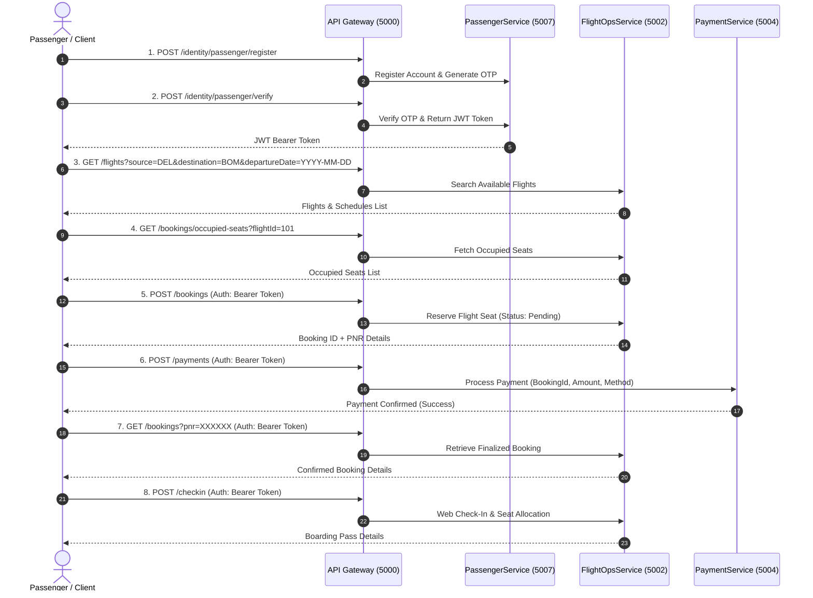

# Airline Management System - Complete API & Booking Guide

A comprehensive developer reference and step-by-step guide for interacting with the Airline Management System microservices.

---

## 1. System Architecture & Base URLs

Requests can be routed through the **API Gateway** (`http://localhost:5000`) or sent directly to each individual microservice.

| Service | Port (Direct) | Gateway Route (Port 5000) |
| :--- | :--- | :--- |
| **API Gateway** | `http://localhost:5000` | `/` |
| **Passenger Service** | `http://localhost:5007` | `/identity/passenger/*`, `/passengers/*` |
| **Flight Operations Service** | `http://localhost:5002` | `/flights/*`, `/bookings/*`, `/checkin/*` |
| **Payment Service** | `http://localhost:5004` | `/payments/*` |
| **BackOffice Service** | `http://localhost:5010` | `/identity/admin/*`, `/identity/staff/*`, `/admin/*`, `/staff/*` |

---

## 2. End-to-End Booking Lifecycle



---

## 3. Passenger Authentication & Identity APIs

### 3.1 Register Passenger Account
* **Route:** `POST /identity/passenger/register` *(Direct: `http://localhost:5007/api/auth/register`)*
* **Allowed Roles:** Public (None required)
* **Headers:** `Content-Type: application/json`

**Input Fields:**
| Field | Type | Required | Description | Example |
| :--- | :--- | :--- | :--- | :--- |
| `name` | string | Yes | Full legal name | `"John Doe"` |
| `email` | string | Yes | Unique email address | `"john.doe@example.com"` |
| `password` | string | Yes | Strong password | `"Password@123"` |
| `phone` | string | No | Contact mobile number | `"+919876543210"` |
| `dateOfBirth` | string | No | Date of birth (YYYY-MM-DD) | `"1995-05-15"` |
| `aadhar` | string | No | National ID / Aadhar number | `"123456789012"` |

**Sample Request Body:**
```json
{
  "name": "John Doe",
  "email": "john.doe@example.com",
  "password": "Password@123",
  "phone": "+919876543210",
  "dateOfBirth": "1995-05-15",
  "aadhar": "123456789012"
}
```

**Response (`200 OK`):**
```json
{
  "message": "Registration successful. Check your email for the OTP."
}
```

---

### 3.2 Verify Passenger Account (OTP)
* **Route:** `POST /identity/passenger/verify` *(Direct: `http://localhost:5007/api/auth/verify`)*
* **Allowed Roles:** Public (None required)

**Input Fields:**
| Field | Type | Required | Description | Example |
| :--- | :--- | :--- | :--- | :--- |
| `email` | string | Yes | Registered email address | `"john.doe@example.com"` |
| `token` | string | Yes | OTP code received | `"123456"` |

**Sample Request Body:**
```json
{
  "email": "john.doe@example.com",
  "token": "123456"
}
```

**Response (`200 OK`):**
```json
{
  "userId": 1,
  "email": "john.doe@example.com",
  "name": "John Doe",
  "role": "Passenger",
  "token": "eyJhbGciOiJIUzI1NiIsInR5cCI6IkpXVCJ9..."
}
```
> [!IMPORTANT]
> Save the `token` and pass it in the `Authorization` header as `Bearer <token>` for all protected endpoints.

---

### 3.3 Passenger Login
* **Route:** `POST /identity/passenger/login` *(Direct: `http://localhost:5007/api/auth/login`)*
* **Allowed Roles:** Public (None required)

**Sample Request Body:**
```json
{
  "email": "john.doe@example.com",
  "password": "Password@123"
}
```

---

## 4. Flight Operations APIs (Flights & Schedules)

---

### 4.1 Get / Search All Flights
* **Route:** `GET /flights` *(Direct: `http://localhost:5002/api/flights`)*
* **Description:** Retrieves all flights or searches flights if source, destination, or date are provided.
* **Allowed Roles:** Public (None required)

**Query Parameters:**
| Parameter | Type | Required | Description | Example |
| :--- | :--- | :--- | :--- | :--- |
| `source` | string | No | Source airport / city | `DEL` |
| `destination` | string | No | Destination airport / city | `BOM` |
| `departureDate` | string | No | Departure date in ISO-8601 (`YYYY-MM-DD`) | `2026-08-20` |

**Sample Response (`200 OK`):**
```json
[
  {
    "id": 101,
    "flightNumber": "AI-202",
    "airline": "Air India",
    "source": "DEL",
    "destination": "BOM",
    "departureTime": "2026-08-20T10:00:00",
    "arrivalTime": "2026-08-20T12:15:00",
    "aircraft": "Airbus A320",
    "totalSeats": 152,
    "economySeats": 120,
    "businessSeats": 24,
    "firstSeats": 8,
    "economyPrice": 4500.00,
    "businessPrice": 9500.00,
    "firstClassPrice": 16000.00,
    "status": "Scheduled"
  }
]
```

---

### 4.2 Create Flight
* **Route:** `POST /flights` *(Direct: `http://localhost:5002/api/flights`)*
* **Description:** Creates a new flight with route, schedule, pricing, and seat configuration. Sets initial status to Scheduled.
* **Allowed Roles:** `Admin`, `SuperAdmin`
* **Headers:** `Authorization: Bearer <ADMIN_TOKEN>`, `Content-Type: application/json`

**Input Fields:**
| Field | Type | Required | Description | Example |
| :--- | :--- | :--- | :--- | :--- |
| `flightNumber` | string | Yes | Flight code / number | `"AI-305"` |
| `source` | string | Yes | Origin airport code | `"DEL"` |
| `destination` | string | Yes | Destination airport code | `"BLR"` |
| `departureTime` | datetime | Yes | Scheduled departure time | `"2026-08-25T08:00:00"` |
| `arrivalTime` | datetime | Yes | Scheduled arrival time | `"2026-08-25T10:45:00"` |
| `aircraft` | string | Yes | Aircraft model name | `"Boeing 737"` |
| `totalSeats` | integer | Yes | Total aircraft capacity | `180` |
| `economySeats` | integer | Yes | Number of Economy seats | `150` |
| `businessSeats`| integer | Yes | Number of Business seats | `24` |
| `firstSeats` | integer | Yes | Number of First Class seats | `6` |
| `economyPrice` | decimal | Yes | Base Economy fare | `5200.00` |
| `businessPrice`| decimal | Yes | Base Business fare | `11000.00` |
| `firstClassPrice`| decimal| Yes | Base First Class fare | `19000.00` |

**Sample Request Body:**
```json
{
  "flightNumber": "AI-305",
  "source": "DEL",
  "destination": "BLR",
  "departureTime": "2026-08-25T08:00:00",
  "arrivalTime": "2026-08-25T10:45:00",
  "aircraft": "Boeing 737",
  "totalSeats": 180,
  "economySeats": 150,
  "businessSeats": 24,
  "firstSeats": 6,
  "economyPrice": 5200.00,
  "businessPrice": 11000.00,
  "firstClassPrice": 19000.00
}
```

**Response (`201 Created`):** Returns the newly created flight object with assigned `id`.

---

### 4.3 Get Flight by ID
* **Route:** `GET /flights/{id}` *(Direct: `http://localhost:5002/api/flights/{id}`)*
* **Description:** Retrieves a single flight by ID. Returns 404 if not found.
* **Allowed Roles:** Public (None required)

**Path Parameters:**
* `id` (integer, required): Unique ID of the flight (e.g. `101`).

**Response (`200 OK`):**
```json
{
  "id": 101,
  "flightNumber": "AI-202",
  "source": "DEL",
  "destination": "BOM",
  "departureTime": "2026-08-20T10:00:00",
  "arrivalTime": "2026-08-20T12:15:00",
  "aircraft": "Airbus A320",
  "economySeats": 120,
  "businessSeats": 24,
  "firstSeats": 8,
  "economyPrice": 4500.00,
  "businessPrice": 9500.00,
  "firstClassPrice": 16000.00,
  "status": "Scheduled"
}
```

---

### 4.4 Update Flight
* **Route:** `PUT /flights/{id}` *(Direct: `http://localhost:5002/api/flights/{id}`)*
* **Description:** Updates flight details (departure/arrival times, gate, aircraft, crew). Only updates non-null fields.
* **Allowed Roles:** `Admin`, `SuperAdmin`
* **Headers:** `Authorization: Bearer <ADMIN_TOKEN>`, `Content-Type: application/json`

**Sample Request Body:**
```json
{
  "departureTime": "2026-08-20T10:30:00",
  "arrivalTime": "2026-08-20T12:45:00",
  "gate": "Gate 12B",
  "aircraft": "Airbus A320neo",
  "crewAssignment": "Capt. Sharma, FO Verma"
}
```

**Response (`200 OK`):** Returns the updated flight object.

---

### 4.5 Delete Flight
* **Route:** `DELETE /flights/{id}` *(Direct: `http://localhost:5002/api/flights/{id}`)*
* **Description:** Permanently removes a flight from the system.
* **Allowed Roles:** `Admin`, `SuperAdmin`
* **Headers:** `Authorization: Bearer <ADMIN_TOKEN>`

**Response (`204 No Content`)**

---

### 4.6 Get / Search Flight Schedules
* **Route:** `GET /flights/schedules` *(Direct: `http://localhost:5002/api/flights/schedules`)*
* **Description:** Retrieves all flight schedules, or searches schedules if source, destination, date, or flightId are provided.
* **Allowed Roles:** Public (None required)

**Query Parameters:**
| Parameter | Type | Required | Description | Example |
| :--- | :--- | :--- | :--- | :--- |
| `source` | string | No | Source airport code | `DEL` |
| `destination` | string | No | Destination airport code | `BOM` |
| `departureDate` | string | No | ISO-8601 date string (`YYYY-MM-DD`) | `2026-08-20` |
| `flightId` | integer | No | Specific flight ID | `101` |

**Sample Response (`200 OK`):**
```json
[
  {
    "id": 12,
    "flightId": 101,
    "flightNumber": "AI-202",
    "source": "DEL",
    "destination": "BOM",
    "departureTime": "2026-08-20T10:00:00",
    "arrivalTime": "2026-08-20T12:15:00",
    "gate": "Gate 3",
    "economySeats": 115,
    "businessSeats": 20,
    "firstSeats": 6,
    "economyPrice": 4500.00,
    "businessPrice": 9500.00,
    "firstClassPrice": 16000.00,
    "status": "Scheduled"
  }
]
```

---

### 4.7 Create Flight Schedule
* **Route:** `POST /flights/schedules` *(Direct: `http://localhost:5002/api/flights/schedules`)*
* **Description:** Creates a new flight schedule instance from a flight template.
* **Allowed Roles:** `Admin`, `SuperAdmin`, `Staff`
* **Headers:** `Authorization: Bearer <STAFF_OR_ADMIN_TOKEN>`, `Content-Type: application/json`

**Sample Request Body:**
```json
{
  "flightId": 101,
  "departureTime": "2026-08-22T10:00:00",
  "arrivalTime": "2026-08-22T12:15:00",
  "gate": "Gate 5A",
  "economySeats": 120,
  "businessSeats": 24,
  "firstSeats": 8,
  "economyPrice": 4500.00,
  "businessPrice": 9500.00,
  "firstClassPrice": 16000.00
}
```

**Response (`201 Created`):** Returns the newly created schedule object.

---

## 5. Bookings APIs

---

### 5.1 Get Bookings
* **Route:** `GET /bookings` *(Direct: `http://localhost:5002/api/bookings`)*
* **Description:** Retrieves all bookings, or filters by PNR, userId, flightId, or scheduleId.
* **Allowed Roles:** Public / Authorized Users

**Query Parameters:**
| Parameter | Type | Required | Description | Example |
| :--- | :--- | :--- | :--- | :--- |
| `pnr` | string | No | 6-character PNR code | `"K9X7Q2"` |
| `userId` | integer | No | Passenger user ID | `1` |
| `flightId` | integer | No | Flight ID | `101` |
| `scheduleId`| integer | No | Schedule ID | `12` |

**Sample Response (`200 OK`):**
```json
[
  {
    "id": 501,
    "userId": 1,
    "flightId": 101,
    "scheduleId": null,
    "seatClass": "Economy",
    "baggageWeight": 15.0,
    "pnr": "K9X7Q2",
    "status": "Confirmed",
    "paymentStatus": "Paid",
    "totalPassengers": 1,
    "totalAmount": 4500.00
  }
]
```

---

### 5.2 Create Booking
* **Route:** `POST /bookings` *(Direct: `http://localhost:5002/api/bookings`)*
* **Description:** Creates a new booking and saves each passenger's details (manifest records). **The backend automatically calculates `totalAmount`** based on the flight/schedule seat class price and passenger count.
* **Allowed Roles:** `Passenger`, `Dealer`
* **Headers:** `Authorization: Bearer <TOKEN>`, `Content-Type: application/json`

**Input Fields:**
| Field | Type | Required | Description | Example |
| :--- | :--- | :--- | :--- | :--- |
| `flightId` | integer | Yes | Flight ID to book | `6` |
| `scheduleId` | integer | No | Schedule ID (or `null`) | `21` |
| `seatClass` | string | Yes | Tier: `"Economy"`, `"Business"`, `"First"` | `"Economy"` |
| `baggageWeight` | decimal | Yes | Luggage weight in kg (0 - 100) | `20.0` |
| `passengerCount`| integer | Yes | Number of tickets/seats | `2` |
| `passengers` | array | Optional | Array of passenger objects with details | `[...]` |

**Passenger Object Fields (`passengers[]`):**
| Field | Type | Required | Description | Example |
| :--- | :--- | :--- | :--- | :--- |
| `name` | string | Yes | Passenger full name | `"Sagar Sandeep"` |
| `age` | integer | Yes | Passenger age | `28` |
| `gender` | string | Yes | `"Male"`, `"Female"`, `"Other"` | `"Male"` |
| `aadharCardNo` | string | No | 12-digit Aadhar number | `"123456789012"` |
| `passportNumber` | string | No | Passport number | `"A1234567"` |
| `nationality` | string | No | Nationality | `"Indian"` |
| `dietaryRequirements` | string | No | Meal preference | `"Vegetarian"` |
| `medicalNeeds` | string | No | Medical assistance | `"None"` |
| `seatNumber` | string | No | Preferred seat number | `"12A"` |

**Sample Request Body (Booking for 2 Passengers):**
```json
{
  "flightId": 6,
  "scheduleId": 21,
  "seatClass": "Economy",
  "baggageWeight": 20,
  "passengerCount": 2,
  "passengers": [
    {
      "name": "Sagar Sandeep",
      "age": 28,
      "gender": "Male",
      "aadharCardNo": "123456789012",
      "dietaryRequirements": "Vegetarian"
    },
    {
      "name": "Pooja Sharma",
      "age": 26,
      "gender": "Female",
      "aadharCardNo": "987654321098",
      "dietaryRequirements": "Standard"
    }
  ]
}
```

**Response (`201 Created` - Returns both passenger records & calculated fare):**
```json
{
  "id": 1,
  "userId": 1,
  "flightId": 6,
  "scheduleId": 21,
  "seatClass": "Economy",
  "baggageWeight": 20.0,
  "pnr": "CG5GDU",
  "status": "Pending",
  "paymentStatus": "Pending",
  "totalPassengers": 2,
  "confirmedPassengers": 2,
  "cancelledPassengers": 0,
  "createdAt": "2026-08-18T04:05:37Z",
  "totalAmount": 8400.00,
  "passengers": [
    {
      "id": 101,
      "name": "Sagar Sandeep",
      "age": 28,
      "gender": "Male",
      "status": "Confirmed",
      "fare": 4200.00
    },
    {
      "id": 102,
      "name": "Pooja Sharma",
      "age": 26,
      "gender": "Female",
      "status": "Confirmed",
      "fare": 4200.00
    }
  ]
}
```

---

### 5.3 Get Booking by ID
* **Route:** `GET /bookings/{id}` *(Direct: `http://localhost:5002/api/bookings/{id}`)*
* **Description:** Gets a booking by its ID.
* **Allowed Roles:** `Passenger`, `Dealer`, `Admin`
* **Headers:** `Authorization: Bearer <TOKEN>`

**Path Parameters:**
* `id` (integer, required): The booking ID (e.g. `501`).

**Response (`200 OK`):** Returns the full `BookingDto` object with passenger list, PNR, and calculated `totalAmount`.

---

### 5.4 Cancel Booking
* **Route:** `POST /bookings/{id}/cancel` *(Direct: `http://localhost:5002/api/bookings/{id}/cancel`)*
* **Description:** Cancels a booking and automatically releases reserved seat capacity.
* **Allowed Roles:** `Passenger`, `Dealer`
* **Headers:** `Authorization: Bearer <TOKEN>`

**Response (`200 OK`):**
```json
{
  "message": "Booking cancelled successfully"
}
```

---

### 5.5 Get Occupied Seats
* **Route:** `GET /bookings/occupied-seats` *(Direct: `http://localhost:5002/api/bookings/occupied-seats`)*
* **Description:** Gets the occupied seats for a flight schedule.
* **Allowed Roles:** `Passenger`, `Dealer`, `Admin`
* **Headers:** `Authorization: Bearer <TOKEN>`

**Query Parameters:**
| Parameter | Type | Required | Description | Example |
| :--- | :--- | :--- | :--- | :--- |
| `flightId` | integer | Yes | Flight ID | `101` |
| `scheduleId`| integer | No | Schedule ID (optional) | `12` |

**Response (`200 OK`):**
```json
[
  "12A",
  "12B",
  "14C",
  "20F"
]
```

---

### 5.6 Cancel a Specific Passenger from Booking
* **Route:** `POST /bookings/passengers/{passengerId}/cancel` *(Direct: `http://localhost:5002/api/bookings/passengers/{passengerId}/cancel`)*
* **Description:** Cancels a specific passenger from a multi-passenger booking.
* **Allowed Roles:** `Passenger`, `Dealer`
* **Headers:** `Authorization: Bearer <TOKEN>`, `Content-Type: application/json`

**Path Parameters:**
* `passengerId` (integer, required): ID of the passenger record.

**Sample Request Body:**
```json
{
  "cancellationReason": "Medical emergency, cannot travel on scheduled date."
}
```

**Response (`200 OK`):**
```json
{
  "message": "Passenger cancelled successfully"
}
```

---

## 6. Payment APIs

---

### 6.1 Process Payment
* **Route:** `POST /payments` *(Direct: `http://localhost:5004/api/payments`)*
* **Description:** Processes payment for a booking. **If `amount` is omitted or `0`, the payment service automatically fetches and charges the exact booking `totalAmount` from the database.**
* **Allowed Roles:** `Passenger`, `Dealer`
* **Headers:** `Authorization: Bearer <TOKEN>`, `Content-Type: application/json`

**Input Fields:**
| Field | Type | Required | Description | Example |
| :--- | :--- | :--- | :--- | :--- |
| `bookingId` | integer | Yes | ID of the pending booking | `501` |
| `amount` | decimal | Optional | Exact amount (defaults to booking's total if omitted) | `9000.00` |
| `paymentMethod` | string | Yes | Payment mode (`Card`, `UPI`, `NetBanking`, `RazorPay`) | `"Card"` |

**Sample Request Body:**
```json
{
  "bookingId": 501,
  "paymentMethod": "Card"
}
```

**Response (`200 OK`):**
```json
{
  "id": 8901,
  "bookingId": 501,
  "amount": 9000.00,
  "status": "Success",
  "paymentMethod": "Card",
  "createdAt": "2026-08-18T01:46:30Z"
}
```

---

### 6.2 Get Payment Details
* **Route:** `GET /payments/{id}` *(Direct: `http://localhost:5004/api/payments/{id}`)*
* **Description:** Retrieves payment transaction details by payment ID.
* **Allowed Roles:** `Passenger`, `Dealer`, `Admin`, `SuperAdmin`
* **Headers:** `Authorization: Bearer <TOKEN>`

**Response (`200 OK`):**
```json
{
  "id": 8901,
  "bookingId": 501,
  "amount": 4500.00,
  "status": "Success",
  "paymentMethod": "Card",
  "createdAt": "2026-08-18T01:46:30Z"
}
```

---

### 6.3 Refund Payment
* **Route:** `POST /payments/{id}/refund` *(Direct: `http://localhost:5004/api/payments/{id}/refund`)*
* **Description:** Initiates a refund for a processed payment transaction.
* **Allowed Roles:** `Admin`, `SuperAdmin`, `FinancialAdmin`
* **Headers:** `Authorization: Bearer <ADMIN_TOKEN>`

**Response (`200 OK`):** Returns the updated payment record with status `"Refunded"`.

---

## 7. Check-In APIs

---

### 7.1 Get Check-Ins / Boarding Passes
* **Route:** `GET /checkin` *(Direct: `http://localhost:5002/api/checkins`)*
* **Description:** Retrieves all check-in records, or filters by bookingId.
* **Allowed Roles:** Logged-in Users (`Authorize`)
* **Headers:** `Authorization: Bearer <TOKEN>`

**Query Parameters:**
| Parameter | Type | Required | Description | Example |
| :--- | :--- | :--- | :--- | :--- |
| `bookingId` | integer | No | Filter boarding passes by booking ID | `501` |

**Sample Response (`200 OK`):**
```json
[
  {
    "id": 701,
    "bookingId": 501,
    "passengerName": "John Doe",
    "flightNumber": "AI-202",
    "seatNumber": "14B",
    "gate": "Gate 4",
    "departureTime": "2026-08-20T10:00:00",
    "status": "CheckedIn"
  }
]
```

---

### 7.2 Perform Check-In
* **Route:** `POST /checkin` *(Direct: `http://localhost:5002/api/checkins`)*
* **Description:** Performs passenger or staff counter Check-In and allocates a seat number.
* **Allowed Roles:** `Passenger`, `Admin`, `GroundStaff`, `Staff`
* **Headers:** `Authorization: Bearer <TOKEN>`, `Content-Type: application/json`

**Query Parameters:**
| Parameter | Type | Required | Description | Example |
| :--- | :--- | :--- | :--- | :--- |
| `passengerName` | string | Yes | Name of passenger checking in | `John Doe` |
| `flightNumber` | string | Yes | Flight identifier number | `AI-202` |
| `flightId` | integer | Yes | Flight ID | `101` |
| `departureTime` | datetime | Yes | Flight departure time | `2026-08-20T10:00:00` |
| `fare` | decimal | Yes | Fare amount | `4500.00` |

**Sample Request Body:**
```json
{
  "bookingId": 501,
  "seatNumber": "14B",
  "baggageCount": 1
}
```

**Response (`200 OK`):** Returns the issued boarding pass object.

---

### 7.3 Get Check-In by ID
* **Route:** `GET /checkin/{id}` *(Direct: `http://localhost:5002/api/checkins/{id}`)*
* **Description:** Retrieves a single check-in record by ID. Returns 404 if not found.
* **Allowed Roles:** `Passenger`, `Admin`, `Staff`, `GroundStaff`
* **Headers:** `Authorization: Bearer <TOKEN>`

**Response (`200 OK`):** Returns the specific boarding pass details.

---

## 8. Error Codes & Troubleshooting Reference

| Error Code / Message | HTTP Status | Root Cause | Solution |
| :--- | :--- | :--- | :--- |
| `401 Unauthorized` | 401 | Missing, malformed, or expired JWT Bearer token | Include header: `Authorization: Bearer <token>` from `/identity/passenger/login`. |
| `403 Forbidden` | 403 | User role does not have permission (e.g. Passenger calling Admin endpoint) | Login with proper role credentials (e.g., `Admin` or `Staff`). |
| `SEATS_NOT_AVAILABLE` | 400 | Requested passenger count exceeds remaining seats in chosen class | Switch `seatClass` (`Business`/`First`) or select an alternative flight. |
| `FLIGHT_NOT_FOUND` | 404 | Provided `flightId` does not exist in the database | Query `GET /flights` to obtain valid flight IDs. |
| `SCHEDULE_NOT_FOUND` | 404 | Provided `scheduleId` does not exist | Query `GET /flights/schedules` to obtain valid schedule IDs. |
| `Invalid departureDate format` | 400 | Query string date was not in ISO-8601 format | Provide date in `YYYY-MM-DD` format (e.g., `2026-08-20`). |
| `VALIDATION_ERROR` | 400 | Invalid `seatClass` or baggage weight > 100kg | Use `"Economy"`, `"Business"`, or `"First"`. Ensure weight is $\ge 0$ and $\le 100$. |
