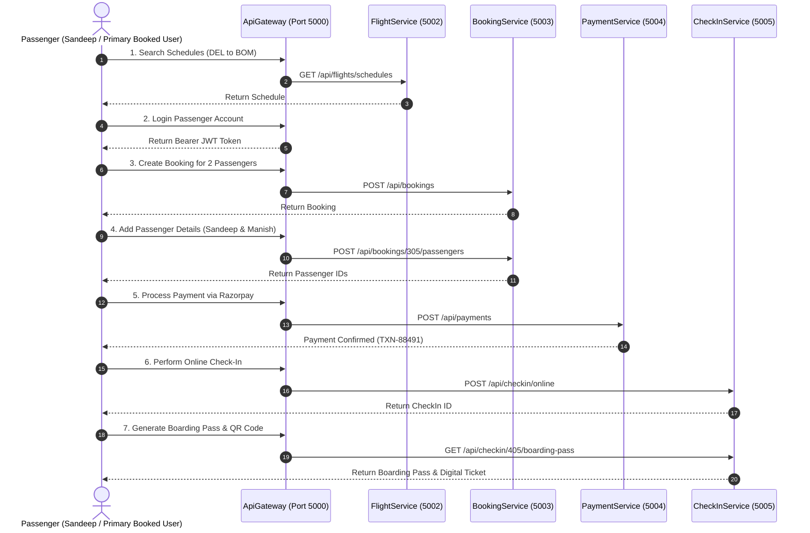

# 🎫 Complete End-to-End Flight Booking & Ticketing Walkthrough
### Case Study: Booking & Issuing Tickets for Sandeep & Manish

This guide demonstrates the exact step-by-step API requests, JSON payloads, and workflow required to search flights, reserve seats, add passenger details for **Sandeep** and **Manish**, process payment, perform online check-in, generate boarding passes, and register baggage.

---

## 📌 Workflow Overview



---

## 🚀 Step-by-Step API Execution Guide

---

### STEP 1: Search Available Flights & Schedules

Find scheduled flights from New Delhi (`DEL`) to Mumbai (`BOM`) for travel on `2026-09-10`.

**HTTP Request:**
```http
GET http://localhost:5000/api/flights/schedules?source=DEL&destination=BOM&departureDate=2026-09-10
Host: localhost:5000
Content-Type: application/json
```

**JSON Response (200 OK):**
```json
[
  {
    "id": 105,
    "flightId": 10,
    "flightNumber": "SK-204",
    "airlineName": "SkyPass Airlines",
    "source": "DEL",
    "destination": "BOM",
    "departureTime": "2026-09-10T09:00:00Z",
    "arrivalTime": "2026-09-10T11:15:00Z",
    "gate": "T3-Gate 14",
    "economySeatsAvailable": 120,
    "economyPrice": 3500.00
  }
]
```

---

### STEP 2: Authenticate & Obtain Bearer JWT Token

Login as the primary booking passenger (`sandeep@example.com`).

**HTTP Request:**
```http
POST http://localhost:5000/api/identity/passenger/login
Host: localhost:5000
Content-Type: application/json

{
  "email": "sandeep@example.com",
  "password": "Password123!"
}
```

**JSON Response (200 OK):**
```json
{
  "token": "eyJhbGciOiJIUzI1NiIsInR5cCI6IkpXVCJ9.eyJzdWIiOiIxMDAxIiwicm9sZSI6IlBhc3NlbmdlciIsImVtYWlsIjoic2FuZGVlcEBleGFtcGxlLmNvbSJ9...",
  "userId": 1001,
  "email": "sandeep@example.com",
  "firstName": "Sandeep",
  "role": "Passenger"
}
```

> [!IMPORTANT]
> Copy the returned `token` string and include `Authorization: Bearer <TOKEN>` in all subsequent requests.

---

### STEP 3: Create Booking Reservation

Reserve 2 Economy seats on Schedule `#105`.

**HTTP Request:**
```http
POST http://localhost:5000/api/bookings
Host: localhost:5000
Authorization: Bearer <TOKEN>
Content-Type: application/json

{
  "userId": 1001,
  "flightId": 10,
  "scheduleId": 105,
  "seatClass": "Economy",
  "totalPassengers": 2,
  "contactEmail": "sandeep@example.com",
  "contactPhone": "+919876543210"
}
```

**JSON Response (201 Created):**
```json
{
  "id": 305,
  "pnr": "PNR-SK992",
  "userId": 1001,
  "flightId": 10,
  "scheduleId": 105,
  "seatClass": "Economy",
  "totalPassengers": 2,
  "totalAmount": 7000.00,
  "status": "PendingPayment",
  "createdAt": "2026-08-06T11:45:00Z"
}
```

---

### STEP 4: Add Passenger Details for Sandeep & Manish

Attach passenger records and assign seats (`12A` and `12B`) to Booking `#305`.

**HTTP Request:**
```http
POST http://localhost:5000/api/bookings/305/passengers
Host: localhost:5000
Authorization: Bearer <TOKEN>
Content-Type: application/json

[
  {
    "firstName": "Sandeep",
    "lastName": "Kumar",
    "gender": "Male",
    "age": 28,
    "seatNumber": "12A",
    "specialRequests": "Window Seat"
  },
  {
    "firstName": "Manish",
    "lastName": "Sharma",
    "gender": "Male",
    "age": 27,
    "seatNumber": "12B",
    "specialRequests": "Extra Legroom"
  }
]
```

**JSON Response (201 Created):**
```json
[
  {
    "id": 701,
    "bookingId": 305,
    "firstName": "Sandeep",
    "lastName": "Kumar",
    "gender": "Male",
    "age": 28,
    "seatNumber": "12A"
  },
  {
    "id": 702,
    "bookingId": 305,
    "firstName": "Manish",
    "lastName": "Sharma",
    "gender": "Male",
    "age": 27,
    "seatNumber": "12B"
  }
]
```

---

### STEP 5: Process Payment via Razorpay

Pay ₹7,000.00 to confirm the reservation.

**HTTP Request:**
```http
POST http://localhost:5000/api/payments
Host: localhost:5000
Authorization: Bearer <TOKEN>
Content-Type: application/json

{
  "bookingId": 305,
  "amount": 7000.00,
  "currency": "INR",
  "paymentMethod": "Razorpay",
  "razorpayPaymentId": "pay_RZP98104820",
  "razorpayOrderId": "order_RZP48291048",
  "razorpaySignature": "8a7e8b9104f98104c..."
}
```

**JSON Response (200 OK):**
```json
{
  "id": 905,
  "bookingId": 305,
  "transactionId": "TXN-88491",
  "amount": 7000.00,
  "currency": "INR",
  "status": "Success",
  "paidAt": "2026-08-06T11:47:00Z"
}
```

---

### STEP 6: Perform Online Check-In

Complete Online Check-In for Sandeep & Manish.

**HTTP Request (Sandeep):**
```http
POST http://localhost:5000/api/checkin/online?passengerName=Sandeep%20Kumar&flightNumber=SK-204&flightId=10&departureTime=2026-09-10T09:00:00Z&fare=3500.00
Host: localhost:5000
Authorization: Bearer <TOKEN>
Content-Type: application/json

{
  "bookingId": 305,
  "seatNumber": "12A"
}
```

**JSON Response (200 OK):**
```json
{
  "id": 405,
  "bookingId": 305,
  "passengerName": "Sandeep Kumar",
  "flightNumber": "SK-204",
  "seatNumber": "12A",
  "boardingTime": "2026-09-10T08:15:00Z",
  "gate": "T3-Gate 14",
  "status": "CheckedIn"
}
```

---

### STEP 7: Generate Digital Boarding Pass & E-Ticket

Fetch digital boarding pass and QR code for Sandeep.

**HTTP Request:**
```http
GET http://localhost:5000/api/checkin/405/boarding-pass
Host: localhost:5000
Authorization: Bearer <TOKEN>
```

**JSON Response (200 OK):**
```json
{
  "checkInId": 405,
  "bookingId": 305,
  "pnr": "PNR-SK992",
  "passengerName": "Sandeep Kumar",
  "flightNumber": "SK-204",
  "source": "DEL",
  "destination": "BOM",
  "departureTime": "2026-09-10T09:00:00Z",
  "seatNumber": "12A",
  "boardingGroup": "Group B",
  "gate": "T3-Gate 14",
  "qrCodeData": "data:image/png;base64,iVBORw0KGgoAAAANSUhEUgAA...",
  "status": "BoardingPassIssued"
}
```

---

### STEP 8: Register Checked Baggage at Airport Counter (Staff)

Ground Staff registers luggage tags for Sandeep (`TAG-SAN101`) and Manish (`TAG-MAN102`).

**HTTP Request (Staff Registration):**
```http
POST http://localhost:5000/api/baggage
Host: localhost:5000
Authorization: Bearer <STAFF_TOKEN>
Content-Type: application/json

{
  "bookingId": 305,
  "weightKg": 15.0,
  "baggageType": "Checked",
  "tagNumber": "TAG-SAN101"
}
```

**JSON Response (201 Created):**
```json
{
  "id": 805,
  "bookingId": 305,
  "trackingNumber": "BAG-SAN101",
  "weightKg": 15.0,
  "status": "CheckedIn",
  "createdAt": "2026-09-10T07:30:00Z"
}
```

---

## 🎯 Verification Checklist

| Step | Action | Endpoint | Verification Metric | Status |
| :---: | :--- | :--- | :--- | :---: |
| 1 | Search Flight | `GET /flights/schedules` | Schedule #105 found | ✅ |
| 2 | Login User | `POST /identity/passenger/login` | Bearer JWT generated | ✅ |
| 3 | Create Booking | `POST /bookings` | Booking #305 (PNR-SK992) generated | ✅ |
| 4 | Add Passengers | `POST /bookings/305/passengers` | Sandeep (12A) & Manish (12B) added | ✅ |
| 5 | Process Payment | `POST /payments` | Status updated to `Confirmed` | ✅ |
| 6 | Online Check-In | `POST /checkin/online` | CheckIn #405 created | ✅ |
| 7 | Issue Boarding Pass | `GET /checkin/405/boarding-pass` | QR code & Boarding Pass issued | ✅ |
| 8 | Baggage Tagging | `POST /baggage` | Baggage #BAG-SAN101 tracked | ✅ |
