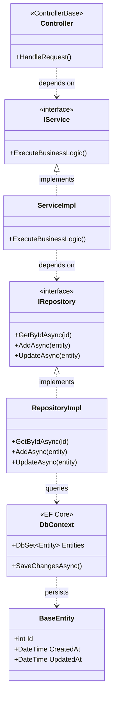
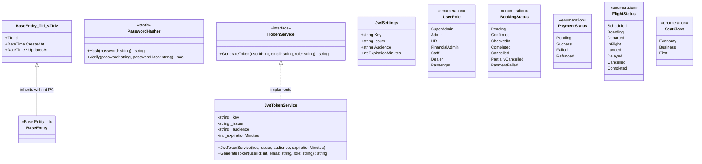
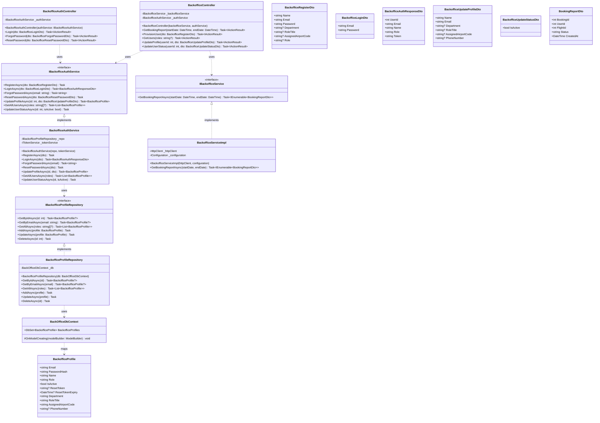
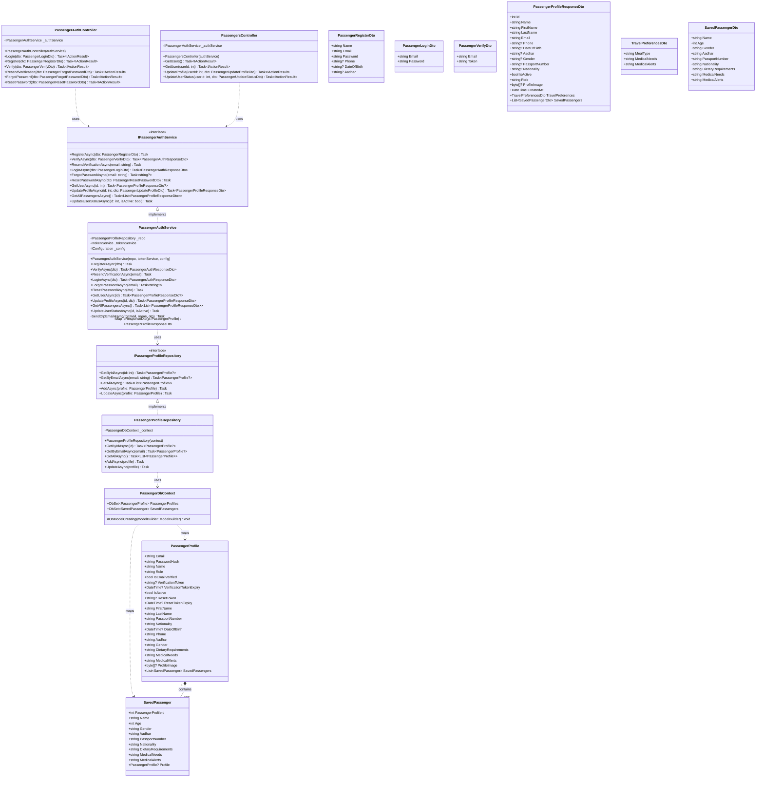
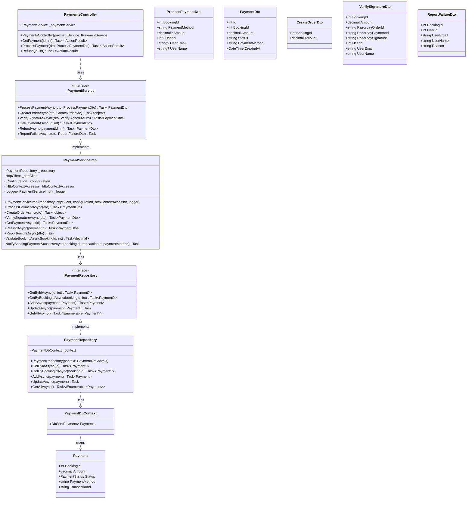

# Airline Management System - Class Diagrams Reference

This document provides complete Class Diagrams (using Mermaid) detailing the Object-Oriented structure, layered architecture, interface contracts, entity relationships, repositories, services, controllers, and Data Transfer Objects (DTOs) for all microservices in the solution.

---

## Table of Contents
1. [Layered Architecture Pattern](#1-layered-architecture-pattern)
2. [Shared Common & Core Infrastructure Classes](#2-shared-common--core-infrastructure-classes)
3. [BackOfficeService Class Diagram](#3-backofficeservice-class-diagram)
4. [PassengerService Class Diagram](#4-passengerservice-class-diagram)
5. [FlightOpsService Class Diagram](#5-flightopsservice-class-diagram)
6. [PaymentService Class Diagram](#6-paymentservice-class-diagram)
7. [Comprehensive Domain Models & Inheritance Map](#7-comprehensive-domain-models--inheritance-map)

---

## 1. Layered Architecture Pattern

All microservices follow a clean 4-tier architectural design:
- **Presentation Layer (Controllers)**: Receives HTTP requests, executes authorization checks, model state validations, and dispatches to services.
- **Business Logic Layer (Services)**: Implements business logic, transaction boundaries, validations, token generation, and DTO mapping.
- **Data Access Layer (Repositories)**: Encapsulates EF Core DbContext interactions and SQL queries.
- **Data Model Layer (Entities & DbContext)**: Represents database tables and schemas inheriting from `BaseEntity`.

---

## 2. Shared Common & Core Infrastructure Classes

The `Shared` library provides reusable base entities, security helpers, JWT token generation, and domain enums used across all services.

---

## 3. BackOfficeService Class Diagram

Handles authentication, staff account provisioning, role management, airport assignment, and cross-service booking aggregation.

---

## 4. PassengerService Class Diagram

Handles passenger authentication, email verification via OTP, profile updates, travel preferences, and companion passenger records.

---

## 5. FlightOpsService Class Diagram

Core operational service managing flights, scheduled instances, bookings, manifests, check-ins, and background completion.

```mermaid
classDiagram
    direction TB

    %% Controllers
    class FlightsController {
        -IFlightService _flightService
        -IFlightScheduleService _scheduleService
        +FlightsController(flightService, scheduleService)
        +GetAllFlights(source, destination, departureDate) Task~IActionResult~
        +GetFlight(id: int) Task~IActionResult~
        +CreateFlight(dto: CreateFlightDto) Task~IActionResult~
        +UpdateFlight(id: int, dto: UpdateFlightDto) Task~IActionResult~
        +DeleteFlight(id: int) Task~IActionResult~
        +GetAllSchedules(source, destination, departureDate, flightId) Task~IActionResult~
        +CreateSchedule(dto: CreateScheduleDto) Task~IActionResult~
    }

    class BookingsController {
        -IBookingService _bookingService
        -IPassengerService _passengerService
        -ILogger~BookingsController~ _logger
        +BookingsController(bookingService, passengerService, logger)
        +GetBookings(pnr, userId, flightId, scheduleId) Task~IActionResult~
        +GetBooking(id: int) Task~IActionResult~
        +CreateBooking(dto: CreateBookingDto) Task~IActionResult~
        +CancelBooking(id: int) Task~IActionResult~
        +CancelPassenger(passengerId: int, dto: CancelPassengerDto) Task~IActionResult~
        +GetOccupiedSeats(flightId: int, scheduleId: int?) Task~IActionResult~
    }

    class CheckInsController {
        -ICheckInService _checkInService
        +CheckInsController(checkInService)
        +GetAll(bookingId: int?) Task~IActionResult~
        +GetCheckIn(id: int) Task~IActionResult~
        +CheckIn(dto: OnlineCheckInDto, ...) Task~IActionResult~
    }

    %% Service Layer
    class IFlightService {
        <<interface>>
        +CreateFlightAsync(dto: CreateFlightDto) Task~FlightDto~
        +GetFlightAsync(id: int) Task~FlightDto~
        +UpdateFlightAsync(id: int, dto: UpdateFlightDto) Task~FlightDto~
        +DeleteFlightAsync(id: int) Task
        +SearchFlightsAsync(source, destination, departureDate) Task~IEnumerable~FlightDto~~
        +GetAllFlightsAsync() Task~IEnumerable~FlightDto~~
    }

    class IFlightScheduleService {
        <<interface>>
        +CreateScheduleAsync(dto: CreateScheduleDto) Task~FlightScheduleDto~
        +GetScheduleAsync(id: int) Task~FlightScheduleDto~
        +DeleteScheduleAsync(id: int) Task
        +CancelScheduleAsync(id: int) Task
        +SearchSchedulesAsync(source, destination, departureDate, flightId) Task~IEnumerable~FlightScheduleDto~~
        +GetAllSchedulesAsync() Task~IEnumerable~FlightScheduleDto~~
        +BookScheduleSeatAsync(scheduleId, seatClass, count) Task
        +ReleaseScheduleSeatAsync(scheduleId, seatClass, count) Task
        +MarkExpiredSchedulesCompletedAsync() Task
    }

    class IBookingService {
        <<interface>>
        +CreateBookingAsync(dto: CreateBookingDto) Task~BookingDto~
        +GetBookingAsync(id: int) Task~BookingDto~
        +CancelBookingAsync(id: int) Task
        +GetBookingHistoryAsync(userId: int) Task~IEnumerable~BookingHistoryDto~~
        +GetBookingsByScheduleAsync(scheduleId: int) Task~IEnumerable~object~~
        +GetOccupiedSeatsAsync(flightId: int, scheduleId: int?) Task~IEnumerable~string~~
        +GetBookingByPnrAsync(pnr: string) Task~BookingDto~
        +GetAllBookingsAsync() Task~IEnumerable~object~~
        +GetBookingsByFlightIdAsync(flightId: int) Task~IEnumerable~object~~
        +ConfirmPaymentAsync(bookingId: int, transactionId, paymentMethod) Task
    }

    class ICheckInService {
        <<interface>>
        +OnlineCheckInAsync(dto: OnlineCheckInDto, ...) Task~CheckInDto~
        +GetCheckInAsync(id: int) Task~CheckInDto~
        +GetBoardingPassesByBookingAsync(bookingId: int) Task~IEnumerable~BoardingPassDto~~
        +GetAllCheckInsAsync() Task~IEnumerable~CheckInDto~~
    }

    class IPassengerService {
        <<interface>>
        +GetPassengerAsync(passengerId: int) Task~PassengerResponseDto?~
        +CancelPassengerAsync(passengerId: int, dto: CancelPassengerDto) Task
        +ValidateAadharNumberAsync(aadharCardNo: string, excludeId: int?) Task~bool~
    }

    %% Service Implementations
    class FlightServiceImpl {
        -IFlightRepository _repository
    }
    class FlightScheduleService {
        -IFlightRepository _repository
    }
    class BookingServiceImpl {
        -IBookingRepository _repository
        -IFlightService _flightService
        -IFlightScheduleService _scheduleService
    }
    class CheckInServiceImpl {
        -ICheckInRepository _repository
    }
    class PassengerService {
        -IPassengerRepository _passengerRepository
        -IBookingRepository _bookingRepository
    }

    IFlightService <|.. FlightServiceImpl : implements
    IFlightScheduleService <|.. FlightScheduleService : implements
    IBookingService <|.. BookingServiceImpl : implements
    ICheckInService <|.. CheckInServiceImpl : implements
    IPassengerService <|.. PassengerService : implements

    FlightsController ..> IFlightService : uses
    FlightsController ..> IFlightScheduleService : uses
    BookingsController ..> IBookingService : uses
    BookingsController ..> IPassengerService : uses
    CheckInsController ..> ICheckInService : uses

    %% Background Worker
    class ScheduleCompletionWorker {
        <<BackgroundService>>
        -IServiceScopeFactory _scopeFactory
        #ExecuteAsync(stoppingToken: CancellationToken) Task
    }
    ScheduleCompletionWorker ..> IFlightScheduleService : triggers

    %% Repositories
    class IFlightRepository {
        <<interface>>
        +GetByIdAsync(id: int) Task~Flight?~
        +GetByFlightNumberAsync(flightNumber: string) Task~Flight?~
        +AddAsync(flight: Flight) Task~Flight~
        +UpdateAsync(flight: Flight) Task
        +DeleteAsync(id: int) Task
        +GetScheduleByIdAsync(id: int) Task~FlightSchedule?~
        +AddScheduleAsync(schedule: FlightSchedule) Task~FlightSchedule~
        +UpdateScheduleAsync(schedule: FlightSchedule) Task
        +DeleteScheduleAsync(id: int) Task
        +SearchSchedulesAsync(source, destination, date, flightId) Task~IEnumerable~FlightSchedule~~
        +GetAllSchedulesAsync() Task~IEnumerable~FlightSchedule~~
    }

    class IBookingRepository {
        <<interface>>
        +GetByIdAsync(id: int) Task~Booking?~
        +GetByPNRAsync(pnr: string) Task~Booking?~
        +GetByUserIdAsync(userId: int) Task~IEnumerable~Booking~~
        +GetByScheduleIdAsync(scheduleId: int) Task~IEnumerable~Booking~~
        +AddAsync(booking: Booking) Task~Booking~
        +UpdateAsync(booking: Booking) Task
        +GetOccupiedSeatsAsync(flightId: int, scheduleId: int?) Task~IEnumerable~string~~
    }

    class ICheckInRepository {
        <<interface>>
        +GetByIdAsync(id: int) Task~CheckIn?~
        +GetByBookingIdAsync(bookingId: int) Task~IEnumerable~CheckIn~~
        +GetByPassengerIdAsync(passengerId: int) Task~CheckIn?~
        +AddAsync(checkIn: CheckIn) Task~CheckIn~
        +GetAllAsync() Task~IEnumerable~CheckIn~~
    }

    class IPassengerRepository {
        <<interface>>
        +GetPassengerByIdAsync(passengerId: int) Task~BookingPassenger?~
        +UpdatePassengerAsync(passenger: BookingPassenger) Task
        +IsAadharUniqueAsync(aadhar: string, excludeId: int?) Task~bool~
    }

    %% Domain Entities
    class Flight {
        +string FlightNumber
        +string Source
        +string Destination
        +DateTime DepartureTime
        +DateTime ArrivalTime
        +string Gate
        +string Aircraft
        +FlightStatus Status
        +int TotalSeats
        +int AvailableSeats
        +int EconomySeats
        +int BusinessSeats
        +int FirstSeats
        +string CrewAssignment
        +decimal EconomyPrice
        +decimal BusinessPrice
        +decimal FirstClassPrice
    }

    class FlightSchedule {
        +int FlightId
        +Flight? Flight
        +DateTime DepartureTime
        +DateTime ArrivalTime
        +string Gate
        +FlightStatus Status
        +int TotalSeats
        +int AvailableSeats
        +int EconomySeats
        +int BusinessSeats
        +int FirstSeats
        +decimal EconomyPrice
        +decimal BusinessPrice
        +decimal FirstClassPrice
    }

    class Booking {
        +int UserId
        +string UserEmail
        +string UserName
        +int FlightId
        +Flight? Flight
        +int? ScheduleId
        +FlightSchedule? Schedule
        +SeatClass SeatClass
        +decimal BaggageWeight
        +string PNR
        +BookingStatus Status
        +PaymentStatus PaymentStatus
        +int TotalPassengers
        +int ConfirmedPassengers
        +int CancelledPassengers
        +decimal TotalAmount
        +ICollection~BookingPassenger~ Passengers
    }

    class BookingPassenger {
        +int BookingId
        +string Name
        +int Age
        +string Gender
        +string AadharCardNo
        +string PassportNumber
        +string Nationality
        +string DietaryRequirements
        +string MedicalNeeds
        +string MedicalAlerts
        +BookingPassengerStatus Status
        +decimal Fare
        +DateTime? CancelledAt
        +string? CancellationReason
        +string? SeatNumber
        +Booking? Booking
    }

    class CheckIn {
        +int BookingId
        +Booking? Booking
        +int PassengerId
        +BookingPassenger? Passenger
        +int UserId
        +int FlightId
        +Flight? Flight
        +string SeatNumber
        +string Gate
        +string BoardingPass
        +string QRCode
        +DateTime CheckInTime
        +bool IsCheckedIn
    }

    Flight "1" *-- "many" FlightSchedule : has
    Flight "1" *-- "many" Booking : booked
    FlightSchedule "1" *-- "many" Booking : scheduled
    Booking "1" *-- "many" BookingPassenger : manifest
    Booking "1" *-- "many" CheckIn : checked in
    BookingPassenger "1" *-- "0..1" CheckIn : issued
```

---

## 6. PaymentService Class Diagram

Encapsulates payment processing, Razorpay order generation, signature verification, refunds, and cross-service booking updates.

---

## 7. Comprehensive Domain Models & Inheritance Map

Illustrates how all persistence entity models across the 4 microservices inherit from `BaseEntity` and maintain domain properties.

```mermaid
classDiagram
    direction TB

    class BaseEntity {
        +int Id
        +DateTime CreatedAt
        +DateTime? UpdatedAt
    }

    class BackofficeProfile {
        +string Email
        +string PasswordHash
        +string Name
        +string Role
        +bool IsActive
        +string? ResetToken
        +DateTime? ResetTokenExpiry
        +string Department
        +string RoleTitle
        +string AssignedAirportCode
        +string? PhoneNumber
    }

    class PassengerProfile {
        +string Email
        +string PasswordHash
        +string Name
        +string FirstName
        +string LastName
        +string Role
        +bool IsEmailVerified
        +string? VerificationToken
        +DateTime? VerificationTokenExpiry
        +bool IsActive
        +string? ResetToken
        +DateTime? ResetTokenExpiry
        +string PassportNumber
        +string Nationality
        +DateTime? DateOfBirth
        +string Phone
        +string Aadhar
        +string Gender
        +string DietaryRequirements
        +string MedicalNeeds
        +string MedicalAlerts
        +byte[]? ProfileImage
    }

    class SavedPassenger {
        +int PassengerProfileId
        +string Name
        +int Age
        +string Gender
        +string Aadhar
        +string PassportNumber
        +string Nationality
        +string DietaryRequirements
        +string MedicalNeeds
        +string MedicalAlerts
    }

    class Flight {
        +string FlightNumber
        +string Source
        +string Destination
        +DateTime DepartureTime
        +DateTime ArrivalTime
        +string Gate
        +string Aircraft
        +FlightStatus Status
        +int TotalSeats
        +int AvailableSeats
        +int EconomySeats
        +int BusinessSeats
        +int FirstSeats
        +string CrewAssignment
        +decimal EconomyPrice
        +decimal BusinessPrice
        +decimal FirstClassPrice
    }

    class FlightSchedule {
        +int FlightId
        +DateTime DepartureTime
        +DateTime ArrivalTime
        +string Gate
        +FlightStatus Status
        +int TotalSeats
        +int AvailableSeats
        +int EconomySeats
        +int BusinessSeats
        +int FirstSeats
        +decimal EconomyPrice
        +decimal BusinessPrice
        +decimal FirstClassPrice
    }

    class Booking {
        +int UserId
        +string UserEmail
        +string UserName
        +int FlightId
        +int? ScheduleId
        +SeatClass SeatClass
        +decimal BaggageWeight
        +string PNR
        +BookingStatus Status
        +PaymentStatus PaymentStatus
        +int TotalPassengers
        +int ConfirmedPassengers
        +int CancelledPassengers
        +decimal TotalAmount
    }

    class BookingPassenger {
        +int BookingId
        +string Name
        +int Age
        +string Gender
        +string AadharCardNo
        +string PassportNumber
        +string Nationality
        +string DietaryRequirements
        +string MedicalNeeds
        +string MedicalAlerts
        +BookingPassengerStatus Status
        +decimal Fare
        +DateTime? CancelledAt
        +string? CancellationReason
        +string? SeatNumber
    }

    class CheckIn {
        +int BookingId
        +int PassengerId
        +int UserId
        +int FlightId
        +string SeatNumber
        +string Gate
        +string BoardingPass
        +string QRCode
        +DateTime CheckInTime
        +bool IsCheckedIn
    }

    class Payment {
        +int BookingId
        +decimal Amount
        +PaymentStatus Status
        +string PaymentMethod
        +string TransactionId
    }

    BaseEntity <|-- BackofficeProfile
    BaseEntity <|-- PassengerProfile
    BaseEntity <|-- SavedPassenger
    BaseEntity <|-- Flight
    BaseEntity <|-- FlightSchedule
    BaseEntity <|-- Booking
    BaseEntity <|-- BookingPassenger
    BaseEntity <|-- CheckIn
    BaseEntity <|-- Payment
```

