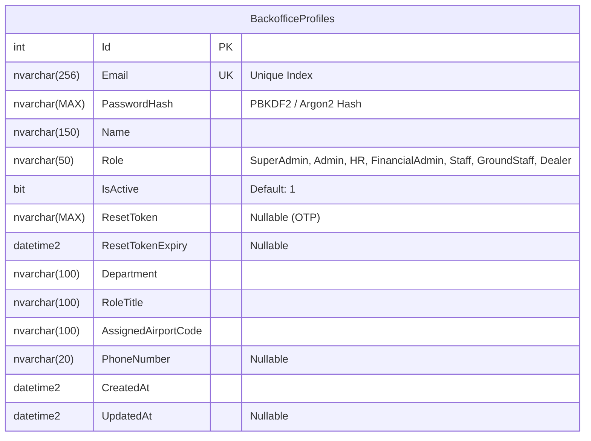
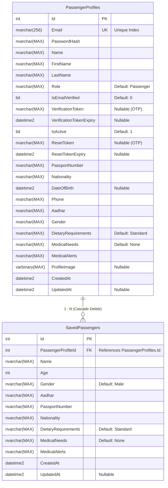

# Entity Relationship (ER) Diagrams & Database Schema Reference

This document provides complete Entity Relationship (ER) diagrams, cross-service relationship maps, and database schemas for all microservices in the Airline Management System.

---

## 1. System-Wide Entity Relationship Overview

The system follows a Database-per-Service microservices architecture. Direct foreign keys exist within individual service databases, while cross-service references are maintained logically using identifier keys (e.g., `UserId`, `BookingId`, `FlightId`).

```mermaid
erDiagram
    %% Microservice Databases
    
    %% BackOffice Service Database
    BACKOFFICE_PROFILES {
        int Id PK
        string Email UK
        string Name
        string Role
        string Department
        string RoleTitle
        string AssignedAirportCode
    }

    %% Passenger Service Database
    PASSENGER_PROFILES {
        int Id PK
        string Email UK
        string Name
        string Phone
        string Aadhar
        string PassportNumber
        string Role
    }

    SAVED_PASSENGERS {
        int Id PK
        int PassengerProfileId FK
        string Name
        int Age
        string Gender
        string Aadhar
        string PassportNumber
    }

    %% FlightOps Service Database
    FLIGHTS {
        int Id PK
        string FlightNumber UK
        string Source
        string Destination
        datetime DepartureTime
        datetime ArrivalTime
        string Aircraft
        string Status
    }

    FLIGHT_SCHEDULES {
        int Id PK
        int FlightId FK
        datetime DepartureTime
        datetime ArrivalTime
        string Gate
        string Status
        int TotalSeats
        int AvailableSeats
    }

    BOOKINGS {
        int Id PK
        int UserId "Logical FK -> PassengerProfile / BackofficeProfile"
        int FlightId FK
        int ScheduleId FK
        string PNR UK
        string SeatClass
        string Status
        string PaymentStatus
        decimal TotalAmount
    }

    BOOKING_PASSENGERS {
        int Id PK
        int BookingId FK
        string Name
        int Age
        string Gender
        string AadharCardNo
        string PassportNumber
        string Status
        decimal Fare
        string SeatNumber
    }

    CHECK_INS {
        int Id PK
        int BookingId FK
        int PassengerId FK
        int FlightId FK
        int UserId "Logical FK"
        string SeatNumber
        string Gate
        string BoardingPass
        string QRCode
        datetime CheckInTime
    }

    %% Payment Service Database
    PAYMENTS {
        int Id PK
        int BookingId "Logical FK -> Booking"
        decimal Amount
        string Status
        string PaymentMethod
        string TransactionId
    }

    %% Internal Database Relationships
    PASSENGER_PROFILES ||--o{ SAVED_PASSENGERS : "has many"
    FLIGHTS ||--o{ FLIGHT_SCHEDULES : "has schedules"
    FLIGHTS ||--o{ BOOKINGS : "booked for"
    FLIGHT_SCHEDULES ||--o{ BOOKINGS : "scheduled for"
    BOOKINGS ||--|{ BOOKING_PASSENGERS : "contains"
    BOOKINGS ||--o{ CHECK_INS : "checked in via"
    BOOKING_PASSENGERS ||--o| CHECK_INS : "issues boarding pass"
    FLIGHTS ||--o{ CHECK_INS : "manifested on"

    %% Cross-Service Logical Linkages
    PASSENGER_PROFILES ..o{ BOOKINGS : "logical (UserId)"
    BOOKINGS ..o{ PAYMENTS : "logical (BookingId)"
```

---

## 2. Service-Level Entity Relationship Diagrams

### 2.1 BackOffice Service Database (`Airline_BackOfficeDB`)

Manages backoffice personnel profiles, authorization roles (SuperAdmin, Admin, HR, FinancialAdmin, Staff, GroundStaff, Dealer), and operational assignments.



---

### 2.2 Passenger Service Database (`Airline_PassengerDB`)

Manages customer identity, authentication, profile preferences, and saved companion passenger profiles.



---

### 2.3 Flight Operations Service Database (`Airline_FlightOpsDB`)

Core operational domain managing flights, flight schedules, customer bookings, passenger manifests, and boarding check-ins.

```mermaid
erDiagram
    Flights ||--o{ FlightSchedules : "1 : N (Cascade Delete)"
    Flights ||--o{ Bookings : "1 : N (Restrict)"
    Flights ||--o{ CheckIns : "1 : N (Restrict)"
    FlightSchedules ||--o{ Bookings : "1 : N (Restrict)"
    Bookings ||--|{ Passengers : "1 : N (Cascade Delete)"
    Bookings ||--o{ CheckIns : "1 : N (Restrict)"
    Passengers ||--o| CheckIns : "1 : 1 (Restrict)"

    Flights {
        int Id PK
        nvarchar(20) FlightNumber UK "Unique Index"
        nvarchar(50) Source
        nvarchar(50) Destination
        datetime2 DepartureTime
        datetime2 ArrivalTime
        nvarchar(10) Gate "Nullable"
        nvarchar(50) Aircraft
        nvarchar(MAX) Status "Scheduled, Boarding, Departed, Landed, Delayed, Cancelled"
        int TotalSeats
        int AvailableSeats
        int EconomySeats
        int BusinessSeats
        int FirstSeats
        nvarchar(MAX) CrewAssignment
        decimal(18,2) EconomyPrice
        decimal(18,2) BusinessPrice
        decimal(18,2) FirstClassPrice
        datetime2 CreatedAt
        datetime2 UpdatedAt "Nullable"
    }

    FlightSchedules {
        int Id PK
        int FlightId FK "References Flights.Id"
        datetime2 DepartureTime
        datetime2 ArrivalTime
        nvarchar(10) Gate "Nullable"
        nvarchar(MAX) Status "Scheduled, Boarding, Departed, Landed, Delayed, Cancelled"
        int TotalSeats
        int AvailableSeats
        int EconomySeats
        int BusinessSeats
        int FirstSeats
        decimal(18,2) EconomyPrice
        decimal(18,2) BusinessPrice
        decimal(18,2) FirstClassPrice
        datetime2 CreatedAt
        datetime2 UpdatedAt "Nullable"
    }

    Bookings {
        int Id PK
        int UserId "Indexed"
        nvarchar(MAX) UserEmail
        nvarchar(MAX) UserName
        int FlightId FK "References Flights.Id"
        int ScheduleId FK "References FlightSchedules.Id (Nullable)"
        nvarchar(MAX) SeatClass "Economy, Business, First"
        decimal(18,2) BaggageWeight
        nvarchar(10) PNR UK "Unique Index"
        nvarchar(MAX) Status "Pending, Confirmed, CheckedIn, Completed, Cancelled, PartiallyCancelled"
        nvarchar(MAX) PaymentStatus "Pending, Success, Failed, Refunded"
        int TotalPassengers
        int ConfirmedPassengers
        int CancelledPassengers
        decimal(18,2) TotalAmount
        datetime2 CreatedAt
        datetime2 UpdatedAt "Nullable"
    }

    Passengers {
        int Id PK
        int BookingId FK "References Bookings.Id (Indexed)"
        nvarchar(100) Name
        int Age
        nvarchar(20) Gender
        nvarchar(12) AadharCardNo "Indexed"
        nvarchar(MAX) PassportNumber
        nvarchar(MAX) Nationality
        nvarchar(MAX) DietaryRequirements "Default: Standard"
        nvarchar(MAX) MedicalNeeds "Default: None"
        nvarchar(MAX) MedicalAlerts
        nvarchar(MAX) Status "Confirmed, CheckedIn, Boarded, Cancelled"
        decimal(18,2) Fare
        datetime2 CancelledAt "Nullable"
        nvarchar(500) CancellationReason "Nullable"
        nvarchar(MAX) SeatNumber "Nullable"
        datetime2 CreatedAt
        datetime2 UpdatedAt "Nullable"
    }

    CheckIns {
        int Id PK
        int BookingId FK "References Bookings.Id (Indexed)"
        int PassengerId FK "References Passengers.Id (Indexed)"
        int UserId "Indexed"
        int FlightId FK "References Flights.Id"
        nvarchar(10) SeatNumber
        nvarchar(10) Gate
        nvarchar(MAX) BoardingPass
        nvarchar(MAX) QRCode "Base64 Encoded PNG"
        datetime2 CheckInTime
        bit IsCheckedIn
        datetime2 CreatedAt
        datetime2 UpdatedAt "Nullable"
    }
```

---

### 2.4 Payment Service Database (`Airline_PaymentDB`)

Handles payment transactions, transaction states, and references bookings logically.

```mermaid
erDiagram
    Payments {
        int Id PK
        int BookingId "Logical FK -> Bookings.Id"
        decimal(18,2) Amount
        nvarchar(MAX) Status "Pending, Success, Failed, Refunded"
        nvarchar(MAX) PaymentMethod "CreditCard, DebitCard, UPI, NetBanking"
        nvarchar(MAX) TransactionId
        datetime2 CreatedAt
        datetime2 UpdatedAt "Nullable"
    }
```

---

## 3. Data Dictionary & Detailed Schema Specifications

### 3.1 `BackofficeProfiles` (Database: `Airline_BackOfficeDB`)

| Column Name | Data Type | Nullable | Constraints / Index | Description |
| :--- | :--- | :---: | :--- | :--- |
| `Id` | `int` | No | `PK`, `IDENTITY(1,1)` | Unique backoffice staff identifier |
| `Email` | `nvarchar(256)` | No | `UNIQUE INDEX` | Staff login email address |
| `PasswordHash` | `nvarchar(MAX)` | No | | Secure hashed password string |
| `Name` | `nvarchar(150)` | No | | Full name of staff member |
| `Role` | `nvarchar(50)` | No | Default: `'Staff'` | Role (`SuperAdmin`, `Admin`, `HR`, `FinancialAdmin`, `Staff`, `GroundStaff`, `Dealer`) |
| `IsActive` | `bit` | No | Default: `1` | Account activation flag |
| `ResetToken` | `nvarchar(MAX)` | Yes | | Password reset 6-digit OTP |
| `ResetTokenExpiry` | `datetime2` | Yes | | Expiration timestamp for reset OTP |
| `Department` | `nvarchar(100)` | No | | Department (e.g. Operations, Ticketing, Admin) |
| `RoleTitle` | `nvarchar(100)` | No | | Job title description |
| `AssignedAirportCode`| `nvarchar(100)` | No | | Airport base station code (e.g. `DEL`, `BOM`, `BLR`) |
| `PhoneNumber` | `nvarchar(20)` | Yes | | Contact phone number |
| `CreatedAt` | `datetime2` | No | `UTC` | Record creation timestamp |
| `UpdatedAt` | `datetime2` | Yes | `UTC` | Last update timestamp |

---

### 3.2 `PassengerProfiles` (Database: `Airline_PassengerDB`)

| Column Name | Data Type | Nullable | Constraints / Index | Description |
| :--- | :--- | :---: | :--- | :--- |
| `Id` | `int` | No | `PK`, `IDENTITY(1,1)` | Passenger unique identifier |
| `Email` | `nvarchar(256)` | No | `UNIQUE INDEX` | Passenger account email |
| `PasswordHash` | `nvarchar(MAX)` | No | | Password hash |
| `Name` | `nvarchar(MAX)` | No | | Full display name |
| `FirstName` | `nvarchar(MAX)` | No | | First name |
| `LastName` | `nvarchar(MAX)` | No | | Last name |
| `Role` | `nvarchar(MAX)` | No | Default: `'Passenger'` | User portal role |
| `IsEmailVerified` | `bit` | No | Default: `0` | Email verification flag |
| `VerificationToken` | `nvarchar(MAX)` | Yes | | 6-digit OTP verification token |
| `VerificationTokenExpiry`| `datetime2` | Yes | | OTP token expiry |
| `IsActive` | `bit` | No | Default: `1` | Account status |
| `ResetToken` | `nvarchar(MAX)` | Yes | | Password reset token |
| `ResetTokenExpiry` | `datetime2` | Yes | | Reset token expiry |
| `PassportNumber` | `nvarchar(MAX)` | No | | Passport document number |
| `Nationality` | `nvarchar(MAX)` | No | | Country nationality |
| `DateOfBirth` | `datetime2` | Yes | | Date of birth |
| `Phone` | `nvarchar(MAX)` | No | | Contact phone number |
| `Aadhar` | `nvarchar(MAX)` | No | | 12-digit Indian Aadhar number |
| `Gender` | `nvarchar(MAX)` | No | | Gender identity |
| `DietaryRequirements` | `nvarchar(MAX)` | No | Default: `'Standard'` | Meal preferences (e.g. Vegetarian, Non-Veg, Jain) |
| `MedicalNeeds` | `nvarchar(MAX)` | No | Default: `'None'` | Special medical assistance (e.g. Wheelchair) |
| `MedicalAlerts` | `nvarchar(MAX)` | No | | Medical alerts & allergy notes |
| `ProfileImage` | `varbinary(MAX)` | Yes | | Binary avatar profile picture |
| `CreatedAt` | `datetime2` | No | `UTC` | Account creation timestamp |
| `UpdatedAt` | `datetime2` | Yes | `UTC` | Profile last update timestamp |

---

### 3.3 `SavedPassengers` (Database: `Airline_PassengerDB`)

| Column Name | Data Type | Nullable | Constraints / Index | Description |
| :--- | :--- | :---: | :--- | :--- |
| `Id` | `int` | No | `PK`, `IDENTITY(1,1)` | Saved passenger primary key |
| `PassengerProfileId`| `int` | No | `FK -> PassengerProfiles(Id)` | Account owner reference |
| `Name` | `nvarchar(MAX)` | No | | Companion passenger full name |
| `Age` | `int` | No | | Age |
| `Gender` | `nvarchar(MAX)` | No | Default: `'Male'` | Gender |
| `Aadhar` | `nvarchar(MAX)` | No | | 12-digit Aadhar number |
| `PassportNumber` | `nvarchar(MAX)` | No | | Passport number |
| `Nationality` | `nvarchar(MAX)` | No | | Nationality |
| `DietaryRequirements` | `nvarchar(MAX)` | No | Default: `'Standard'` | Dietary preference |
| `MedicalNeeds` | `nvarchar(MAX)` | No | Default: `'None'` | Special medical requirement |
| `MedicalAlerts` | `nvarchar(MAX)` | No | | Medical alerts |
| `CreatedAt` | `datetime2` | No | `UTC` | Record creation timestamp |
| `UpdatedAt` | `datetime2` | Yes | `UTC` | Record update timestamp |

---

### 3.4 `Flights` (Database: `Airline_FlightOpsDB`)

| Column Name | Data Type | Nullable | Constraints / Index | Description |
| :--- | :--- | :---: | :--- | :--- |
| `Id` | `int` | No | `PK`, `IDENTITY(1,1)` | Flight template ID |
| `FlightNumber` | `nvarchar(20)` | No | `UNIQUE INDEX` | Unique flight code (e.g. `AI-202`) |
| `Source` | `nvarchar(50)` | No | | Origin airport code/city (e.g. `DEL`) |
| `Destination` | `nvarchar(50)` | No | | Destination airport code/city (e.g. `BOM`) |
| `DepartureTime` | `datetime2` | No | | Scheduled departure datetime |
| `ArrivalTime` | `datetime2` | No | | Scheduled arrival datetime |
| `Gate` | `nvarchar(10)` | Yes | | Boarding gate |
| `Aircraft` | `nvarchar(50)` | No | | Aircraft model (e.g. `Boeing 737-800`, `Airbus A320`) |
| `Status` | `nvarchar(MAX)` | No | Conversion: `Enum` | Flight status |
| `TotalSeats` | `int` | No | | Total aircraft capacity |
| `AvailableSeats` | `int` | No | | Remaining available seats |
| `EconomySeats` | `int` | No | | Economy seat allocation |
| `BusinessSeats` | `int` | No | | Business seat allocation |
| `FirstSeats` | `int` | No | | First class seat allocation |
| `CrewAssignment` | `nvarchar(MAX)` | No | | Assigned crew information |
| `EconomyPrice` | `decimal(18,2)`| No | | Base economy fare |
| `BusinessPrice` | `decimal(18,2)`| No | | Base business fare |
| `FirstClassPrice`| `decimal(18,2)`| No | | Base first class fare |
| `CreatedAt` | `datetime2` | No | `UTC` | Record creation timestamp |
| `UpdatedAt` | `datetime2` | Yes | `UTC` | Record update timestamp |

---

### 3.5 `FlightSchedules` (Database: `Airline_FlightOpsDB`)

| Column Name | Data Type | Nullable | Constraints / Index | Description |
| :--- | :--- | :---: | :--- | :--- |
| `Id` | `int` | No | `PK`, `IDENTITY(1,1)` | Schedule instance primary key |
| `FlightId` | `int` | No | `FK -> Flights(Id)` | Reference to base flight template |
| `DepartureTime` | `datetime2` | No | | Specific departure timestamp |
| `ArrivalTime` | `datetime2` | No | | Specific arrival timestamp |
| `Gate` | `nvarchar(10)` | Yes | | Gate assignment for instance |
| `Status` | `nvarchar(MAX)` | No | Conversion: `Enum` | Schedule status (`Scheduled`, `Completed`, etc.) |
| `TotalSeats` | `int` | No | | Total schedule capacity |
| `AvailableSeats` | `int` | No | | Available schedule capacity |
| `EconomySeats` | `int` | No | | Remaining economy seats |
| `BusinessSeats` | `int` | No | | Remaining business seats |
| `FirstSeats` | `int` | No | | Remaining first class seats |
| `EconomyPrice` | `decimal(18,2)`| No | | Schedule economy price |
| `BusinessPrice` | `decimal(18,2)`| No | | Schedule business price |
| `FirstClassPrice`| `decimal(18,2)`| No | | Schedule first class price |
| `CreatedAt` | `datetime2` | No | `UTC` | Record creation timestamp |
| `UpdatedAt` | `datetime2` | Yes | `UTC` | Record update timestamp |

---

### 3.6 `Bookings` (Database: `Airline_FlightOpsDB`)

| Column Name | Data Type | Nullable | Constraints / Index | Description |
| :--- | :--- | :---: | :--- | :--- |
| `Id` | `int` | No | `PK`, `IDENTITY(1,1)` | Booking primary key |
| `UserId` | `int` | No | `INDEX` | User identity (Passenger or Backoffice Dealer) |
| `UserEmail` | `nvarchar(MAX)` | No | | Booking user email |
| `UserName` | `nvarchar(MAX)` | No | | Booking user full name |
| `FlightId` | `int` | No | `FK -> Flights(Id)` | Referenced flight |
| `ScheduleId` | `int` | Yes | `FK -> FlightSchedules(Id)`, `INDEX` | Referenced flight schedule |
| `SeatClass` | `nvarchar(MAX)` | No | Conversion: `Enum` | Class (`Economy`, `Business`, `First`) |
| `BaggageWeight` | `decimal(18,2)`| No | | Total baggage weight in kg |
| `PNR` | `nvarchar(10)` | No | `UNIQUE INDEX` | 6-character Passenger Name Record |
| `Status` | `nvarchar(MAX)` | No | Conversion: `Enum` | Booking status (`Confirmed`, `Cancelled`, etc.) |
| `PaymentStatus` | `nvarchar(MAX)` | No | Conversion: `Enum` | Payment status (`Pending`, `Success`, `Refunded`) |
| `TotalPassengers`| `int` | No | | Total number of passengers in booking |
| `ConfirmedPassengers`| `int` | No | | Number of active confirmed passengers |
| `CancelledPassengers`| `int` | No | | Number of cancelled passengers |
| `TotalAmount` | `decimal(18,2)`| No | | Total booking invoice amount |
| `CreatedAt` | `datetime2` | No | `UTC` | Booking creation timestamp |
| `UpdatedAt` | `datetime2` | Yes | `UTC` | Booking update timestamp |

---

### 3.7 `Passengers` (Database: `Airline_FlightOpsDB`)

| Column Name | Data Type | Nullable | Constraints / Index | Description |
| :--- | :--- | :---: | :--- | :--- |
| `Id` | `int` | No | `PK`, `IDENTITY(1,1)` | Passenger manifest primary key |
| `BookingId` | `int` | No | `FK -> Bookings(Id)`, `INDEX` | Parent booking reference |
| `Name` | `nvarchar(100)` | No | | Passenger full name |
| `Age` | `int` | No | | Age |
| `Gender` | `nvarchar(20)` | No | | Gender |
| `AadharCardNo` | `nvarchar(12)` | No | `INDEX` | 12-digit Indian Aadhar |
| `PassportNumber` | `nvarchar(MAX)` | No | | Passport document number |
| `Nationality` | `nvarchar(MAX)` | No | | Nationality |
| `DietaryRequirements` | `nvarchar(MAX)` | No | Default: `'Standard'` | Meal choice |
| `MedicalNeeds` | `nvarchar(MAX)` | No | Default: `'None'` | Medical assistance requirement |
| `MedicalAlerts` | `nvarchar(MAX)` | No | | Medical alerts |
| `Status` | `nvarchar(MAX)` | No | Conversion: `Enum` | Status (`Confirmed`, `CheckedIn`, `Cancelled`) |
| `Fare` | `decimal(18,2)`| No | | Per-passenger seat fare |
| `CancelledAt` | `datetime2` | Yes | | Cancellation timestamp if cancelled |
| `CancellationReason` | `nvarchar(500)` | Yes | | Reason provided for passenger cancellation |
| `SeatNumber` | `nvarchar(MAX)` | Yes | | Assigned seat number (e.g. `12A`) |
| `CreatedAt` | `datetime2` | No | `UTC` | Manifest record creation timestamp |
| `UpdatedAt` | `datetime2` | Yes | `UTC` | Manifest record update timestamp |

---

### 3.8 `CheckIns` (Database: `Airline_FlightOpsDB`)

| Column Name | Data Type | Nullable | Constraints / Index | Description |
| :--- | :--- | :---: | :--- | :--- |
| `Id` | `int` | No | `PK`, `IDENTITY(1,1)` | Check-in record primary key |
| `BookingId` | `int` | No | `FK -> Bookings(Id)`, `INDEX` | Associated booking reference |
| `PassengerId` | `int` | No | `FK -> Passengers(Id)`, `INDEX` | Manifest passenger reference |
| `UserId` | `int` | No | `INDEX` | User identifier |
| `FlightId` | `int` | No | `FK -> Flights(Id)` | Flight reference |
| `SeatNumber` | `nvarchar(10)` | No | | Final assigned seat number |
| `Gate` | `nvarchar(10)` | No | | Boarding gate |
| `BoardingPass` | `nvarchar(MAX)` | No | | Formatted boarding string (`Name\|Flight\|Seat`) |
| `QRCode` | `nvarchar(MAX)` | No | | Base64-encoded QR code image data |
| `CheckInTime` | `datetime2` | No | `UTC` | Actual check-in completion timestamp |
| `IsCheckedIn` | `bit` | No | Default: `1` | Check-in completion flag |
| `CreatedAt` | `datetime2` | No | `UTC` | Record creation timestamp |
| `UpdatedAt` | `datetime2` | Yes | `UTC` | Record update timestamp |

---

### 3.9 `Payments` (Database: `Airline_PaymentDB`)

| Column Name | Data Type | Nullable | Constraints / Index | Description |
| :--- | :--- | :---: | :--- | :--- |
| `Id` | `int` | No | `PK`, `IDENTITY(1,1)` | Payment transaction primary key |
| `BookingId` | `int` | No | | Logical reference to `Bookings.Id` |
| `Amount` | `decimal(18,2)`| No | | Transaction total amount |
| `Status` | `nvarchar(MAX)` | No | Conversion: `Enum` | Status (`Pending`, `Success`, `Failed`, `Refunded`) |
| `PaymentMethod` | `nvarchar(MAX)` | No | | Method (`CreditCard`, `DebitCard`, `UPI`, `NetBanking`) |
| `TransactionId` | `nvarchar(MAX)` | No | | Unique gateway transaction reference |
| `CreatedAt` | `datetime2` | No | `UTC` | Transaction timestamp |
| `UpdatedAt` | `datetime2` | Yes | `UTC` | Status update timestamp |

---

## 4. Key Relationships Summary Table

| Source Entity | Target Entity | Relationship Type | Key / Mechanism | On Delete Behavior |
| :--- | :--- | :---: | :--- | :--- |
| `PassengerProfiles` | `SavedPassengers` | **1 : N** | `SavedPassengers.PassengerProfileId` -> `PassengerProfiles.Id` | `CASCADE` |
| `Flights` | `FlightSchedules` | **1 : N** | `FlightSchedules.FlightId` -> `Flights.Id` | `CASCADE` |
| `Flights` | `Bookings` | **1 : N** | `Bookings.FlightId` -> `Flights.Id` | `RESTRICT` |
| `FlightSchedules` | `Bookings` | **1 : N** | `Bookings.ScheduleId` -> `FlightSchedules.Id` | `RESTRICT` |
| `Bookings` | `Passengers` | **1 : N** | `Passengers.BookingId` -> `Bookings.Id` | `CASCADE` |
| `Bookings` | `CheckIns` | **1 : N** | `CheckIns.BookingId` -> `Bookings.Id` | `RESTRICT` |
| `Passengers` | `CheckIns` | **1 : 1** | `CheckIns.PassengerId` -> `Passengers.Id` | `RESTRICT` |
| `Flights` | `CheckIns` | **1 : N** | `CheckIns.FlightId` -> `Flights.Id` | `RESTRICT` |
| `PassengerProfiles` | `Bookings` | **1 : N (Logical)** | `Bookings.UserId` -> `PassengerProfiles.Id` | *Application Level* |
| `Bookings` | `Payments` | **1 : N (Logical)** | `Payments.BookingId` -> `Bookings.Id` | *Application Level* |
