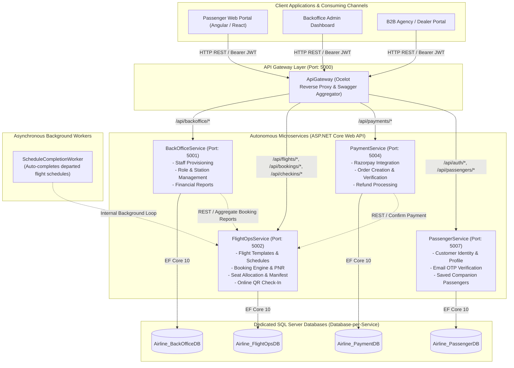
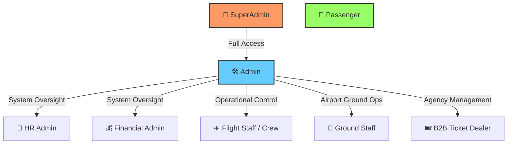
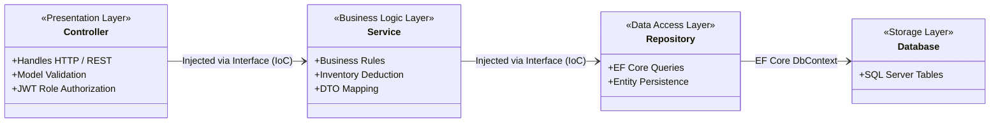
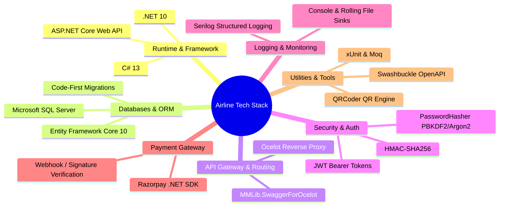
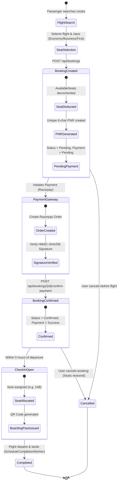

# Airline Management System - Comprehensive Project Overview & Architecture Guide

---

## 1. Executive Summary & Business Idea

### 1.1 The Business Problem
Traditional airline reservation and operations systems often suffer from monolithic architectures with high coupling, leading to:
- Frequent operational bottlenecks between passenger ticketing, ground operations, and backoffice administration.
- Single points of failure where a failure in payments or reporting crashes the booking engine.
- High latency during flash sales or heavy passenger check-in traffic.
- Complex user management where internal airline staff (crew, ground handlers, HR, financial analysts, ticket dealers) lack isolated, role-specific portals and security boundaries.

### 1.2 The Business Solution
The **Airline Management System** is a next-generation, cloud-ready, microservices-driven enterprise platform engineered to modernize end-to-end airline operations. 

It provides an integrated ecosystem serving two distinct user demographics:
1. **Public Passengers & Travel Agents (Dealers)**: Frictionless flight search, seat selection across multiple cabin classes, instant booking with automated PNR generation, Razorpay payment processing, digital check-in with dynamic QR-coded boarding passes, and self-service companion passenger management.
2. **Airline Backoffice Staff & Executives**: Granular role-based administration for SuperAdmins, HR, Financial Admins, Ground Staff, Station Managers, and Ticket Dealers—with real-time flight scheduling, seat inventory controls, manifest tracking, and financial reporting.

---

## 2. System Architecture & Service Structure

The platform adopts an enterprise **Microservices Architecture** combined with the **Database-per-Service** pattern to guarantee high availability, domain autonomy, horizontal scalability, and zero cross-database locking.

---

### 2.1 Microservices Breakdown

| Service Name | Port | Primary Responsibilities | Database | Key Technologies |
| :--- | :---: | :--- | :--- | :--- |
| **`ApiGateway`** | `5000` | Single entry point, reverse proxy routing, JWT validation, unified Swagger documentation aggregation. | *None* | Ocelot, SwaggerForOcelot |
| **`BackOfficeService`** | `5001` | Backoffice personnel authentication, RBAC provisioning, airport station assignments, operational/financial reports. | `Airline_BackOfficeDB` | ASP.NET Core 10, EF Core, JWT, Serilog |
| **`FlightOpsService`** | `5002` | Flight catalog, scheduling, real-time seat inventory, booking lifecycle (PNR), passenger manifests, online check-in with QR code boarding passes. | `Airline_FlightOpsDB` | ASP.NET Core 10, EF Core, QRCoder, BackgroundService |
| **`PaymentService`** | `5004` | Payment processing, Razorpay order creation & HMAC-SHA256 signature verification, refunds, cross-service booking confirmation. | `Airline_PaymentDB` | ASP.NET Core 10, Razorpay SDK, EF Core, HttpClient |
| **`PassengerService`** | `5007` | Customer registration, email OTP verification, password resets, profile management, dietary/medical preferences, saved companion passengers. | `Airline_PassengerDB` | ASP.NET Core 10, EF Core, JWT, Serilog |
| **`Shared`** | *Library* | Shared domain base entities (`BaseEntity`), enums, JWT token generator, password hashing utilities, exception hierarchy. | *Shared Dll* | .NET Standard / .NET 10 |

---

## 3. User Roles & Role-Based Access Control (RBAC)

The platform implements a comprehensive **Role-Based Access Control (RBAC)** model embedded directly into JWT claim tokens.

### 3.1 Role Capabilities Matrix

| Role | Domain Scope | Permissions & Capabilities |
| :--- | :--- | :--- |
| **`SuperAdmin`** | System-Wide | Root level control. Can create/deactivate any staff account, manage flights, view financial reports, configure system-wide parameters. |
| **`Admin`** | Backoffice & Ops | Manages flights, creates schedules, oversees bookings, cancels flights/bookings, views reports, provisions staff users. |
| **`HR`** | Staff Management | Provisions and manages backoffice staff accounts, assigns roles, updates departments and airport station codes, activates/deactivates staff. |
| **`FinancialAdmin`**| Financials & Audit | Accesses financial and booking reports, views payment transaction audit trails, manages refunds. |
| **`Staff`** | In-Flight Operations | Views flight manifests, inspects schedule details, views passenger lists. |
| **`GroundStaff`** | Airport Terminal | Performs airport counter check-in, verifies boarding passes, manages gate assignments and baggage weights. |
| **`Dealer`** | B2B Travel Agency | Books tickets on behalf of corporate/retail clients, manages bulk client bookings, issues cancellations. |
| **`Passenger`** | Customer Portal | Self-registration, OTP verification, searches flights, books seats, pays via Razorpay/Cards, performs online check-in, downloads QR boarding pass, saves companion passenger profiles. |

---

## 4. Architectural & Design Patterns Applied

The project applies industry-standard software design patterns to achieve clean code, testability, and separation of concerns.

### 4.1 Summary of Applied Patterns

1. **Microservices & API Gateway Pattern**:
   - `ApiGateway` acts as the single facade for all client applications, handling path rewrites, JWT propagation, and centralizing Swagger documentation for all 4 downstream services.
2. **Database-per-Service Pattern**:
   - Each service has its own dedicated SQL database (`Airline_BackOfficeDB`, `Airline_FlightOpsDB`, `Airline_PaymentDB`, `Airline_PassengerDB`), preventing monolithic database locks and allowing independent database schema evolution.
3. **Clean 4-Tier / Layered Architecture**:
   - Strict separation between **Presentation Layer (Controllers)**, **Business Logic Layer (Services)**, **Data Access Layer (Repositories)**, and **Domain Entities / Data Layer**.
4. **Repository Pattern & Unit of Work**:
   - Direct database queries are encapsulated inside repository interfaces (`IBackofficeProfileRepository`, `IPassengerProfileRepository`, `IFlightRepository`, `IBookingRepository`, `ICheckInRepository`, `IPaymentRepository`), making services 100% unit-testable with mocks.
5. **Dependency Injection (DI) & Inversion of Control (IoC)**:
   - Native ASP.NET Core DI container used across all services to inject interfaces (`AddScoped`, `AddSingleton`, `AddHttpClient`).
6. **Data Transfer Object (DTO) Pattern**:
   - Every service separates API contracts from database entities. Dedicated single-responsibility DTO files prevent over-posting and under-posting vulnerabilities.
7. **Background Hosted Service / Worker Pattern**:
   - `ScheduleCompletionWorker` inherits from `BackgroundService` to autonomously monitor departed flights and transition schedule statuses to `Completed` without human intervention.
8. **Gateway / Adapter Pattern**:
   - `PaymentService` integrates the Razorpay API with HMAC-SHA256 signature verification, abstracting payment gateway complexities from the rest of the airline booking engine.
9. **Global Exception Handling Middleware Pattern**:
   - Centralized middleware captures unhandled domain exceptions (`SeatsNotAvailableException`, `BookingNotFoundException`, `DomainValidationException`) and outputs standardized RFC 7807 problem details with appropriate HTTP status codes.

---

## 5. Technology Stack & Component Responsibilities

### 5.1 Technology Matrix & Role in Solution

| Technology / Library | Category | What it does in this project |
| :--- | :--- | :--- |
| **`.NET 10` & `C# 13`** | Core Platform | Modern, high-performance runtime with C# 13 language features (records, pattern matching, top-level statements, nullability annotations). |
| **`ASP.NET Core Web API`**| Web Framework | High-throughput REST API controllers, routing, dependency injection container, and middleware pipeline. |
| **`Microsoft SQL Server`** | Relational Database | Enterprise ACID-compliant relational data storage powering isolated databases for all 4 microservices. |
| **`Entity Framework Core`** | ORM / Data Layer | Code-first schema modeling, LINQ queries, relationship mappings, foreign keys, cascade delete policies, and automated migrations. |
| **`Ocelot`** | API Gateway | Reverse proxy routing incoming client traffic from port 5000 to internal downstream services based on URL route templates. |
| **`SwaggerForOcelot`** | Gateway Documentation | Aggregates Swagger endpoints from all 4 microservices into a unified interactive documentation hub on the gateway. |
| **`JWT Bearer Authentication`**| Security | Stateless authentication using HMAC-SHA256 signed JSON Web Tokens containing User ID, Email, and Role claims. |
| **`Razorpay .NET SDK`** | Payment Integration | Creates payment orders, integrates checkout flows in INR, and verifies payment signatures against gateway secrets. |
| **`QRCoder`** | Utility / Barcode | Lightweight library generating Base64-encoded PNG QR codes for boarding passes during online check-in. |
| **`Serilog`** | Observability & Logging| Enterprise structured logging with timestamped console output and rolling daily log files (`logs/log-.txt`) enriched with thread and environment metadata. |
| **`Swashbuckle / OpenAPI`**| API Documentation | Generates OpenAPI v3 specifications and interactive Swagger UI consoles with Bearer token authentication support. |
| **`xUnit & Moq`** | Quality Assurance | Unit testing framework and mocking library used for automated verification of services, business rules, and repositories. |

---

## 6. End-to-End Core Business Workflows

### 6.1 Flight Booking & Payment Lifecycle

---

## 7. Security, Resiliency & Production Best Practices

1. **Defense-in-Depth Security**:
   - Passwords never stored in plaintext—hashed using secure cryptographic hashing algorithms.
   - Private endpoints protected by `[Authorize(Roles = "...")]` attributes enforced at controller and action levels.
   - Sensitive tokens (OTP verification & password reset tokens) expire automatically in 15 minutes.
2. **Resilient Database Startup**:
   - Microservices incorporate automatic database migration retry loops on application startup, handling transient SQL Server connection initialization during cold boots or container orchestration.
3. **Optimized Cross-Origin Resource Sharing (CORS)**:
   - Configured to seamlessly support multi-portal Angular/React frontends (`http://localhost:4200`, `4201`, `4202`) with credentials support.
4. **Clean Code & Maintainability**:
   - Zero bloated monolithic files—every DTO, model, interface, and repository lives in its own dedicated single-responsibility file with XML documentation comments.
