# Airline Management System - Sequence Diagrams Reference

This document provides detailed **Sequence Diagrams** (powered by Mermaid) depicting the runtime message flows, synchronous/asynchronous inter-service interactions, authorization handshakes, database transactions, exception paths, and external gateway integrations across the **Airline Management System** microservices platform.

---

## Table of Contents
1. [Architecture & Sequence Actors Overview](#1-architecture--sequence-actors-overview)
2. [Passenger Identity & Access Management](#2-passenger-identity--access-management)
   - [2.1 Passenger Registration & Email Verification OTP Flow](#21-passenger-registration--email-verification-otp-flow)
   - [2.2 Passenger Email OTP Verification & JWT Token Issuance](#22-passenger-email-otp-verification--jwt-token-issuance)
   - [2.3 Passenger Login & Authentication](#23-passenger-login--authentication)
   - [2.4 Passenger Forgot Password & Password Reset Flow](#24-passenger-forgot-password--password-reset-flow)
   - [2.5 Passenger Profile Update & Status Management](#25-passenger-profile-update--status-management)
3. [Backoffice Staff Authentication & Administration](#3-backoffice-staff-authentication--administration)
   - [3.1 Backoffice User Provisioning (SuperAdmin / HR / Admin)](#31-backoffice-user-provisioning-superadmin--hr--admin)
   - [3.2 Backoffice Staff Login & RBAC JWT Issuance](#32-backoffice-staff-login--rbac-jwt-issuance)
   - [3.3 Backoffice User Profile & Status Modification](#33-backoffice-user-profile--status-modification)
   - [3.4 Backoffice Forgot Password & Password Reset Workflow](#34-backoffice-forgot-password--password-reset-workflow)
4. [Flight Catalog & Schedule Operations](#4-flight-catalog--schedule-operations)
   - [4.1 Flight Template Creation (Admin / SuperAdmin)](#41-flight-template-creation-admin--superadmin)
   - [4.2 Flight Schedule Generation & Inventory Setup](#42-flight-schedule-generation--inventory-setup)
   - [4.3 Public Flight Search & Schedule Query Flow](#43-public-flight-search--schedule-query-flow)
   - [4.4 Flight Template Modification & Removal](#44-flight-template-modification--removal)
5. [End-to-End Flight Booking Lifecycle](#5-end-to-end-flight-booking-lifecycle)
   - [5.1 Multi-Passenger Booking Creation, Seat Deduction & PNR Generation](#51-multi-passenger-booking-creation-seat-deduction--pnr-generation)
   - [5.2 Booking Inquiries (By PNR, User History, or Schedule)](#52-booking-inquiries-by-pnr-user-history-or-schedule)
   - [5.3 Full Booking Cancellation & Dynamic Seat Inventory Release](#53-full-booking-cancellation--dynamic-seat-inventory-release)
   - [5.4 Partial Companion Passenger Cancellation](#54-partial-companion-passenger-cancellation)
6. [Payment Processing & Razorpay Gateway Integration](#6-payment-processing--razorpay-gateway-integration)
   - [6.1 Razorpay Order Creation Flow](#61-razorpay-order-creation-flow)
   - [6.2 Razorpay Signature Verification & Cross-Service Booking Confirmation](#62-razorpay-signature-verification--cross-service-booking-confirmation)
   - [6.3 Direct Payment Processing Workflow](#63-direct-payment-processing-workflow)
   - [6.4 Payment Refund Processing Flow](#64-payment-refund-processing-flow)
7. [Digital Online Check-In & Boarding Pass Issuance](#7-digital-online-check-in--boarding-pass-issuance)
   - [7.1 5-Hour Window Check-In, Seat Assignment & QR Generation](#71-5-hour-window-check-in-seat-assignment--qr-generation)
   - [7.2 Fetching Digital Boarding Passes by Booking ID](#72-fetching-digital-boarding-passes-by-booking-id)
8. [Asynchronous Background Processing](#8-asynchronous-background-processing)
   - [8.1 Autonomous Flight Schedule Auto-Completion Loop](#81-autonomous-flight-schedule-auto-completion-loop)
9. [Cross-Service Operational & Financial Reporting](#9-cross-service-operational--financial-reporting)
   - [9.1 Backoffice Booking & Financial Report Aggregation Flow](#91-backoffice-booking--financial-report-aggregation-flow)

---

## 1. Architecture & Sequence Actors Overview

The sequence diagrams model interactions between the following primary participants:

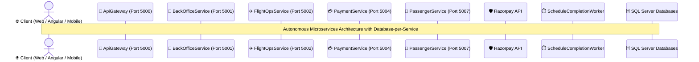

---

## 2. Passenger Identity & Access Management

### 2.1 Passenger Registration & Email Verification OTP Flow

When a new passenger registers on the portal, an account profile is created in an unverified state (`IsEmailVerified = false`), a secure OTP is generated with a 15-minute expiration, and a confirmation email is dispatched.

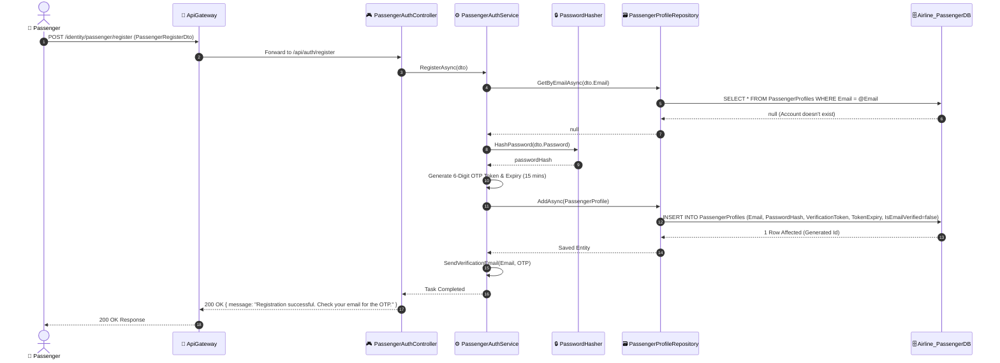

---

### 2.2 Passenger Email OTP Verification & JWT Token Issuance

The passenger submits the 6-digit OTP code received in their email to activate the account and receive an initial JWT Bearer authentication token.

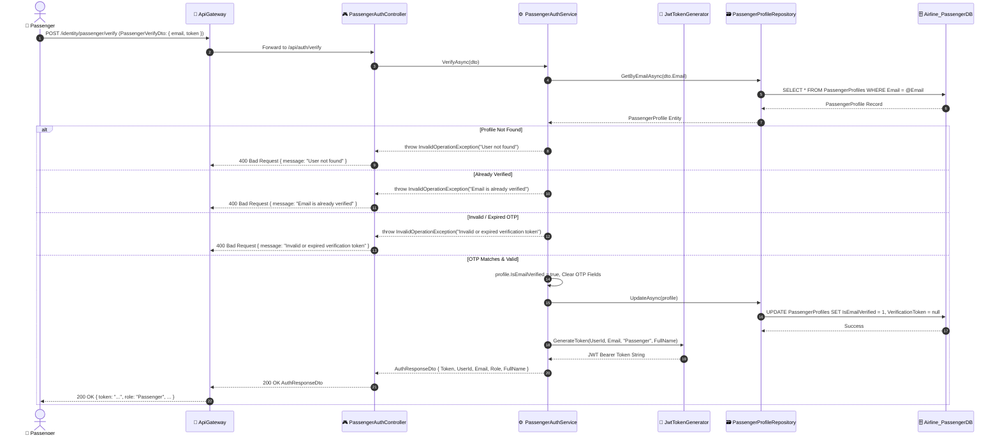

---

### 2.3 Passenger Login & Authentication

Existing passengers authenticate with their email and password. The system checks email verification status, verifies the cryptographic password hash, and produces a signed JWT claim token.

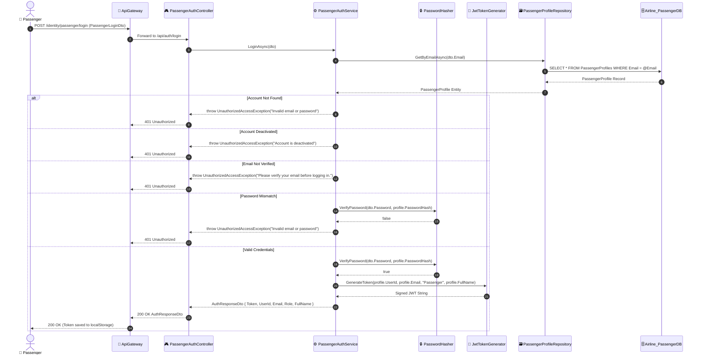

---

### 2.4 Passenger Forgot Password & Password Reset Flow

A streamlined self-service password recovery flow that issues a 15-minute reset OTP and verifies the OTP before updating the hashed password.

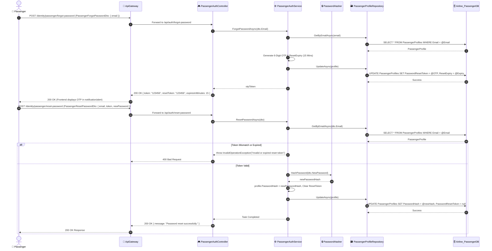

---

### 2.5 Passenger Profile Update & Status Management

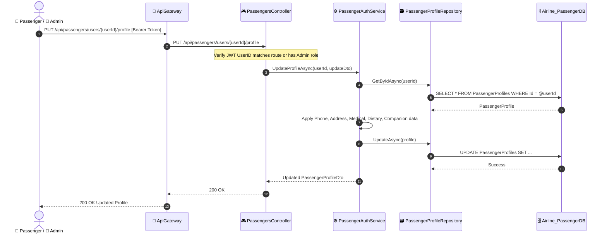

---

## 3. Backoffice Staff Authentication & Administration

### 3.1 Backoffice User Provisioning (SuperAdmin / HR / Admin)

SuperAdmins, Admins, and HR managers provision internal staff accounts across all departments (HR, FinancialAdmin, Staff/Crew, GroundStaff, Dealer).

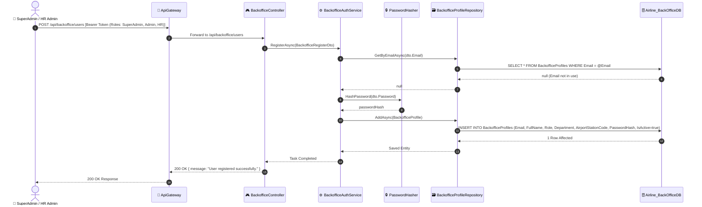

---

### 3.2 Backoffice Staff Login & RBAC JWT Issuance

All backoffice personnel log in via a unified portal endpoint (`/api/backoffice/auth/login`), receiving a JWT embedded with their specific administrative role claims.

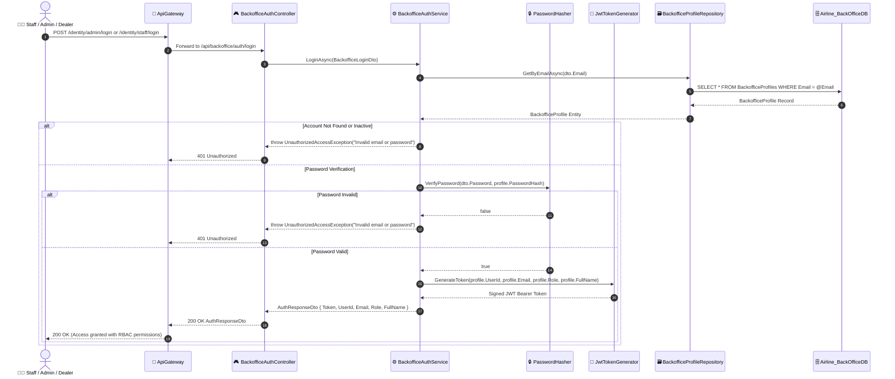

---

### 3.3 Backoffice User Profile & Status Modification

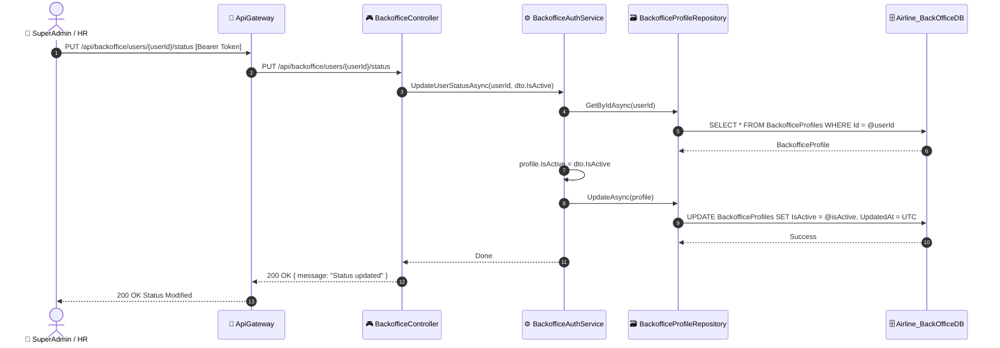

---

### 3.4 Backoffice Forgot Password & Password Reset Workflow

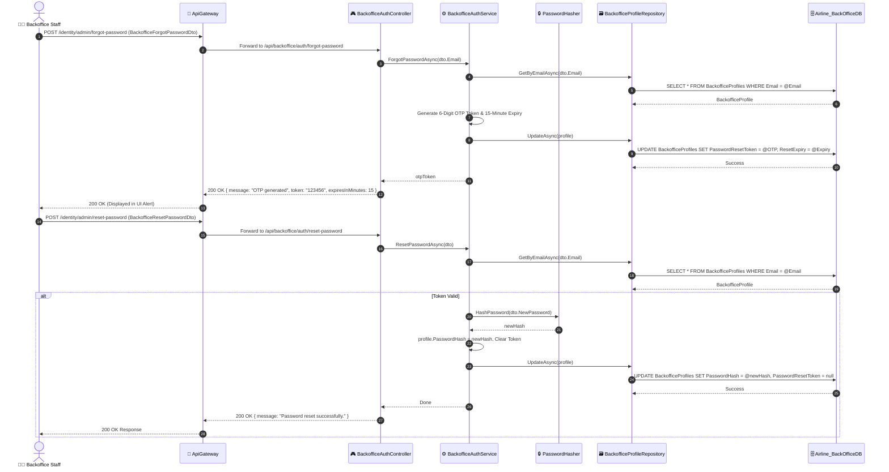

---

## 4. Flight Catalog & Schedule Operations

### 4.1 Flight Template Creation (Admin / SuperAdmin)

Flight templates establish the baseline route, pricing tiers, and cabin class capacities for a given flight number.

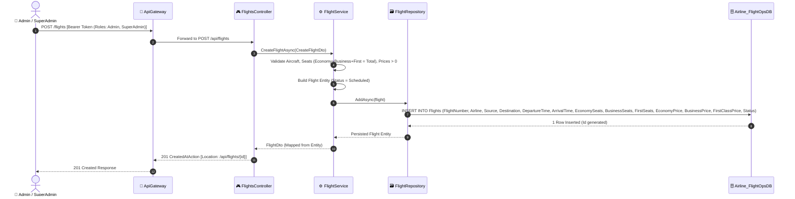

---

### 4.2 Flight Schedule Generation & Inventory Setup

Schedules are concrete departure instances derived from flight templates, managing day-to-day seat inventory.

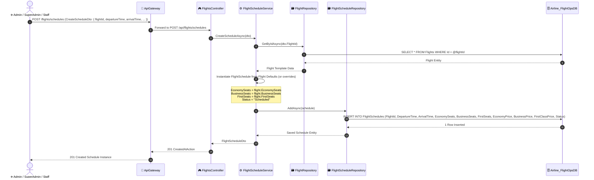

---

### 4.3 Public Flight Search & Schedule Query Flow

Passengers and Dealers query flight schedules by origin, destination, and departure date without requiring authentication.

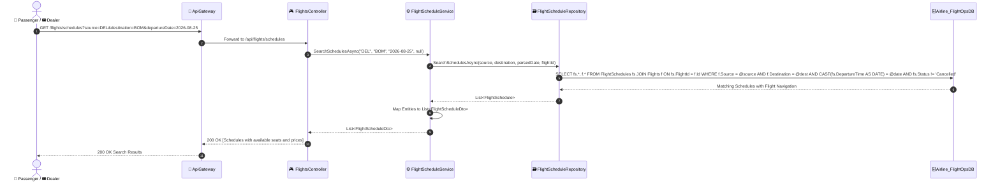

---

### 4.4 Flight Template Modification & Removal

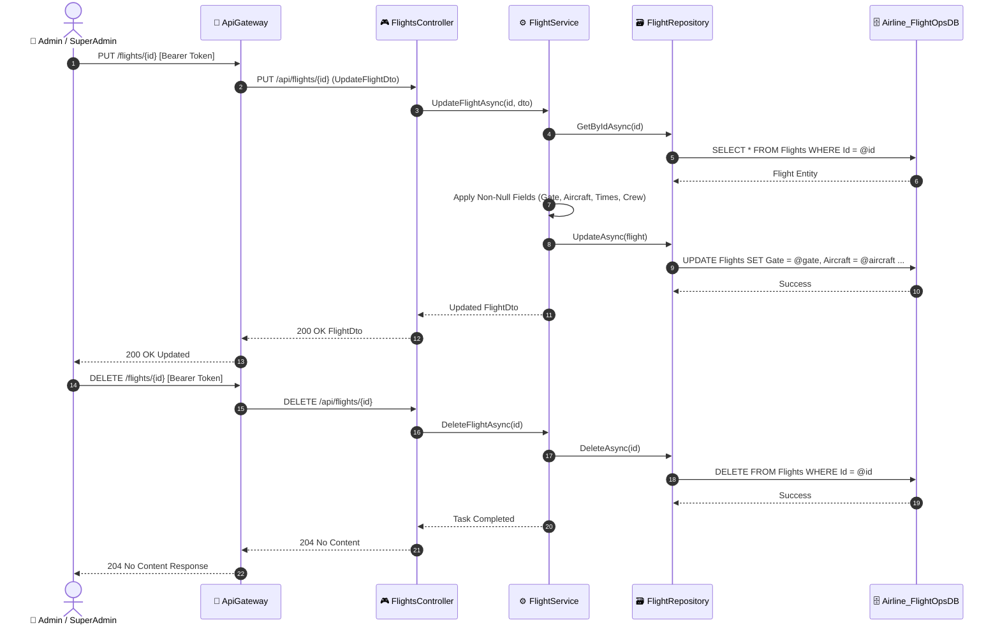

---

## 5. End-to-End Flight Booking Lifecycle

### 5.1 Multi-Passenger Booking Creation, Seat Deduction & PNR Generation

When booking, the system extracts the user identity from JWT claims, verifies seat inventory in-process on the `FlightSchedule` (or `Flight`), deducts seats, generates a unique 6-character PNR, inserts passenger manifest items, and marks the initial state as `Pending` payment.

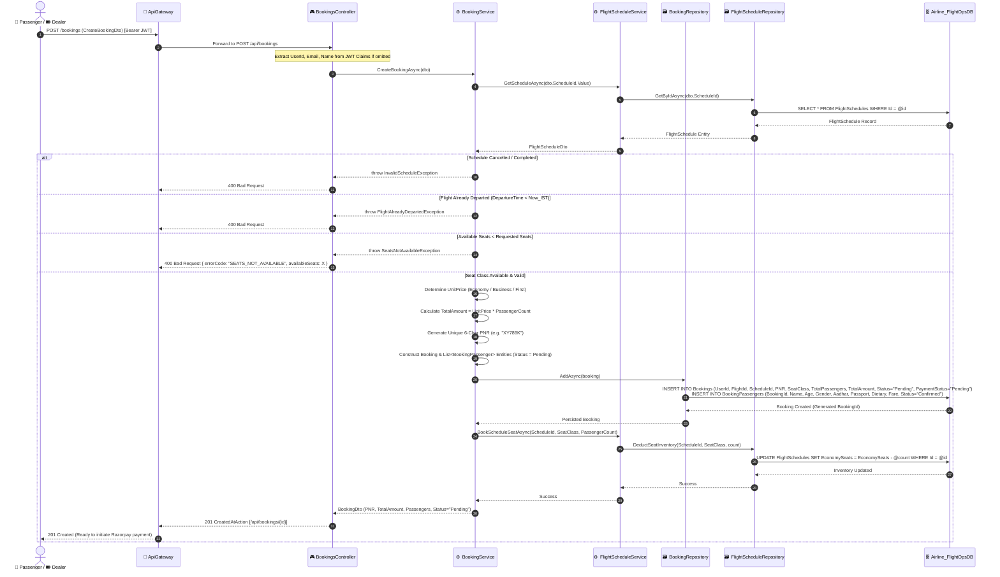

---

### 5.2 Booking Inquiries (By PNR, User History, or Schedule)

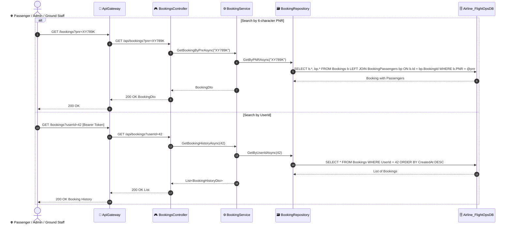

---

### 5.3 Full Booking Cancellation & Dynamic Seat Inventory Release

Cancelling a booking updates the booking status to `Cancelled` and automatically restores the reserved seats to the `FlightSchedule` seat inventory.

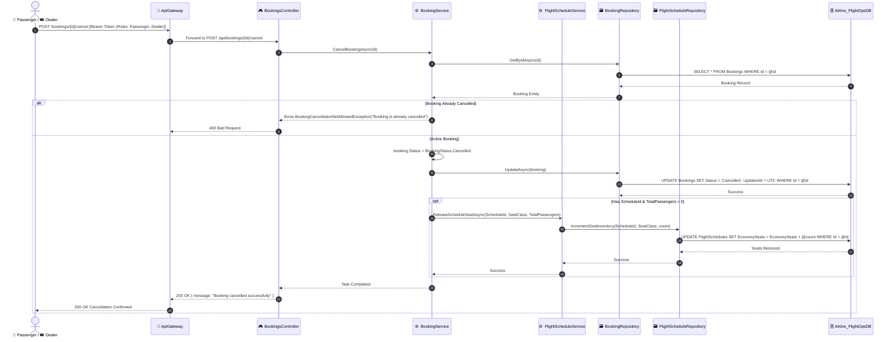

---

### 5.4 Partial Companion Passenger Cancellation

Allows removing an individual companion passenger from a multi-seat booking without cancelling the remaining passengers.

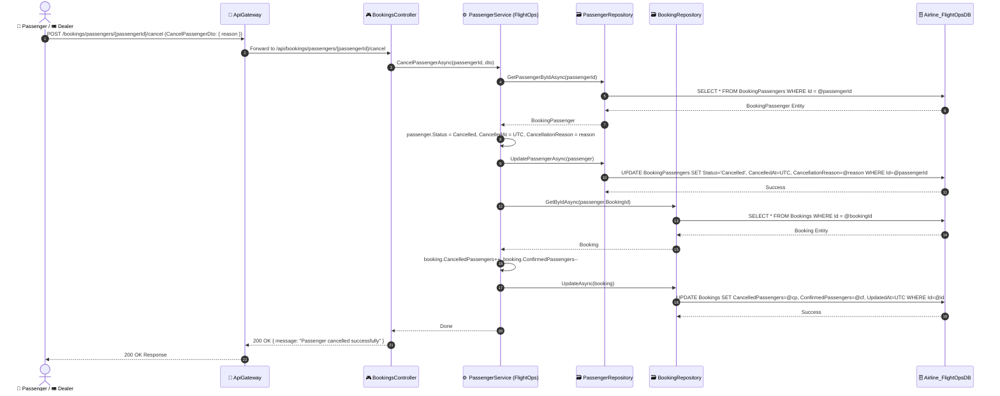

---

## 6. Payment Processing & Razorpay Gateway Integration

### 6.1 Razorpay Order Creation Flow

The frontend initiates payment by asking `PaymentService` to create an official Razorpay Order. `PaymentService` calls `FlightOpsService` to validate the booking's authoritative total amount before communicating with Razorpay.

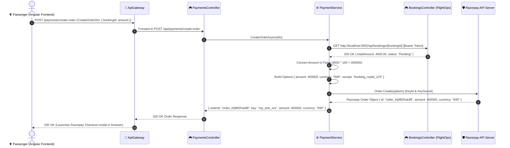

---

### 6.2 Razorpay Signature Verification & Cross-Service Booking Confirmation

After the user completes payment on the Razorpay modal, the frontend sends the checkout signatures for cryptographic verification. Once verified, `PaymentService` notifies `FlightOpsService` via REST to confirm the booking.

```mermaid
sequenceDiagram
    autonumber
    actor Client as 🌐 Passenger (Angular / Razorpay SDK)
    participant Gateway as 🚪 ApiGateway
    participant PaymentCtrl as 🎮 PaymentsController
    participant PaymentSvc as ⚙️ PaymentService
    participant PaymentRepo as 🗃️ PaymentRepository
    participant DB_Pay as 🗄️ Airline_PaymentDB
    participant FlightOpsCtrl as 🎮 BookingsController (FlightOps)
    participant BookingRepo as 🗃️ BookingRepository (FlightOps)
    participant DB_Flight as 🗄️ Airline_FlightOpsDB

    Note over Client: User completes payment on Razorpay modal.<br/>Receives payment_id, order_id, signature.
    
    Client->>Gateway: POST /payments/verify-signature (VerifySignatureDto: { bookingId, amount, razorpayOrderId, razorpayPaymentId, razorpaySignature })
    Gateway->>PaymentCtrl: Forward to POST /api/payments/verify-signature
    PaymentCtrl->>PaymentSvc: VerifySignatureAsync(dto)
    
    %% HMAC-SHA256 Signature Verification
    PaymentSvc->>PaymentSvc: Compute HMAC-SHA256(payload = orderId + "|" + paymentId, secret = KeySecret)
    PaymentSvc->>PaymentSvc: Compare computed signature with dto.RazorpaySignature
    
    alt Signature Mismatch
        PaymentSvc-->>PaymentCtrl: throw InvalidOperationException("Signature mismatch")
        PaymentCtrl-->>Gateway: 400 Bad Request { message: "Invalid RazorPay Signature. Payment Failed." }
        Gateway-->>Client: 400 Bad Request
    else Signature Valid
        %% Persist Payment Record
        PaymentSvc->>PaymentRepo: AddAsync(Payment: { BookingId, Amount, PaymentMethod="RazorPay", TransactionId=paymentId, Status="Success" })
        PaymentRepo->>DB_Pay: INSERT INTO Payments (BookingId, Amount, PaymentMethod, TransactionId, Status, CreatedAt)
        DB_Pay-->>PaymentRepo: Payment Record Saved
        PaymentRepo-->>PaymentSvc: Saved Payment Entity
        
        %% Inter-Service Call to Confirm Booking
        PaymentSvc->>FlightOpsCtrl: POST http://localhost:5002/api/bookings/{bookingId}/confirm-payment?transactionId={paymentId}&paymentMethod=RazorPay [Bearer Token]
        
        FlightOpsCtrl->>BookingRepo: GetByIdAsync(bookingId)
        BookingRepo->>DB_Flight: SELECT * FROM Bookings WHERE Id = @bookingId
        DB_Flight-->>BookingRepo: Booking Record
        BookingRepo-->>FlightOpsCtrl: Booking Entity
        
        FlightOpsCtrl->>BookingRepo: Update Booking (Status = "Confirmed", PaymentStatus = "Success")
        BookingRepo->>DB_Flight: UPDATE Bookings SET Status = 'Confirmed', PaymentStatus = 'Success', UpdatedAt = UTC WHERE Id = @bookingId
        DB_Flight-->>BookingRepo: Success
        FlightOpsCtrl-->>PaymentSvc: 200 OK { message: "Booking payment confirmed successfully", status: "Confirmed" }
        
        PaymentSvc-->>PaymentCtrl: PaymentDto { Id, BookingId, Amount, Status="Success", PaymentMethod="RazorPay" }
        PaymentCtrl-->>Gateway: 200 OK PaymentDto
        Gateway-->>Client: 200 OK Payment Confirmed (Redirect to Booking Success Page)
    end
```

---

### 6.3 Direct Payment Processing Workflow

For direct card/UPI simulation endpoints (`POST /api/payments`):

```mermaid
sequenceDiagram
    autonumber
    actor Client as 🌐 Passenger / 🎟️ Dealer
    participant Gateway as 🚪 ApiGateway
    participant PaymentCtrl as 🎮 PaymentsController
    participant PaymentSvc as ⚙️ PaymentService
    participant PaymentRepo as 🗃️ PaymentRepository
    participant DB_Pay as 🗄️ Airline_PaymentDB
    participant FlightOpsCtrl as 🎮 BookingsController (FlightOps)
    participant DB_Flight as 🗄️ Airline_FlightOpsDB

    Client->>Gateway: POST /payments (ProcessPaymentDto: { bookingId, amount, paymentMethod }) [Bearer Token]
    Gateway->>PaymentCtrl: Forward to POST /api/payments
    PaymentCtrl->>PaymentSvc: ProcessPaymentAsync(dto)
    
    PaymentSvc->>FlightOpsCtrl: GET /api/bookings/{bookingId} (Validate Total)
    FlightOpsCtrl-->>PaymentSvc: 200 OK { totalAmount: 3200.00 }
    
    PaymentSvc->>PaymentSvc: Generate Transaction UUID
    PaymentSvc->>PaymentRepo: AddAsync(Payment)
    PaymentRepo->>DB_Pay: INSERT INTO Payments (BookingId, Amount, PaymentMethod, TransactionId, Status="Success")
    DB_Pay-->>PaymentRepo: Success
    
    PaymentSvc->>FlightOpsCtrl: POST /api/bookings/{bookingId}/confirm-payment
    FlightOpsCtrl->>DB_Flight: UPDATE Bookings SET Status = 'Confirmed', PaymentStatus = 'Success'
    DB_Flight-->>FlightOpsCtrl: Success
    FlightOpsCtrl-->>PaymentSvc: 200 OK
    
    PaymentSvc-->>PaymentCtrl: PaymentDto
    PaymentCtrl-->>Gateway: 200 OK PaymentDto
    Gateway-->>Client: 200 OK Direct Payment Successful
```

---

### 6.4 Payment Refund Processing Flow

Authorized Financial Admins and SuperAdmins issue refunds for previously successful payments.

```mermaid
sequenceDiagram
    autonumber
    actor FinAdmin as 💰 Financial Admin / SuperAdmin
    participant Gateway as 🚪 ApiGateway
    participant Controller as 🎮 PaymentsController
    participant Service as ⚙️ PaymentService
    participant Repo as 🗃️ PaymentRepository
    participant DB as 🗄️ Airline_PaymentDB

    FinAdmin->>Gateway: POST /payments/{id}/refund [Bearer Token (Roles: Admin, SuperAdmin, FinancialAdmin)]
    Gateway->>Controller: Forward to POST /api/payments/{id}/refund
    Controller->>Service: RefundAsync(paymentId)
    
    Service->>Repo: GetByIdAsync(paymentId)
    Repo->>DB: SELECT * FROM Payments WHERE Id = @paymentId
    DB-->>Repo: Payment Record
    Repo-->>Service: Payment Entity
    
    alt Payment Record Not Found
        Service-->>Controller: throw KeyNotFoundException("Payment not found")
        Controller-->>Gateway: 404 Not Found
    else Active Payment
        Service->>Service: payment.Status = PaymentStatus.Refunded
        Service->>Repo: UpdateAsync(payment)
        Repo->>DB: UPDATE Payments SET Status = 'Refunded', UpdatedAt = UTC WHERE Id = @paymentId
        DB-->>Repo: Success
        Service-->>Controller: Updated PaymentDto (Status="Refunded")
        Controller-->>Gateway: 200 OK PaymentDto
        Gateway-->>FinAdmin: 200 OK Refund Processed
    end
```

---

## 7. Digital Online Check-In & Boarding Pass Issuance

### 7.1 5-Hour Window Check-In, Seat Assignment & QR Generation

Check-in enforces an IST departure time rule (opens strictly within **5 hours** before departure), generates or assigns the seat number, creates a dynamic Base64 PNG QR code via `QRCoder`, and issues the digital boarding pass.

```mermaid
sequenceDiagram
    autonumber
    actor Passenger as 👤 Passenger / 🏢 Ground Staff
    participant Gateway as 🚪 ApiGateway
    participant Controller as 🎮 CheckInsController
    participant CheckInSvc as ⚙️ CheckInService
    participant QREngine as 📱 QRCoder Engine
    participant Repo as 🗃️ CheckInRepository
    participant DB as 🗄️ Airline_FlightOpsDB

    Passenger->>Gateway: POST /api/checkins?passengerName=John+Doe&flightNumber=AI-202&flightId=5&departureTime=2026-08-20T15:00:00&fare=4500 (OnlineCheckInDto) [Bearer Token]
    Gateway->>Controller: Forward to POST /api/checkins
    Controller->>CheckInSvc: OnlineCheckInAsync(dto, passengerName, flightNumber, flightId, departureTime, fare, token)
    
    %% Rule: 5-Hour Departure Check
    CheckInSvc->>CheckInSvc: Calculate nowIst = DateTime.UtcNow + 5.5 hours
    CheckInSvc->>CheckInSvc: timeUntilDeparture = departureTime - nowIst
    
    alt Time Until Departure > 5 Hours
        CheckInSvc-->>Controller: throw InvalidOperationException("Check-in opens only 5 hours before departure.")
        Controller-->>Gateway: 400 Bad Request { message: "Check-in opens only 5 hours before departure..." }
        Gateway-->>Passenger: 400 Bad Request
    else Flight Already Departed (timeUntilDeparture < 0)
        CheckInSvc-->>Controller: throw InvalidOperationException("Flight has already departed.")
        Controller-->>Gateway: 400 Bad Request
        Gateway-->>Passenger: 400 Bad Request
    else Check-In Window Valid (0 <= hours <= 5)
        CheckInSvc->>Repo: GetByPassengerIdAsync(dto.PassengerId)
        Repo->>DB: SELECT * FROM CheckIns WHERE PassengerId = @passengerId
        DB-->>Repo: null (Not checked in yet)
        Repo-->>CheckInSvc: null
        
        CheckInSvc->>CheckInSvc: Assign Seat (dto.SeatNumber or Generate e.g. "14B")
        
        %% Generate Dynamic QR Code
        CheckInSvc->>QREngine: GenerateQRCode("AI-202-14B")
        QREngine->>QREngine: Create PngByteQRCode (ECCLevel Q)
        QREngine-->>CheckInSvc: Base64 Encoded PNG QR String
        
        CheckInSvc->>CheckInSvc: Construct CheckIn Entity { BoardingPass: "John Doe|AI-202|14B", QRCode: base64, Gate: "TBD", IsCheckedIn: true }
        
        CheckInSvc->>Repo: AddAsync(checkIn)
        Repo->>DB: INSERT INTO CheckIns (BookingId, PassengerId, UserId, FlightId, SeatNumber, Gate, BoardingPass, QRCode, CheckInTime, IsCheckedIn)
        DB-->>Repo: 1 Row Inserted (Id generated)
        Repo-->>CheckInSvc: Persisted CheckIn Entity
        
        CheckInSvc-->>Controller: CheckInDto
        Controller-->>Gateway: 200 OK CheckInDto
        Gateway-->>Passenger: 200 OK (Displays Boarding Pass with Scannable QR Code)
    end
```

---

### 7.2 Fetching Digital Boarding Passes by Booking ID

```mermaid
sequenceDiagram
    autonumber
    actor Passenger as 👤 Passenger / 🏢 Ground Staff
    participant Gateway as 🚪 ApiGateway
    participant Controller as 🎮 CheckInsController
    participant CheckInSvc as ⚙️ CheckInService
    participant Repo as 🗃️ CheckInRepository
    participant DB as 🗄️ Airline_FlightOpsDB

    Passenger->>Gateway: GET /api/checkins?bookingId=123 [Bearer Token]
    Gateway->>Controller: GET /api/checkins?bookingId=123
    Controller->>CheckInSvc: GetBoardingPassesByBookingAsync(123)
    CheckInSvc->>Repo: GetByBookingIdAsync(123)
    Repo->>DB: SELECT * FROM CheckIns WHERE BookingId = 123
    DB-->>Repo: List<CheckIn> Records
    Repo-->>CheckInSvc: List<CheckIn> Entities
    
    CheckInSvc->>CheckInSvc: Parse BoardingPass strings into BoardingPassDto list (PassengerName, FlightNumber, SeatNumber, Gate, QRCode)
    CheckInSvc-->>Controller: List<BoardingPassDto>
    Controller-->>Gateway: 200 OK [Boarding Passes with QR Codes]
    Gateway-->>Passenger: 200 OK Response
```

---

## 8. Asynchronous Background Processing

### 8.1 Autonomous Flight Schedule Auto-Completion Loop

The `ScheduleCompletionWorker` runs as a hosted background service loop every 60 seconds. It identifies flight schedules whose arrival time has elapsed in IST and marks them as `Completed`.

```mermaid
sequenceDiagram
    autonumber
    participant Host as ⚙️ ASP.NET Core Runtime
    participant Worker as ⏱️ ScheduleCompletionWorker (BackgroundService)
    participant ScopeFactory as 🏭 IServiceScopeFactory
    participant ScheduleSvc as ⚙️ FlightScheduleService
    participant Repo as 🗃️ FlightScheduleRepository
    participant DB as 🗄️ Airline_FlightOpsDB

    Host->>Worker: StartAsync(CancellationToken)
    
    loop Every 60 Seconds (While Not Cancelled)
        Worker->>ScopeFactory: CreateScope()
        ScopeFactory-->>Worker: IServiceScope
        
        Worker->>ScheduleSvc: MarkExpiredSchedulesCompletedAsync()
        ScheduleSvc->>Repo: GetExpiredScheduledSchedulesAsync(nowIst)
        Repo->>DB: SELECT * FROM FlightSchedules WHERE Status = 'Scheduled' AND ArrivalTime <= @nowIst
        DB-->>Repo: Expired FlightSchedule Entities
        Repo-->>ScheduleSvc: List<FlightSchedule>
        
        loop For Each Expired Schedule
            ScheduleSvc->>ScheduleSvc: schedule.Status = "Completed"
            ScheduleSvc->>Repo: UpdateAsync(schedule)
            Repo->>DB: UPDATE FlightSchedules SET Status = 'Completed', UpdatedAt = UTC WHERE Id = @schedule.Id
            DB-->>Repo: Success
        end
        
        ScheduleSvc-->>Worker: Completed
        Worker->>Worker: Task.Delay(60000, stoppingToken)
    end
```

---

## 9. Cross-Service Operational & Financial Reporting

### 9.1 Backoffice Booking & Financial Report Aggregation Flow

The Backoffice Service aggregates financial performance, booking velocity, and occupancy metrics across dates by invoking the `FlightOpsService` API securely over internal HTTP.

```mermaid
sequenceDiagram
    autonumber
    actor Admin as 💰 Financial Admin / 👑 SuperAdmin
    participant Gateway as 🚪 ApiGateway
    participant BackofficeCtrl as 🎮 BackofficeController
    participant BackofficeSvc as ⚙️ BackofficeService
    participant Http as 🌐 HttpClient
    participant FlightOpsCtrl as 🎮 BookingsController (FlightOps)
    participant BookingRepo as 🗃️ BookingRepository (FlightOps)
    participant DB_Flight as 🗄️ Airline_FlightOpsDB

    Admin->>Gateway: GET /api/backoffice/booking-report?startDate=2026-08-01&endDate=2026-08-31 [Bearer Token (Roles: SuperAdmin, Admin, HR, FinancialAdmin)]
    Gateway->>BackofficeCtrl: Forward to /api/backoffice/booking-report
    BackofficeCtrl->>BackofficeSvc: GetBookingReportAsync(startDate, endDate)
    
    BackofficeSvc->>Http: GET http://localhost:5002/api/bookings
    Http->>FlightOpsCtrl: GET /api/bookings
    FlightOpsCtrl->>BookingRepo: GetAllAsync()
    BookingRepo->>DB_Flight: SELECT * FROM Bookings
    DB_Flight-->>BookingRepo: All Bookings List
    BookingRepo-->>FlightOpsCtrl: List<Booking>
    FlightOpsCtrl-->>Http: 200 OK [JSON Array of Bookings]
    Http-->>BackofficeSvc: 200 OK Response
    
    BackofficeSvc->>BackofficeSvc: Filter Bookings (CreatedAt >= startDate AND CreatedAt <= endDate)
    BackofficeSvc->>BackofficeSvc: Map to List<BookingReportDto> (Id, PNR, UserEmail, Amount, SeatClass, Status, PaymentStatus, CreatedAt)
    
    BackofficeSvc-->>BackofficeCtrl: IEnumerable<BookingReportDto>
    BackofficeCtrl-->>Gateway: 200 OK Filtered Report Data
    Gateway-->>Admin: 200 OK Financial & Operational Report
```

---

## Summary of Sequence Interaction Coverage

| Feature / Workflow | Primary Initiator | Services & External Components Involved | Outcome / Result |
| :--- | :--- | :--- | :--- |
| **Passenger Registration & OTP** | Public Passenger | `PassengerService`, SQL Server | Profile created (`IsEmailVerified=false`), 6-digit OTP sent via email. |
| **Email OTP Verification** | Passenger | `PassengerService`, `JwtTokenGenerator` | Account activated, signed JWT Bearer token issued. |
| **Backoffice Staff Provisioning** | SuperAdmin / HR | `BackOfficeService`, `PasswordHasher` | Role-based internal staff profile provisioned. |
| **Flight Template & Schedule Creation** | Admin / SuperAdmin | `FlightOpsService`, `Airline_FlightOpsDB` | Catalog template & schedule instances with inventory generated. |
| **Booking Creation & Seat Deduction** | Passenger / Dealer | `FlightOpsService` (In-Process) | Seats deducted, 6-char PNR created, booking set to `Pending`. |
| **Razorpay Order Creation** | Passenger (Frontend) | `PaymentService`, `FlightOpsService`, Razorpay API | Authoritative total validated, order created in paise. |
| **Razorpay Payment Verification** | Passenger (Frontend) | `PaymentService`, `FlightOpsService`, `Razorpay` | HMAC-SHA256 signature verified, booking transitioned to `Confirmed` & `Paid`. |
| **Digital Online Check-In** | Passenger / Ground Staff | `FlightOpsService`, `QRCoder` | 5-hour window verified, seat assigned, Base64 PNG QR boarding pass issued. |
| **Schedule Auto-Completion Worker** | Background Hosted Service | `FlightOpsService`, SQL Server | Departed flight schedules automatically transitioned to `Completed`. |
| **Cross-Service Reporting** | FinancialAdmin / SuperAdmin | `BackOfficeService` $\rightarrow$ `FlightOpsService` | Booking and revenue data aggregated and filtered across date ranges. |
