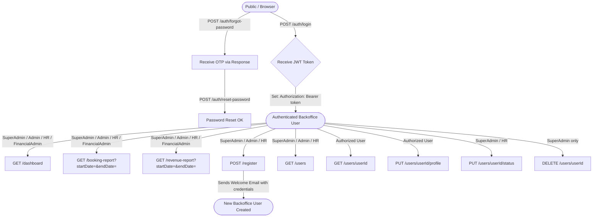

# 🏢 BackOffice Service — Complete API Guide & Workflow Manual

> **SkyPass Airlines · Microservices Architecture**  
> Service: `BackOfficeService` | Port: `5006` (direct) | Gateway: `5000`  
> Database: `Airline_BackOfficeDB` (SQL Server) | JWT Auth: HS256

---

## 📋 Table of Contents

1. [Overview & Prerequisites](#1-overview--prerequisites)
2. [Service Architecture](#2-service-architecture)
3. [Role-Based Access Control (RBAC) Matrix](#3-role-based-access-control-rbac-matrix)
4. [API Groups & Workflow Flowchart](#4-api-groups--workflow-flowchart)
5. [Authentication APIs (Public — No Token Required)](#5-authentication-apis-public--no-token-required)
6. [Dashboard & Reports APIs](#6-dashboard--reports-apis)
7. [User Provisioning & Account Management APIs](#7-user-provisioning--account-management-apis)
8. [Data Models (DTOs)](#8-data-models-dtos)
9. [Error Reference](#9-error-reference)
10. [Default Seeded Credentials](#10-default-seeded-credentials)
11. [Inter-Service Communication](#11-inter-service-communication)

---

## 1. Overview & Prerequisites

The **BackOffice Service** is the administrative backbone of the SkyPass airline management system. It manages:

- **Authentication** for all internal/backoffice roles (SuperAdmin, Admin, HR, FinancialAdmin, Staff, GroundStaff, Dealer)
- **Dashboard reporting** aggregated from FlightOpsService and PassengerService via HTTP
- **User lifecycle management** — provisioning, activation, deactivation, and deletion of all backoffice accounts

### Base URLs

| Access Point | URL |
| :--- | :--- |
| **API Gateway (Recommended)** | `http://localhost:5000` |
| **Direct Service** | `http://localhost:5006` |
| **Swagger UI** | `http://localhost:5006/swagger/index.html` |

### Required Headers (for all protected endpoints)

```http
Authorization: Bearer <your_jwt_token>
Content-Type: application/json
```

> [!NOTE]
> JWT tokens are issued at login with a **60-minute expiry**. Re-authenticate when the token expires.

---

## 2. Service Architecture

```
┌─────────────────────────────────────────────────────────┐
│                  BackOffice Service (:5006)              │
│                                                         │
│  ┌───────────────────┐   ┌───────────────────────────┐  │
│  │ BackofficeAuth    │   │  BackofficeController     │  │
│  │ Controller        │   │  (Dashboard / Reports /   │  │
│  │                   │   │   User Management)        │  │
│  │ POST /auth/login  │   │                           │  │
│  │ POST /auth/forgot │   │  GET  /dashboard          │  │
│  │ POST /auth/reset  │   │  GET  /booking-report     │  │
│  └───────┬───────────┘   │  GET  /revenue-report     │  │
│          │               │  POST /register           │  │
│          ▼               │  GET  /users              │  │
│  ┌───────────────┐       │  GET  /users/{id}         │  │
│  │ BackofficeAuth│       │  PUT  /users/{id}/profile │  │
│  │ Service       │       │  PUT  /users/{id}/status  │  │
│  └───────┬───────┘       │  DEL  /users/{id}         │  │
│          │               └──────────┬────────────────┘  │
│          ▼                          ▼                    │
│  ┌───────────────────────────────────────────────────┐  │
│  │         Airline_BackOfficeDB (SQL Server)          │  │
│  │              BackofficeProfiles table              │  │
│  └───────────────────────────────────────────────────┘  │
│                     HTTP Client (outbound)               │
│          ┌───────────────┼───────────────┐               │
│          ▼               ▼               ▼               │
│  FlightOpsService  PassengerService  PaymentService      │
│    (:5002)           (:5007)           (:5004)           │
└─────────────────────────────────────────────────────────┘
```

---

## 3. Role-Based Access Control (RBAC) Matrix

| HTTP Method | Endpoint | Description | Allowed Roles |
| :--- | :--- | :--- | :--- |
| `POST` | `/api/backoffice/auth/login` | Login & get JWT token | **Public** |
| `POST` | `/api/backoffice/auth/forgot-password` | Request password reset OTP | **Public** |
| `POST` | `/api/backoffice/auth/reset-password` | Reset password using OTP | **Public** |
| `GET` | `/api/backoffice/dashboard` | Live system metrics | `SuperAdmin`, `Admin`, `HR`, `FinancialAdmin` |
| `GET` | `/api/backoffice/booking-report` | Booking report by date range | `SuperAdmin`, `Admin`, `HR`, `FinancialAdmin` |
| `GET` | `/api/backoffice/revenue-report` | Revenue report by date range | `SuperAdmin`, `Admin`, `HR`, `FinancialAdmin` |
| `POST` | `/api/backoffice/register` | Provision a new backoffice user | `SuperAdmin`, `Admin`, `HR` |
| `POST` | `/api/backoffice/users` | Alias for register endpoint | `SuperAdmin`, `Admin`, `HR` |
| `GET` | `/api/backoffice/users` | List all users (optional role filter) | `SuperAdmin`, `Admin`, `HR` |
| `GET` | `/api/backoffice/users/{userId}` | Get user by ID | `SuperAdmin` (any), Others (own profile only) |
| `PUT` | `/api/backoffice/users/{userId}/profile` | Update user profile | `SuperAdmin` (any), Others (own profile only) |
| `PUT` | `/api/backoffice/users/{userId}/status` | Activate / Deactivate user | `SuperAdmin`, `HR` |
| `DELETE` | `/api/backoffice/users/{userId}` | Permanently delete user | `SuperAdmin` **only** |

---

## 4. API Groups & Workflow Flowchart



---

## 5. Authentication APIs (Public — No Token Required)

All authentication endpoints are under the base route: `/api/backoffice/auth`

---

### 5.1 Login

Authenticates a backoffice user by email and password. Returns a signed JWT token along with user details.

| Property | Value |
| :--- | :--- |
| **Method** | `POST` |
| **Route** | `/api/backoffice/auth/login` |
| **Auth** | None (Public) |

#### Request Body

```json
{
  "email": "superadmin@airline.com",
  "password": "admin123"
}
```

#### Success Response — `200 OK`

```json
{
  "userId": 1,
  "email": "superadmin@airline.com",
  "name": "Super Admin",
  "role": "SuperAdmin",
  "token": "eyJhbGciOiJIUzI1NiIsInR5cCI6IkpXVCJ9.eyJzdWIiOiIxIiwiZW1haWwiOiJzdXBlcmFkbWluQGFpcmxpbmUuY29tIiwicm9sZSI6IlN1cGVyQWRtaW4iLCJleHAiOjE3NTM5NzYwMDB9.XXXX"
}
```

#### Error Response — `401 Unauthorized`

```json
{
  "message": "Invalid email or password."
}
```

> [!IMPORTANT]
> The returned `token` must be passed in the `Authorization` header for all protected endpoints:
> ```
> Authorization: Bearer eyJhbGci...
> ```
> Copy this token into Swagger UI's **Authorize** button or Postman's Auth tab.

---

### 5.2 Forgot Password

Generates a 6-digit OTP reset token for the specified email and **returns it directly** in the API response.

| Property | Value |
| :--- | :--- |
| **Method** | `POST` |
| **Route** | `/api/backoffice/auth/forgot-password` |
| **Auth** | None (Public) |

#### Request Body

```json
{
  "email": "superadmin@airline.com"
}
```

#### Success Response — `200 OK`

```json
{
  "message": "Password reset token generated successfully.",
  "resetToken": "472918"
}
```

> [!NOTE]
> The OTP token expires in **15 minutes**. Copy the `resetToken` value and use it immediately in the Reset Password endpoint.

#### Error Response — `400 Bad Request`

```json
{
  "message": "Account not found for the provided email."
}
```

---

### 5.3 Reset Password

Resets the user's password using the OTP token obtained from the Forgot Password endpoint.

| Property | Value |
| :--- | :--- |
| **Method** | `POST` |
| **Route** | `/api/backoffice/auth/reset-password` |
| **Auth** | None (Public) |

#### Request Body

```json
{
  "email": "superadmin@airline.com",
  "token": "472918",
  "newPassword": "NewSecurePassword@123"
}
```

#### Success Response — `200 OK`

```json
{
  "message": "Password reset successfully."
}
```

#### Error Responses

| Status | Body | Cause |
| :--- | :--- | :--- |
| `400` | `{ "message": "Invalid or expired token." }` | OTP mismatch or token expired (> 15 min) |
| `400` | `{ "message": "Account not found." }` | Email does not match any user |

---

## 6. Dashboard & Reports APIs

All analytics endpoints require a valid JWT token from an authorized role.
Base route: `/api/backoffice`

---

### 6.1 Get Dashboard Metrics

Returns a high-level summary of the system: total bookings, total confirmed revenue, active flights count, and total user count.

| Property | Value |
| :--- | :--- |
| **Method** | `GET` |
| **Route** | `/api/backoffice/dashboard` |
| **Auth** | `Bearer <JWT>` |
| **Allowed Roles** | `SuperAdmin`, `Admin`, `HR`, `FinancialAdmin` |

#### Success Response — `200 OK`

```json
{
  "totalBookings": 1548,
  "totalRevenue": 4250300.75,
  "activeFlights": 42,
  "totalUsers": 312
}
```

| Field | Type | Description |
| :--- | :--- | :--- |
| `totalBookings` | `int` | Total count of all bookings across the system |
| `totalRevenue` | `decimal` | Sum of `TotalAmount` for **Confirmed** bookings only |
| `activeFlights` | `int` | Total count of flights from FlightOpsService |
| `totalUsers` | `int` | Backoffice profiles + passenger accounts combined |

> [!NOTE]
> If FlightOpsService or PassengerService is unreachable, those counters default to `0` and a warning is logged. The endpoint **never fails** due to downstream service outages.

---

### 6.2 Get Booking Report

Fetches all bookings from FlightOpsService and filters them by the specified date range.

| Property | Value |
| :--- | :--- |
| **Method** | `GET` |
| **Route** | `/api/backoffice/booking-report` |
| **Auth** | `Bearer <JWT>` |
| **Allowed Roles** | `SuperAdmin`, `Admin`, `HR`, `FinancialAdmin` |

#### Query Parameters

| Parameter | Type | Required | Example |
| :--- | :--- | :--- | :--- |
| `startDate` | `DateTime` (ISO 8601 UTC) | Yes | `2026-08-01T00:00:00Z` |
| `endDate` | `DateTime` (ISO 8601 UTC) | Yes | `2026-08-31T23:59:59Z` |

#### Full Request Example

```
GET /api/backoffice/booking-report?startDate=2026-08-01T00:00:00Z&endDate=2026-08-31T23:59:59Z
Authorization: Bearer eyJhbGci...
```

#### Success Response — `200 OK`

```json
[
  {
    "bookingId": 1001,
    "userId": 501,
    "flightId": 221,
    "status": "Confirmed",
    "createdAt": "2026-08-03T09:15:00Z"
  },
  {
    "bookingId": 1002,
    "userId": 502,
    "flightId": 224,
    "status": "Cancelled",
    "createdAt": "2026-08-07T14:30:00Z"
  }
]
```

| Field | Type | Description |
| :--- | :--- | :--- |
| `bookingId` | `int` | Unique booking identifier |
| `userId` | `int` | Passenger who made the booking |
| `flightId` | `int` | Associated flight |
| `status` | `string` | `Confirmed`, `Cancelled`, `Pending` |
| `createdAt` | `DateTime` | Booking creation timestamp (UTC) |

> [!TIP]
> Use ISO 8601 UTC format (`2026-08-01T00:00:00Z`) for date parameters to avoid timezone parsing errors.

---

### 6.3 Get Revenue Report

Fetches confirmed bookings from FlightOpsService, filters by date range, and groups results by date with daily revenue totals.

| Property | Value |
| :--- | :--- |
| **Method** | `GET` |
| **Route** | `/api/backoffice/revenue-report` |
| **Auth** | `Bearer <JWT>` |
| **Allowed Roles** | `SuperAdmin`, `Admin`, `HR`, `FinancialAdmin` |

#### Query Parameters

| Parameter | Type | Required | Example |
| :--- | :--- | :--- | :--- |
| `startDate` | `DateTime` (ISO 8601 UTC) | Yes | `2026-08-01T00:00:00Z` |
| `endDate` | `DateTime` (ISO 8601 UTC) | Yes | `2026-08-31T23:59:59Z` |

#### Full Request Example

```
GET /api/backoffice/revenue-report?startDate=2026-08-01T00:00:00Z&endDate=2026-08-31T23:59:59Z
Authorization: Bearer eyJhbGci...
```

#### Success Response — `200 OK`

```json
[
  {
    "date": "2026-08-01T00:00:00Z",
    "revenue": 125000.50,
    "bookingCount": 18
  },
  {
    "date": "2026-08-02T00:00:00Z",
    "revenue": 98450.00,
    "bookingCount": 14
  },
  {
    "date": "2026-08-03T00:00:00Z",
    "revenue": 203200.75,
    "bookingCount": 29
  }
]
```

| Field | Type | Description |
| :--- | :--- | :--- |
| `date` | `DateTime` | The date (truncated to midnight) |
| `revenue` | `decimal` | Sum of `TotalAmount` for confirmed bookings on that day |
| `bookingCount` | `int` | Count of confirmed bookings on that day |

> [!NOTE]
> Only **Confirmed** bookings contribute to revenue. Cancelled, Pending, and other statuses are excluded.

---

## 7. User Provisioning & Account Management APIs

Base route: `/api/backoffice`

---

### 7.1 Provision / Register a New User

Creates a new backoffice staff account. When provisioned by an authorized admin, the account is **auto-verified** (no OTP required). A welcome email with the temporary credentials is sent to the new user.

| Property | Value |
| :--- | :--- |
| **Method** | `POST` |
| **Routes** | `/api/backoffice/register` *(or alias)* `/api/backoffice/users` |
| **Auth** | `Bearer <JWT>` |
| **Allowed Roles** | `SuperAdmin`, `Admin`, `HR` |

#### Request Body

```json
{
  "name": "Sarah Connor",
  "email": "sarah.hr@skypass.com",
  "password": "TempPassword@123",
  "department": "Human Resources",
  "roleTitle": "HR Manager",
  "assignedAirportCode": "DEL",
  "role": "HR"
}
```

#### Request Body Field Reference

| Field | Type | Required | Default | Notes |
| :--- | :--- | :--- | :--- | :--- |
| `name` | `string` | Yes | — | Full name (split into FirstName/LastName internally) |
| `email` | `string` | Yes | — | Must be unique in the system |
| `password` | `string` | Yes | — | Temporary password; user should change immediately |
| `department` | `string?` | No | `""` | e.g., `"Human Resources"`, `"Finance"` |
| `roleTitle` | `string?` | No | `""` | e.g., `"HR Manager"`, `"Financial Controller"` |
| `assignedAirportCode` | `string?` | No | `""` | IATA airport code, e.g., `"DEL"`, `"BOM"` |
| `role` | `string?` | No | `"Staff"` | See valid roles below |

#### Valid Role Values

| Role | Description |
| :--- | :--- |
| `SuperAdmin` | Full system access |
| `Admin` | Administrative access |
| `HR` | Human Resources operations |
| `FinancialAdmin` | Financial reporting & analytics |
| `Staff` | General airline staff |
| `GroundStaff` | Airport ground operations |
| `Dealer` | Third-party dealer / agent |

> [!IMPORTANT]
> `ProvisionedByAdmin` is **automatically set to `true`** by the controller. Do NOT send this field in the request. This flag ensures the account is auto-verified and a welcome email with credentials is dispatched.

#### Success Response — `200 OK`

```json
{
  "message": "User registered successfully."
}
```

#### Error Response — `400 Bad Request`

```json
{
  "message": "Email already registered and verified."
}
```

---

### 7.2 Get All Users (with Role Filter)

Retrieves all backoffice user accounts. Optionally filters results by one or more roles.

| Property | Value |
| :--- | :--- |
| **Method** | `GET` |
| **Route** | `/api/backoffice/users` |
| **Auth** | `Bearer <JWT>` |
| **Allowed Roles** | `SuperAdmin`, `Admin`, `HR` |

#### Query Parameters

| Parameter | Type | Required | Example |
| :--- | :--- | :--- | :--- |
| `roles` | `string` (comma-separated) | No | `Admin,HR` |

#### Usage Examples

```
GET /api/backoffice/users                    → all users
GET /api/backoffice/users?roles=HR           → HR users only
GET /api/backoffice/users?roles=Admin,HR     → Admin and HR users
GET /api/backoffice/users?roles=Dealer       → Dealer users only
```

#### Success Response — `200 OK`

```json
[
  {
    "id": 1,
    "email": "superadmin@airline.com",
    "name": "Super Admin",
    "firstName": "Super",
    "lastName": "Admin",
    "role": "SuperAdmin",
    "department": "Technology",
    "roleTitle": "System SuperAdmin",
    "assignedAirportCode": "",
    "phoneNumber": null,
    "dateOfBirth": null,
    "aadharNumber": null,
    "gender": null,
    "nationality": null,
    "passportNumber": null,
    "isEmailVerified": true,
    "isActive": true,
    "isProfileComplete": false,
    "hasChangedPassword": false,
    "createdAt": "2026-08-12T06:00:00Z",
    "updatedAt": null
  },
  {
    "id": 2,
    "email": "sarah.hr@skypass.com",
    "name": "Sarah Connor",
    "firstName": "Sarah",
    "lastName": "Connor",
    "role": "HR",
    "department": "Human Resources",
    "roleTitle": "HR Manager",
    "assignedAirportCode": "DEL",
    "phoneNumber": null,
    "dateOfBirth": null,
    "aadharNumber": null,
    "gender": null,
    "nationality": null,
    "passportNumber": null,
    "isEmailVerified": true,
    "isActive": true,
    "isProfileComplete": false,
    "hasChangedPassword": false,
    "createdAt": "2026-08-12T09:42:00Z",
    "updatedAt": null
  }
]
```

---

### 7.3 Get User by ID

Returns a single backoffice user's full profile. Users can view **their own profile**; SuperAdmins / Admins / HR can view **anyone's profile**.

| Property | Value |
| :--- | :--- |
| **Method** | `GET` |
| **Route** | `/api/backoffice/users/{userId}` |
| **Auth** | `Bearer <JWT>` |
| **Allowed Roles** | Any authenticated user (own profile), `SuperAdmin` / `Admin` / `HR` (any profile) |

#### Path Parameter

| Parameter | Type | Required | Example |
| :--- | :--- | :--- | :--- |
| `userId` | `int` | Yes | `2` |

#### Full Request Example

```
GET /api/backoffice/users/2
Authorization: Bearer eyJhbGci...
```

#### Success Response — `200 OK`

```json
{
  "id": 2,
  "email": "sarah.hr@skypass.com",
  "name": "Sarah Connor",
  "firstName": "Sarah",
  "lastName": "Connor",
  "role": "HR",
  "department": "Human Resources",
  "roleTitle": "HR Manager",
  "assignedAirportCode": "DEL",
  "phoneNumber": "+91-9876543210",
  "dateOfBirth": "1990-05-15T00:00:00Z",
  "aadharNumber": "1234-5678-9012",
  "gender": "Female",
  "nationality": "Indian",
  "passportNumber": "P1234567",
  "isEmailVerified": true,
  "isActive": true,
  "isProfileComplete": true,
  "hasChangedPassword": true,
  "createdAt": "2026-08-12T09:42:00Z",
  "updatedAt": "2026-08-12T11:00:00Z"
}
```

#### Error Responses

| Status | Body | Cause |
| :--- | :--- | :--- |
| `404` | `{ "message": "User not found" }` | `userId` does not exist |
| `403` | *(empty)* | Trying to access another user's profile without elevated role |

---

### 7.4 Update User Profile

Updates profile fields for a specific backoffice user. The `isProfileComplete` flag is automatically set to `true` when all required personal fields (phone, DOB, Aadhar, gender, nationality, passport) are filled.

| Property | Value |
| :--- | :--- |
| **Method** | `PUT` |
| **Route** | `/api/backoffice/users/{userId}/profile` |
| **Auth** | `Bearer <JWT>` |
| **Allowed Roles** | Any authenticated user (own profile), `SuperAdmin` / `Admin` / `HR` (any profile) |

#### Path Parameter

| Parameter | Type | Required | Example |
| :--- | :--- | :--- | :--- |
| `userId` | `int` | Yes | `2` |

#### Request Body

```json
{
  "name": "Sarah M. Connor",
  "email": "sarah.hr@skypass.com",
  "department": "Human Resources",
  "roleTitle": "Senior HR Manager",
  "assignedAirportCode": "BOM",
  "phoneNumber": "+91-9876543210",
  "dateOfBirth": "1990-05-15T00:00:00Z",
  "aadharNumber": "1234-5678-9012",
  "gender": "Female",
  "nationality": "Indian",
  "passportNumber": "P1234567"
}
```

#### Request Body Field Reference

| Field | Type | Required | Notes |
| :--- | :--- | :--- | :--- |
| `name` | `string` | Yes | Full display name |
| `email` | `string` | Yes | Updated email |
| `department` | `string?` | No | Retains existing value if `null` |
| `roleTitle` | `string?` | No | Job title in the department |
| `assignedAirportCode` | `string?` | No | IATA airport code |
| `phoneNumber` | `string?` | No | Required to mark profile complete |
| `dateOfBirth` | `DateTime?` | No | Required to mark profile complete |
| `aadharNumber` | `string?` | No | Required to mark profile complete |
| `gender` | `string?` | No | Required to mark profile complete |
| `nationality` | `string?` | No | Required to mark profile complete |
| `passportNumber` | `string?` | No | Required to mark profile complete |

#### Success Response — `200 OK`

Returns the updated `BackofficeProfile` object (same structure as the GET response), with `isProfileComplete: true` if all personal fields are filled.

---

### 7.5 Activate or Deactivate User

Toggles the `isActive` status of a user account. Deactivated accounts cannot log in — login returns `401 "Account is deactivated."`.

| Property | Value |
| :--- | :--- |
| **Method** | `PUT` |
| **Route** | `/api/backoffice/users/{userId}/status` |
| **Auth** | `Bearer <JWT>` |
| **Allowed Roles** | `SuperAdmin`, `HR` |

#### Path Parameter

| Parameter | Type | Required | Example |
| :--- | :--- | :--- | :--- |
| `userId` | `int` | Yes | `2` |

#### Request Body — Deactivate

```json
{
  "isActive": false
}
```

#### Request Body — Reactivate

```json
{
  "isActive": true
}
```

#### Success Response — `200 OK`

```json
{
  "message": "Status updated"
}
```

---

### 7.6 Delete User

Permanently removes a backoffice user profile from the database. **This operation is irreversible.**

| Property | Value |
| :--- | :--- |
| **Method** | `DELETE` |
| **Route** | `/api/backoffice/users/{userId}` |
| **Auth** | `Bearer <JWT>` |
| **Allowed Roles** | `SuperAdmin` **only** |

#### Path Parameter

| Parameter | Type | Required | Example |
| :--- | :--- | :--- | :--- |
| `userId` | `int` | Yes | `2` |

#### Full Request Example

```
DELETE /api/backoffice/users/2
Authorization: Bearer eyJhbGci...
```

#### Success Response — `200 OK`

```json
{
  "message": "User deleted"
}
```

> [!CAUTION]
> User deletion is **permanent** — there is no soft-delete or recycle bin. Use the **Deactivate** endpoint (`PUT /users/{userId}/status` with `isActive: false`) if you want to suspend access without losing the account record.

---

## 8. Data Models (DTOs)

### BackofficeLoginDto

| Field | Type | Required |
| :--- | :--- | :--- |
| `email` | `string` | Yes |
| `password` | `string` | Yes |

### BackofficeRegisterDto

| Field | Type | Required | Default |
| :--- | :--- | :--- | :--- |
| `name` | `string` | Yes | — |
| `email` | `string` | Yes | — |
| `password` | `string` | Yes | — |
| `department` | `string?` | No | `""` |
| `roleTitle` | `string?` | No | `""` |
| `assignedAirportCode` | `string?` | No | `""` |
| `role` | `string?` | No | `"Staff"` |

### BackofficeForgotPasswordDto

| Field | Type | Required |
| :--- | :--- | :--- |
| `email` | `string` | Yes |

### BackofficeResetPasswordDto

| Field | Type | Required |
| :--- | :--- | :--- |
| `email` | `string` | Yes |
| `token` | `string` | Yes — 6-digit OTP |
| `newPassword` | `string` | Yes |

### BackofficeAuthResponseDto *(Login response)*

| Field | Type | Notes |
| :--- | :--- | :--- |
| `userId` | `int` | User ID in BackofficeProfiles |
| `email` | `string` | User's email |
| `name` | `string` | User's display name |
| `role` | `string` | Assigned role |
| `token` | `string` | JWT Bearer token (60-min expiry) |

### BackofficeUpdateProfileDto

| Field | Type | Required |
| :--- | :--- | :--- |
| `name` | `string` | Yes |
| `email` | `string` | Yes |
| `department` | `string?` | No |
| `roleTitle` | `string?` | No |
| `assignedAirportCode` | `string?` | No |
| `phoneNumber` | `string?` | No |
| `dateOfBirth` | `DateTime?` | No |
| `aadharNumber` | `string?` | No |
| `gender` | `string?` | No |
| `nationality` | `string?` | No |
| `passportNumber` | `string?` | No |

### BackofficeUpdateStatusDto

| Field | Type | Required |
| :--- | :--- | :--- |
| `isActive` | `bool` | Yes — `true` = Activate, `false` = Deactivate |

### DashboardDto *(Response only)*

| Field | Type | Description |
| :--- | :--- | :--- |
| `totalBookings` | `int` | All bookings |
| `totalRevenue` | `decimal` | Confirmed bookings sum |
| `activeFlights` | `int` | Active flight count |
| `totalUsers` | `int` | Backoffice + passenger count |

### BookingReportDto *(Response only)*

| Field | Type | Description |
| :--- | :--- | :--- |
| `bookingId` | `int` | Booking ID |
| `userId` | `int` | Passenger user ID |
| `flightId` | `int` | Flight ID |
| `status` | `string` | Confirmed / Cancelled / Pending |
| `createdAt` | `DateTime` | Booking creation timestamp (UTC) |

### RevenueReportDto *(Response only)*

| Field | Type | Description |
| :--- | :--- | :--- |
| `date` | `DateTime` | Day (midnight UTC) |
| `revenue` | `decimal` | Total confirmed revenue that day |
| `bookingCount` | `int` | Confirmed bookings that day |

---

## 9. Error Reference

| HTTP Status | Scenario | Response Body |
| :--- | :--- | :--- |
| `200 OK` | Request processed successfully | Success body as documented |
| `400 Bad Request` | Register with duplicate email | `{ "message": "Email already registered and verified." }` |
| `400 Bad Request` | Forgot/Reset password — email not found | `{ "message": "Account not found." }` |
| `400 Bad Request` | Reset password — OTP wrong or expired | `{ "message": "Invalid or expired token." }` |
| `401 Unauthorized` | Wrong login credentials | `{ "message": "Invalid email or password." }` |
| `401 Unauthorized` | Email not verified | `{ "message": "Please verify your email." }` |
| `401 Unauthorized` | Account deactivated | `{ "message": "Account is deactivated." }` |
| `401 Unauthorized` | No or invalid Bearer token on protected endpoint | ASP.NET standard 401 body |
| `403 Forbidden` | Insufficient role for that endpoint | Empty body (ASP.NET Forbid) |
| `404 Not Found` | `userId` does not exist | `{ "message": "User not found" }` |

---

## 10. Default Seeded Credentials

On first startup, `DbInitializer` seeds a default **SuperAdmin** account automatically. **This password is reset to the default on every application startup.**

| Field | Value |
| :--- | :--- |
| **Email** | `superadmin@airline.com` |
| **Password** | `admin123` |
| **Role** | `SuperAdmin` |
| **Department** | `Technology` |
| **Role Title** | `System SuperAdmin` |

> [!WARNING]
> The seeder **resets the password to `admin123` on every startup** — this is intentional for development but must be disabled before production. Comment out or remove the password reset block in `DbInitializer.cs` before deploying to production environments.

---

## 11. Inter-Service Communication

The BackOffice Service calls other microservices over HTTP to aggregate dashboard and report data.

| Downstream Service | Base URL (configurable) | Endpoint Called | Purpose |
| :--- | :--- | :--- | :--- |
| **FlightOpsService** | `http://localhost:5002` | `GET /api/bookings` | Booking count, revenue, booking report |
| **FlightOpsService** | `http://localhost:5002` | `GET /api/flights` | Active flight count |
| **PassengerService** | `http://localhost:5007` | `GET /api/auth/users` | Passenger account count |

### Resilience Behaviour

- Each inter-service HTTP call is wrapped in a `try/catch` block.
- If a downstream service is **unreachable**, the corresponding dashboard field defaults to `0` and a `[Warning]` is written to the Serilog log.
- The dashboard endpoint **never returns a failure** due to downstream service outages — it returns partial data with whatever is available.

### Configuration (`appsettings.json`)

```json
{
  "ServiceUrls": {
    "FlightOpsService": "http://localhost:5002",
    "PassengerAuth": "http://localhost:5007"
  },
  "JwtSettings": {
    "Key": "ThisIsA256BitSecretKeyForAirlineProject123456",
    "Issuer": "AirlineIdentityService",
    "Audience": "AirlineManagementSystem",
    "ExpirationMinutes": 60
  },
  "EmailSettings": {
    "SmtpServer": "smtp.gmail.com",
    "SmtpPort": 587,
    "SenderEmail": "sagarsandeep365@gmail.com",
    "SenderName": "SkyPass Airlines"
  }
}
```

> [!TIP]
> Update the `ServiceUrls` in `appsettings.json` when deploying to Docker/Kubernetes to point to the correct container hostnames (e.g., `http://flightops-service:5002`).

---

*Generated from BackOfficeService source on 2026-08-12.*  
*Source: [BackofficeAuthController.cs](file:///c:/Users/sagar/Desktop/CAP_PROJ/Services/BackOfficeService/Controllers/BackofficeAuthController.cs) · [BackofficeController.cs](file:///c:/Users/sagar/Desktop/CAP_PROJ/Services/BackOfficeService/Controllers/BackofficeController.cs) · [BackofficeAuthService.cs](file:///c:/Users/sagar/Desktop/CAP_PROJ/Services/BackOfficeService/Services/implementations/BackofficeAuthService.cs)*
