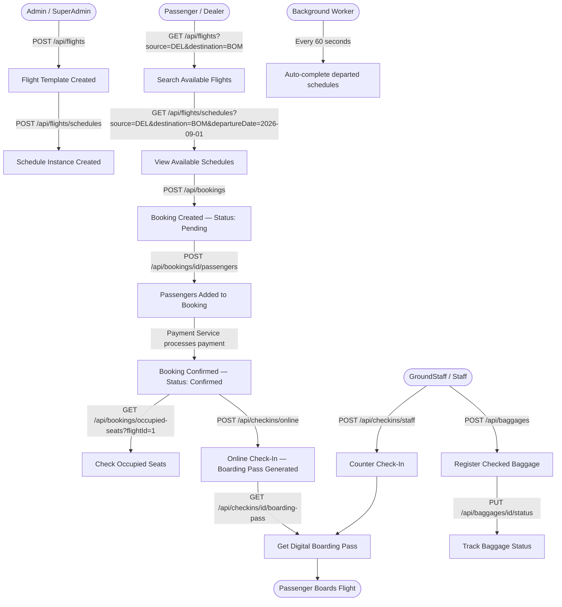

# ✈️ FlightOps Service — Complete API Guide & Workflow Manual

> **SkyPass Airlines · Microservices Architecture**  
> Service: `FlightOpsService` | Port: `5002` (direct) | Gateway: `5000`  
> Database: `Airline_FlightOpsDB` (SQL Server) | JWT Auth: HS256

---

## 📋 Table of Contents

1. [Overview & Prerequisites](#1-overview--prerequisites)
2. [Domain Architecture](#2-domain-architecture)
3. [Role-Based Access Control (RBAC) Matrix](#3-role-based-access-control-rbac-matrix)
4. [End-to-End Workflow Flowchart](#4-end-to-end-workflow-flowchart)
5. [Flights API](#5-flights-api)
   - [5.1 Get All Flights / Search Flights](#51-get-all-flights--search-flights)
   - [5.2 Get Flight by ID](#52-get-flight-by-id)
   - [5.3 Create Flight](#53-create-flight)
   - [5.4 Update Flight](#54-update-flight)
   - [5.5 Delete Flight](#55-delete-flight)
   - [5.6 Book Seat on Flight Template (Internal)](#56-book-seat-on-flight-template-internal)
6. [Schedules API](#6-schedules-api)
   - [6.1 Get All Schedules / Search Schedules](#61-get-all-schedules--search-schedules)
   - [6.2 Create Schedule](#62-create-schedule)
   - [6.3 Book Seat on Schedule (Internal)](#63-book-seat-on-schedule-internal)
7. [Bookings API](#7-bookings-api)
   - [7.1 Get Bookings (with Filters)](#71-get-bookings-with-filters)
   - [7.2 Get Booking by ID](#72-get-booking-by-id)
   - [7.3 Create Booking](#73-create-booking)
   - [7.4 Cancel Booking](#74-cancel-booking)
   - [7.5 Delete Booking](#75-delete-booking)
   - [7.6 Get Occupied Seats](#76-get-occupied-seats)
8. [Passengers API (Nested Under Bookings)](#8-passengers-api-nested-under-bookings)
   - [8.1 Add Passengers to Booking](#81-add-passengers-to-booking)
   - [8.2 Get Passengers for a Booking](#82-get-passengers-for-a-booking)
   - [8.3 Cancel Individual Passenger](#83-cancel-individual-passenger)
9. [Check-In API](#9-check-in-api)
   - [9.1 Get All Check-Ins / Get by Booking](#91-get-all-check-ins--get-by-booking)
   - [9.2 Get Check-In by ID](#92-get-check-in-by-id)
   - [9.3 Get Boarding Pass](#93-get-boarding-pass)
   - [9.4 Online Self-Service Check-In](#94-online-self-service-check-in)
   - [9.5 Staff Airport Check-In](#95-staff-airport-check-in)
10. [Baggage API](#10-baggage-api)
    - [10.1 Get All Baggage / Track / Filter by Booking](#101-get-all-baggage--track--filter-by-booking)
    - [10.2 Get Baggage by ID](#102-get-baggage-by-id)
    - [10.3 Register New Baggage](#103-register-new-baggage)
    - [10.4 Update Baggage Status](#104-update-baggage-status)
11. [Data Models (DTOs)](#11-data-models-dtos)
12. [Status Enumerations & State Machines](#12-status-enumerations--state-machines)
13. [Error Reference](#13-error-reference)
14. [Background Worker](#14-background-worker)

---

## 1. Overview & Prerequisites

The **FlightOps Service** is the operational core of SkyPass — it manages the complete lifecycle of flights from creation to departure, passenger bookings, check-ins, and baggage tracking.

### Base URLs

| Access Point | URL |
| :--- | :--- |
| **API Gateway (Recommended)** | `http://localhost:5000` |
| **Direct Service** | `http://localhost:5002` |
| **Swagger UI** | `http://localhost:5002/swagger/index.html` |
| **Database** | `Airline_FlightOpsDB` (SQL Server) |

### Required Headers (for protected endpoints)

```http
Authorization: Bearer <your_jwt_token>
Content-Type: application/json
```

> [!NOTE]
> JWT tokens expire after **60 minutes**. Obtain a fresh token from BackOffice (`/api/backoffice/auth/login`) or Passenger Service before calling protected endpoints.

---

## 2. Domain Architecture

```
┌─────────────────────────────────────────────────────────────────┐
│                    FlightOps Service (:5002)                     │
│                                                                  │
│  ┌──────────────────┐  ┌───────────────────┐                     │
│  │  FlightsController│  │ BookingsController │                    │
│  │                  │  │                   │                     │
│  │ GET  /flights    │  │ GET  /bookings    │                     │
│  │ POST /flights    │  │ POST /bookings    │                     │
│  │ PUT  /flights/id │  │ POST /bookings/id/cancel               │
│  │ DEL  /flights/id │  │ DEL  /bookings/id │                     │
│  │ GET  /flights/   │  │ GET  /bookings/   │                     │
│  │    schedules     │  │    occupied-seats │                     │
│  │ POST /flights/   │  │ POST /bookings/id/│                     │
│  │    schedules     │  │    passengers     │                     │
│  └────────┬─────────┘  └────────┬──────────┘                    │
│           │                     │                                │
│  ┌────────▼──────────────────────▼────────────────────────────┐  │
│  │                    Service Layer                           │  │
│  │  FlightService │ FlightScheduleService │ BookingService    │  │
│  │  PassengerService │ CheckInService │ BaggageService        │  │
│  └──────────────────────────┬─────────────────────────────────┘  │
│                             │                                    │
│  ┌──────────────────────────▼─────────────────────────────────┐  │
│  │            Airline_FlightOpsDB (SQL Server)                │  │
│  │  Flights | FlightSchedules | Bookings | BookingPassengers  │  │
│  │          | CheckIns | Baggages                             │  │
│  └────────────────────────────────────────────────────────────┘  │
│                                                                  │
│  ┌──────────────────┐  ┌───────────────────────────────────┐     │
│  │ CheckInsController│  │       BaggagesController          │     │
│  │ GET  /checkins   │  │ GET  /baggages                    │     │
│  │ POST /checkins/  │  │ POST /baggages                    │     │
│  │    online        │  │ PUT  /baggages/id/status          │     │
│  │ POST /checkins/  │  └───────────────────────────────────┘     │
│  │    staff         │                                            │
│  └──────────────────┘                                            │
│                                                                  │
│  ── Background Worker ──────────────────────────────────────────  │
│  ScheduleCompletionWorker  (runs every 60 seconds)               │
│  Auto-marks departed schedules as "Completed"                    │
└─────────────────────────────────────────────────────────────────┘
```

---

## 3. Role-Based Access Control (RBAC) Matrix

### Flights & Schedules

| Method | Endpoint | Description | Allowed Roles |
| :--- | :--- | :--- | :--- |
| `GET` | `/api/flights` | Get/Search all flights | **Public** |
| `GET` | `/api/flights/{id}` | Get flight by ID | **Public** |
| `POST` | `/api/flights` | Create a new flight template | `Admin`, `SuperAdmin` |
| `PUT` | `/api/flights/{id}` | Update flight details | `Admin`, `SuperAdmin` |
| `DELETE` | `/api/flights/{id}` | Delete a flight | `Admin`, `SuperAdmin` |
| `POST` | `/api/flights/{id}/book-seat` | Internal seat booking | **Internal / System** |
| `GET` | `/api/flights/schedules` | Get/Search all schedules | **Public** |
| `POST` | `/api/flights/schedules` | Create a flight schedule | `Admin`, `SuperAdmin`, `Staff` |
| `POST` | `/api/flights/schedules/{id}/book-seat` | Internal seat booking on schedule | **Internal / System** |

### Bookings

| Method | Endpoint | Description | Allowed Roles |
| :--- | :--- | :--- | :--- |
| `GET` | `/api/bookings` | Get all / filter bookings | **Public** |
| `GET` | `/api/bookings/{id}` | Get booking by ID | `Passenger`, `Dealer`, `Admin` |
| `POST` | `/api/bookings` | Create a new booking | `Passenger`, `Dealer` |
| `POST` | `/api/bookings/{id}/cancel` | Cancel a booking | `Passenger`, `Dealer` |
| `DELETE` | `/api/bookings/{id}` | Permanently delete booking | `Passenger`, `Dealer`, `Admin` |
| `GET` | `/api/bookings/occupied-seats` | Get occupied seat numbers | `Passenger`, `Dealer`, `Admin` |
| `POST` | `/api/bookings/{id}/passengers` | Add passengers to booking | `Passenger`, `Dealer` |
| `GET` | `/api/bookings/{id}/passengers` | Get passengers on booking | `Passenger`, `Dealer`, `Admin`, `GroundStaff`, `Staff` |
| `POST` | `/api/bookings/passengers/{id}/cancel` | Cancel individual passenger | `Passenger`, `Dealer` |

### Check-Ins

| Method | Endpoint | Description | Allowed Roles |
| :--- | :--- | :--- | :--- |
| `GET` | `/api/checkins` | Get all check-ins / by bookingId | Any authenticated user |
| `GET` | `/api/checkins/{id}` | Get check-in by ID | `Passenger`, `Admin`, `Staff`, `GroundStaff` |
| `GET` | `/api/checkins/{id}/boarding-pass` | Get digital boarding pass | `Passenger`, `Admin`, `Staff`, `GroundStaff` |
| `POST` | `/api/checkins/online` | Passenger self-service check-in | `Passenger` |
| `POST` | `/api/checkins/staff` | Staff / counter check-in | `Admin`, `GroundStaff`, `Staff` |

### Baggage

| Method | Endpoint | Description | Allowed Roles |
| :--- | :--- | :--- | :--- |
| `GET` | `/api/baggages` | Get all / track / filter by booking | Any authenticated user |
| `GET` | `/api/baggages/{id}` | Get baggage by ID | `GroundStaff`, `Passenger`, `Dealer`, `Staff` |
| `POST` | `/api/baggages` | Register new checked baggage | `GroundStaff`, `Staff` |
| `PUT` | `/api/baggages/{id}/status` | Update baggage status | `GroundStaff`, `Staff` |

---

## 4. End-to-End Workflow Flowchart



---

## 5. Flights API

Base route: `/api/flights`

---

### 5.1 Get All Flights / Search Flights

Returns all flight templates. If any query parameter is provided, performs a filtered search instead.

| Property | Value |
| :--- | :--- |
| **Method** | `GET` |
| **Route** | `/api/flights` |
| **Auth** | None (Public) |

#### Query Parameters (all optional — omit all to get all flights)

| Parameter | Type | Example | Description |
| :--- | :--- | :--- | :--- |
| `source` | `string` | `DEL` | Filter by source airport/city (partial match) |
| `destination` | `string` | `BOM` | Filter by destination airport/city |
| `departureDate` | `string` (YYYY-MM-DD) | `2026-09-01` | Filter by departure date |

#### Usage Examples

```
GET /api/flights                                           → All flights
GET /api/flights?source=DEL&destination=BOM               → Route search
GET /api/flights?source=DEL&destination=BOM&departureDate=2026-09-01  → Full search
```

#### Success Response — `200 OK`

```json
[
  {
    "id": 1,
    "flightNumber": "SP-101",
    "source": "DEL",
    "destination": "BOM",
    "departureTime": "2026-09-01T06:00:00Z",
    "arrivalTime": "2026-09-01T08:15:00Z",
    "gate": "A12",
    "aircraft": "Boeing 737",
    "status": "Scheduled",
    "totalSeats": 180,
    "availableSeats": 130,
    "economySeats": 100,
    "businessSeats": 25,
    "firstSeats": 5,
    "economyPrice": 4500.00,
    "businessPrice": 12000.00,
    "firstClassPrice": 28000.00
  }
]
```

#### Error Response — `400 Bad Request`

```json
{
  "message": "Invalid departureDate format. Please use ISO-8601 (YYYY-MM-DD)."
}
```

---

### 5.2 Get Flight by ID

| Property | Value |
| :--- | :--- |
| **Method** | `GET` |
| **Route** | `/api/flights/{id}` |
| **Auth** | None (Public) |

#### Path Parameter

| Parameter | Type | Example |
| :--- | :--- | :--- |
| `id` | `int` | `1` |

#### Success Response — `200 OK`

Returns a single `FlightDto` object (same structure as above).

#### Error Response — `404 Not Found`

```json
{
  "message": "Flight with ID 99 not found."
}
```

---

### 5.3 Create Flight

Creates a new flight template with seat configuration and pricing. Initial status is set to `Scheduled`.

| Property | Value |
| :--- | :--- |
| **Method** | `POST` |
| **Route** | `/api/flights` |
| **Auth** | `Bearer <JWT>` |
| **Allowed Roles** | `Admin`, `SuperAdmin` |

#### Request Body

```json
{
  "flightNumber": "SP-201",
  "source": "BOM",
  "destination": "BLR",
  "departureTime": "2026-09-05T09:00:00Z",
  "arrivalTime": "2026-09-05T11:00:00Z",
  "aircraft": "Airbus A320",
  "totalSeats": 160,
  "economySeats": 120,
  "businessSeats": 30,
  "firstSeats": 10,
  "economyPrice": 3800.00,
  "businessPrice": 10500.00,
  "firstClassPrice": 25000.00
}
```

#### Request Body Field Reference

| Field | Type | Required | Notes |
| :--- | :--- | :--- | :--- |
| `flightNumber` | `string` | Yes | Unique identifier, e.g., `"SP-201"` |
| `source` | `string` | Yes | Origin airport/city code |
| `destination` | `string` | Yes | Destination airport/city code |
| `departureTime` | `DateTime` (UTC) | Yes | ISO 8601 UTC format |
| `arrivalTime` | `DateTime` (UTC) | Yes | Must be after `departureTime` |
| `aircraft` | `string` | Yes | Aircraft model, e.g., `"Boeing 737"` |
| `totalSeats` | `int` | Yes | Total seat count (should equal Economy + Business + First) |
| `economySeats` | `int` | Yes | Economy class seat count |
| `businessSeats` | `int` | Yes | Business class seat count |
| `firstSeats` | `int` | Yes | First class seat count |
| `economyPrice` | `decimal` | Yes | Economy fare in INR |
| `businessPrice` | `decimal` | Yes | Business fare in INR |
| `firstClassPrice` | `decimal` | Yes | First class fare in INR |

#### Success Response — `201 Created`

Returns the created `FlightDto` object with the newly assigned `id`.

---

### 5.4 Update Flight

Updates operational details of an existing flight. Only non-null fields are updated (partial update semantics).

| Property | Value |
| :--- | :--- |
| **Method** | `PUT` |
| **Route** | `/api/flights/{id}` |
| **Auth** | `Bearer <JWT>` |
| **Allowed Roles** | `Admin`, `SuperAdmin` |

#### Path Parameter

| Parameter | Type | Example |
| :--- | :--- | :--- |
| `id` | `int` | `1` |

#### Request Body

```json
{
  "departureTime": "2026-09-01T07:00:00Z",
  "arrivalTime": "2026-09-01T09:15:00Z",
  "gate": "B5",
  "aircraft": "Boeing 737 MAX",
  "crewAssignment": "Capt. Sharma + 4 crew"
}
```

#### Update Fields Reference

| Field | Type | Notes |
| :--- | :--- | :--- |
| `departureTime` | `DateTime?` | Updated departure (nullable — null = no change) |
| `arrivalTime` | `DateTime?` | Updated arrival |
| `gate` | `string?` | Terminal gate number |
| `aircraft` | `string?` | Aircraft model |
| `crewAssignment` | `string?` | Crew assignment string |

#### Success Response — `200 OK`

Returns the updated `FlightDto` object.

---

### 5.5 Delete Flight

Permanently removes a flight template from the system.

| Property | Value |
| :--- | :--- |
| **Method** | `DELETE` |
| **Route** | `/api/flights/{id}` |
| **Auth** | `Bearer <JWT>` |
| **Allowed Roles** | `Admin`, `SuperAdmin` |

#### Success Response — `204 No Content`

*(empty body)*

#### Error Response — `404 Not Found`

```json
{
  "message": "Flight with ID 99 not found."
}
```

---

### 5.6 Book Seat on Flight Template (Internal)

Reduces the available seat count for a flight template. Called internally by the booking system — not intended for direct frontend use.

| Property | Value |
| :--- | :--- |
| **Method** | `POST` |
| **Route** | `/api/flights/{id}/book-seat` |
| **Auth** | None (Internal) |

#### Request Body

```json
{
  "seatClass": "Economy",
  "count": 2
}
```

| Field | Type | Values |
| :--- | :--- | :--- |
| `seatClass` | `string` | `"Economy"`, `"Business"`, `"First"` |
| `count` | `int` | Number of seats to reserve |

#### Success Response — `200 OK`

```json
{
  "message": "Seat booked successfully"
}
```

---

## 6. Schedules API

A **Flight Schedule** is a specific departure instance of a flight template (e.g., Flight SP-101 on 2026-09-01 is one schedule). Each schedule has its own seat availability and pricing.

Base route: `/api/flights/schedules`

---

### 6.1 Get All Schedules / Search Schedules

Returns all flight schedule instances. Supports the same filtering as the flights endpoint, plus `flightId`.

| Property | Value |
| :--- | :--- |
| **Method** | `GET` |
| **Route** | `/api/flights/schedules` |
| **Auth** | None (Public) |

#### Query Parameters (all optional)

| Parameter | Type | Example | Description |
| :--- | :--- | :--- | :--- |
| `source` | `string` | `DEL` | Filter by source city/airport |
| `destination` | `string` | `BOM` | Filter by destination |
| `departureDate` | `string` (YYYY-MM-DD) | `2026-09-01` | Filter by departure date |
| `flightId` | `int` | `1` | Filter schedules for a specific flight template |

#### Usage Examples

```
GET /api/flights/schedules                                          → All schedules
GET /api/flights/schedules?source=DEL&destination=BOM              → Route filter
GET /api/flights/schedules?departureDate=2026-09-01                → Date filter
GET /api/flights/schedules?flightId=1                              → All schedules for flight 1
GET /api/flights/schedules?source=DEL&destination=BOM&departureDate=2026-09-01  → Full search
```

#### Success Response — `200 OK`

```json
[
  {
    "id": 5,
    "flightId": 1,
    "flightNumber": "SP-101",
    "source": "DEL",
    "destination": "BOM",
    "aircraft": "Boeing 737",
    "departureTime": "2026-09-01T06:00:00Z",
    "arrivalTime": "2026-09-01T08:15:00Z",
    "gate": "A12",
    "status": "Scheduled",
    "totalSeats": 180,
    "availableSeats": 130,
    "economySeats": 100,
    "businessSeats": 25,
    "firstSeats": 5,
    "economyPrice": 4500.00,
    "businessPrice": 12000.00,
    "firstClassPrice": 28000.00,
    "createdAt": "2026-08-14T09:00:00Z"
  }
]
```

---

### 6.2 Create Schedule

Creates a new schedule instance for an existing flight template. Each schedule can have its own seat counts, pricing, gate, and departure/arrival times.

| Property | Value |
| :--- | :--- |
| **Method** | `POST` |
| **Route** | `/api/flights/schedules` |
| **Auth** | `Bearer <JWT>` |
| **Allowed Roles** | `Admin`, `SuperAdmin`, `Staff` |

#### Request Body

```json
{
  "flightId": 1,
  "departureTime": "2026-09-05T06:00:00Z",
  "arrivalTime": "2026-09-05T08:15:00Z",
  "gate": "C3",
  "economySeats": 100,
  "businessSeats": 25,
  "firstSeats": 5,
  "economyPrice": 4800.00,
  "businessPrice": 13000.00,
  "firstClassPrice": 30000.00
}
```

| Field | Type | Required | Notes |
| :--- | :--- | :--- | :--- |
| `flightId` | `int` | Yes | Must reference an existing flight template |
| `departureTime` | `DateTime` (UTC) | Yes | Schedule-specific departure time |
| `arrivalTime` | `DateTime` (UTC) | Yes | Schedule-specific arrival time |
| `gate` | `string` | Yes | Gate assignment, e.g., `"C3"` |
| `economySeats` | `int` | Yes | Economy seats for this schedule |
| `businessSeats` | `int` | Yes | Business seats for this schedule |
| `firstSeats` | `int` | Yes | First class seats for this schedule |
| `economyPrice` | `decimal` | Yes | Economy fare for this specific schedule |
| `businessPrice` | `decimal` | Yes | Business fare for this schedule |
| `firstClassPrice` | `decimal` | Yes | First class fare for this schedule |

#### Success Response — `201 Created`

Returns the created `FlightScheduleDto` object.

---

### 6.3 Book Seat on Schedule (Internal)

Reduces available seat count on a specific schedule instance. Called internally by BookingService.

| Property | Value |
| :--- | :--- |
| **Method** | `POST` |
| **Route** | `/api/flights/schedules/{id}/book-seat` |
| **Auth** | None (Internal) |

#### Request Body

```json
{
  "seatClass": "Business",
  "count": 1
}
```

#### Success Response — `200 OK`

```json
{
  "message": "Seat booked on schedule successfully"
}
```

---

## 7. Bookings API

A **Booking** represents a reservation of seats on a flight. It has its own PNR (Passenger Name Record), payment status, and a list of `BookingPassengers`.

Base route: `/api/bookings`

---

### 7.1 Get Bookings (with Filters)

Returns all bookings or filters by `pnr`, `userId`, `flightId`, or `scheduleId`. Priority order: PNR → userId → flightId → scheduleId → all.

| Property | Value |
| :--- | :--- |
| **Method** | `GET` |
| **Route** | `/api/bookings` |
| **Auth** | None (Public) |

#### Query Parameters (all optional — use only one at a time)

| Parameter | Type | Example | Description |
| :--- | :--- | :--- | :--- |
| `pnr` | `string` | `ABCD1234` | Fetch booking by PNR (returns single object) |
| `userId` | `int` | `501` | Fetch booking history for a passenger |
| `flightId` | `int` | `1` | Fetch all bookings on a specific flight |
| `scheduleId` | `int` | `5` | Fetch all bookings on a specific schedule |

#### Usage Examples

```
GET /api/bookings                         → All bookings
GET /api/bookings?pnr=ABCD1234           → Booking by PNR
GET /api/bookings?userId=501             → User's booking history
GET /api/bookings?flightId=1             → All bookings on flight 1
GET /api/bookings?scheduleId=5           → All bookings on schedule 5
```

#### Success Response (all or by filter) — `200 OK`

```json
[
  {
    "id": 1001,
    "userId": 501,
    "flightId": 1,
    "scheduleId": 5,
    "seatClass": "Economy",
    "baggageWeight": 23.5,
    "pnr": "ABCD1234",
    "status": "Confirmed",
    "paymentStatus": "Paid",
    "totalPassengers": 2,
    "confirmedPassengers": 2,
    "cancelledPassengers": 0,
    "createdAt": "2026-08-14T07:30:00Z",
    "totalAmount": 9000.00,
    "passengers": [
      {
        "id": 301,
        "name": "Ravi Kumar",
        "age": 32,
        "gender": "Male",
        "aadharCardNo": "123456789012",
        "passportNumber": "P9876543",
        "nationality": "Indian",
        "dietaryRequirements": "Vegetarian",
        "medicalNeeds": "None",
        "medicalAlerts": "",
        "status": "Confirmed",
        "fare": 4500.00,
        "cancelledAt": null,
        "cancellationReason": null,
        "seatNumber": "14A",
        "createdAt": "2026-08-14T07:32:00Z"
      }
    ]
  }
]
```

---

### 7.2 Get Booking by ID

| Property | Value |
| :--- | :--- |
| **Method** | `GET` |
| **Route** | `/api/bookings/{id}` |
| **Auth** | `Bearer <JWT>` |
| **Allowed Roles** | `Passenger`, `Dealer`, `Admin` |

#### Path Parameter

| Parameter | Type | Example |
| :--- | :--- | :--- |
| `id` | `int` | `1001` |

#### Success Response — `200 OK`

Returns a single `BookingDto` (same structure as above).

#### Error Response — `404 Not Found`

```json
{
  "message": "Booking 1001 not found."
}
```

---

### 7.3 Create Booking

Creates a new booking. Validates seat availability, flight/schedule status, and departure time before creating. Also triggers seat reservation on the flight/schedule.

| Property | Value |
| :--- | :--- |
| **Method** | `POST` |
| **Route** | `/api/bookings` |
| **Auth** | `Bearer <JWT>` |
| **Allowed Roles** | `Passenger`, `Dealer` |

#### Request Body

```json
{
  "userId": 501,
  "flightId": 1,
  "scheduleId": 5,
  "seatClass": "Economy",
  "baggageWeight": 23.5,
  "passengerCount": 2,
  "userEmail": "ravi.kumar@email.com",
  "userName": "Ravi Kumar",
  "totalAmount": 9000.00
}
```

#### Request Body Field Reference

| Field | Type | Required | Notes |
| :--- | :--- | :--- | :--- |
| `userId` | `int` | Yes | Passenger's user ID from PassengerService |
| `flightId` | `int` | Yes | Target flight template ID |
| `scheduleId` | `int?` | No | Specific schedule ID (if omitted, uses flight template seats) |
| `seatClass` | `string` | Yes | `"Economy"`, `"Business"`, or `"First"` |
| `baggageWeight` | `decimal` | Yes | Total baggage weight in KG |
| `passengerCount` | `int` | Yes | Number of passengers (default: 1) |
| `userEmail` | `string` | Yes | Passenger email (for confirmation records) |
| `userName` | `string` | Yes | Passenger name |
| `totalAmount` | `decimal` | Yes | Total fare (sum of all passengers) |

> [!IMPORTANT]
> **Booking Validations enforced by the service:**
> - If `scheduleId` is provided: Schedule must be **Scheduled** status (not Cancelled/Completed)
> - Departure time must be in the **future** (compared to current IST time)
> - Requested `passengerCount` must not exceed available seats for `seatClass`
> - `seatClass` must be one of: `Economy`, `Business`, `First`

#### Success Response — `201 Created`

Returns the created `BookingDto` with `status: "Pending"` and `paymentStatus: "Pending"`.

```json
{
  "id": 1001,
  "userId": 501,
  "flightId": 1,
  "scheduleId": 5,
  "seatClass": "Economy",
  "baggageWeight": 23.5,
  "pnr": "ABCD1234",
  "status": "Pending",
  "paymentStatus": "Pending",
  "totalPassengers": 2,
  "confirmedPassengers": 0,
  "cancelledPassengers": 0,
  "createdAt": "2026-08-14T07:30:00Z",
  "totalAmount": 9000.00,
  "passengers": []
}
```

#### Error Responses

| Status | Error Code | Body | Cause |
| :--- | :--- | :--- | :--- |
| `400` | `SEATS_NOT_AVAILABLE` | `{ "message": "...", "errorCode": "SEATS_NOT_AVAILABLE", "availableSeats": 1, "requestedSeats": 3, "seatClass": "Economy" }` | Not enough seats |
| `400` | `VALIDATION_ERROR` | `{ "message": "...", "errorCode": "VALIDATION_ERROR", "propertyName": "SeatClass", "invalidValue": "Premium" }` | Invalid field value |
| `404` | `FLIGHT_NOT_FOUND` | `{ "message": "...", "errorCode": "FLIGHT_NOT_FOUND", "flightId": 99 }` | Flight ID doesn't exist |
| `404` | `SCHEDULE_NOT_FOUND` | `{ "message": "...", "errorCode": "SCHEDULE_NOT_FOUND", "scheduleId": 99 }` | Schedule ID doesn't exist |
| `503` | `SERVICE_UNAVAILABLE` | `{ "message": "Flight service temporarily unavailable", "errorCode": "SERVICE_UNAVAILABLE" }` | Internal service down |

---

### 7.4 Cancel Booking

Cancels a booking. Bookings in certain statuses (e.g., already Cancelled) cannot be cancelled again.

| Property | Value |
| :--- | :--- |
| **Method** | `POST` |
| **Route** | `/api/bookings/{id}/cancel` |
| **Auth** | `Bearer <JWT>` |
| **Allowed Roles** | `Passenger`, `Dealer` |

#### Full Request Example

```
POST /api/bookings/1001/cancel
Authorization: Bearer eyJhbGci...
```

*(No request body required)*

#### Success Response — `200 OK`

```json
{
  "message": "Booking cancelled successfully"
}
```

#### Error Responses

| Status | Body | Cause |
| :--- | :--- | :--- |
| `404` | `{ "message": "Booking 1001 not found." }` | Booking does not exist |
| `400` | `{ "message": "Booking cannot be cancelled." }` | Already cancelled or post-departure |

---

### 7.5 Delete Booking

Permanently deletes a booking record from the database. Use with caution — this is irreversible.

| Property | Value |
| :--- | :--- |
| **Method** | `DELETE` |
| **Route** | `/api/bookings/{id}` |
| **Auth** | `Bearer <JWT>` |
| **Allowed Roles** | `Passenger`, `Dealer`, `Admin` |

#### Success Response — `200 OK`

```json
{
  "message": "Booking deleted permanently"
}
```

---

### 7.6 Get Occupied Seats

Returns a list of seat numbers already occupied on a given flight/schedule.

| Property | Value |
| :--- | :--- |
| **Method** | `GET` |
| **Route** | `/api/bookings/occupied-seats` |
| **Auth** | `Bearer <JWT>` |
| **Allowed Roles** | `Passenger`, `Dealer`, `Admin` |

#### Query Parameters

| Parameter | Type | Required | Example |
| :--- | :--- | :--- | :--- |
| `flightId` | `int` | Yes | `1` |
| `scheduleId` | `int?` | No | `5` |

#### Usage Example

```
GET /api/bookings/occupied-seats?flightId=1&scheduleId=5
Authorization: Bearer eyJhbGci...
```

#### Success Response — `200 OK`

```json
["12A", "12B", "14C", "22F", "31D"]
```

---

## 8. Passengers API (Nested Under Bookings)

Booking Passengers represent the individuals traveling on a booking. Each passenger has their own identity documents, dietary preferences, seat assignment, and individual cancellation capability.

---

### 8.1 Add Passengers to Booking

Adds one or more passengers to an existing booking. Each passenger record includes personal identity, dietary requirements, and individual fare.

| Property | Value |
| :--- | :--- |
| **Method** | `POST` |
| **Route** | `/api/bookings/{bookingId}/passengers` |
| **Auth** | `Bearer <JWT>` |
| **Allowed Roles** | `Passenger`, `Dealer` |

#### Path Parameter

| Parameter | Type | Example |
| :--- | :--- | :--- |
| `bookingId` | `int` | `1001` |

#### Request Body (Array)

```json
[
  {
    "name": "Ravi Kumar",
    "age": 32,
    "gender": "Male",
    "aadharCardNo": "123456789012",
    "passportNumber": "P9876543",
    "nationality": "Indian",
    "dietaryRequirements": "Vegetarian",
    "medicalNeeds": "None",
    "medicalAlerts": "",
    "seatNumber": "14A",
    "fare": 4500.00
  },
  {
    "name": "Priya Sharma",
    "age": 28,
    "gender": "Female",
    "aadharCardNo": "987654321098",
    "passportNumber": "P1234567",
    "nationality": "Indian",
    "dietaryRequirements": "Standard",
    "medicalNeeds": "None",
    "medicalAlerts": "",
    "seatNumber": "14B",
    "fare": 4500.00
  }
]
```

#### Passenger Validation Rules

| Field | Type | Required | Validation |
| :--- | :--- | :--- | :--- |
| `name` | `string` | Yes | 2–100 characters |
| `age` | `int` | Yes | 1–120 |
| `gender` | `string` | Yes | Max 20 chars |
| `aadharCardNo` | `string` | Yes | Exactly **12 digits** |
| `passportNumber` | `string` | No | — |
| `nationality` | `string` | No | — |
| `dietaryRequirements` | `string` | No | Default: `"Standard"` |
| `medicalNeeds` | `string` | No | Default: `"None"` |
| `medicalAlerts` | `string` | No | — |
| `seatNumber` | `string?` | No | Preferred seat (optional) |
| `fare` | `decimal` | Yes | Must be ≥ 0 |

> [!IMPORTANT]
> **Aadhar card number must be exactly 12 digits** (`^\\d{12}$`). Passing formatted numbers like `"1234-5678-9012"` will fail validation.

#### Success Response — `201 Created`

Returns an array of `PassengerResponseDto` objects.

#### Error Responses

| Status | Body | Cause |
| :--- | :--- | :--- |
| `400` | `{ "message": "Aadhar card number must be exactly 12 digits", "errorCode": "VALIDATION_ERROR", "propertyName": "AadharCardNo" }` | Aadhar validation failed |
| `400` | `{ "message": "At least one passenger is required" }` | Empty array sent |

---

### 8.2 Get Passengers for a Booking

| Property | Value |
| :--- | :--- |
| **Method** | `GET` |
| **Route** | `/api/bookings/{bookingId}/passengers` |
| **Auth** | `Bearer <JWT>` |
| **Allowed Roles** | `Passenger`, `Dealer`, `Admin`, `GroundStaff`, `Staff` |

#### Success Response — `200 OK`

Returns an array of `PassengerResponseDto` objects.

---

### 8.3 Cancel Individual Passenger

Cancels a specific passenger from a booking without cancelling the entire booking.

| Property | Value |
| :--- | :--- |
| **Method** | `POST` |
| **Route** | `/api/bookings/passengers/{passengerId}/cancel` |
| **Auth** | `Bearer <JWT>` |
| **Allowed Roles** | `Passenger`, `Dealer` |

#### Path Parameter

| Parameter | Type | Example |
| :--- | :--- | :--- |
| `passengerId` | `int` | `301` |

#### Request Body

```json
{
  "cancellationReason": "Change of travel plans"
}
```

| Field | Type | Required | Validation |
| :--- | :--- | :--- | :--- |
| `cancellationReason` | `string` | Yes | 5–500 characters |

#### Success Response — `200 OK`

```json
{
  "message": "Passenger cancelled successfully"
}
```

---

## 9. Check-In API

**Check-in** is only permitted within **5 hours before departure**. Attempting check-in before this window returns a `400` error.

Base route: `/api/checkins`

---

### 9.1 Get All Check-Ins / Get by Booking

| Property | Value |
| :--- | :--- |
| **Method** | `GET` |
| **Route** | `/api/checkins` |
| **Auth** | `Bearer <JWT>` (any authenticated user) |

#### Query Parameter (optional)

| Parameter | Type | Example | Description |
| :--- | :--- | :--- | :--- |
| `bookingId` | `int?` | `1001` | Returns boarding passes for that booking only |

#### Usage Examples

```
GET /api/checkins                         → All check-in records
GET /api/checkins?bookingId=1001          → Boarding passes for booking 1001
```

#### Success Response — `200 OK` (all check-ins)

```json
[
  {
    "id": 201,
    "bookingId": 1001,
    "passengerId": 301,
    "passengerName": "Ravi Kumar",
    "flightNumber": "SP-101",
    "seatNumber": "14A",
    "gate": "A12",
    "boardingPass": "Ravi Kumar|SP-101|14A",
    "checkInTime": "2026-09-01T03:30:00Z"
  }
]
```

---

### 9.2 Get Check-In by ID

| Property | Value |
| :--- | :--- |
| **Method** | `GET` |
| **Route** | `/api/checkins/{id}` |
| **Auth** | `Bearer <JWT>` |
| **Allowed Roles** | `Passenger`, `Admin`, `Staff`, `GroundStaff` |

Returns a single `CheckInDto`.

#### Error Response — `404 Not Found`

```json
{
  "message": "Check-in record not found."
}
```

---

### 9.3 Get Boarding Pass

Generates and returns a digital boarding pass for a given check-in record.

| Property | Value |
| :--- | :--- |
| **Method** | `GET` |
| **Route** | `/api/checkins/{id}/boarding-pass` |
| **Auth** | `Bearer <JWT>` |
| **Allowed Roles** | `Passenger`, `Admin`, `Staff`, `GroundStaff` |

#### Success Response — `200 OK`

```json
{
  "passengerName": "Ravi Kumar",
  "flightNumber": "SP-101",
  "gate": "A12",
  "seatNumber": "14A",
  "qrCode": "SP-101-14A-ABC123",
  "departureTime": "2026-09-01T06:00:00Z"
}
```

---

### 9.4 Online Self-Service Check-In

Allows a passenger to check in online. **Check-in window: within 5 hours before departure, and before departure time.** Returns an idempotent result if the passenger has already checked in.

| Property | Value |
| :--- | :--- |
| **Method** | `POST` |
| **Route** | `/api/checkins/online` |
| **Auth** | `Bearer <JWT>` |
| **Allowed Roles** | `Passenger` |

#### Query Parameters (required)

| Parameter | Type | Required | Example |
| :--- | :--- | :--- | :--- |
| `passengerName` | `string` | Yes | `Ravi Kumar` |
| `flightNumber` | `string` | Yes | `SP-101` |
| `flightId` | `int` | Yes | `1` |
| `departureTime` | `DateTime` (UTC) | Yes | `2026-09-01T06:00:00Z` |
| `fare` | `decimal` | Yes | `4500.00` |

#### Request Body

```json
{
  "bookingId": 1001,
  "passengerId": 301,
  "userId": 501,
  "seatNumber": "14A"
}
```

| Field | Type | Required | Notes |
| :--- | :--- | :--- | :--- |
| `bookingId` | `int` | Yes | The booking this passenger belongs to |
| `passengerId` | `int` | Yes | The specific passenger being checked in |
| `userId` | `int` | Yes | The authenticated user's ID |
| `seatNumber` | `string?` | No | Preferred seat (auto-assigned if omitted) |

#### Full Request Example

```
POST /api/checkins/online?passengerName=Ravi+Kumar&flightNumber=SP-101&flightId=1&departureTime=2026-09-01T06:00:00Z&fare=4500
Authorization: Bearer eyJhbGci...
Content-Type: application/json

{
  "bookingId": 1001,
  "passengerId": 301,
  "userId": 501,
  "seatNumber": "14A"
}
```

#### Success Response — `200 OK`

Returns a `CheckInDto` object with the assigned `seatNumber`, `boardingPass`, and `checkInTime`.

#### Error Responses

| Status | Body | Cause |
| :--- | :--- | :--- |
| `400` | `{ "message": "Check-in for flight SP-101 opens only 5 hours before departure..." }` | Check-in window not open yet |
| `400` | `{ "message": "Flight SP-101 has already departed." }` | Departure time has passed |

---

### 9.5 Staff Airport Check-In

Allows ground staff to check in a passenger at the airport counter. No time-window restriction — staff can override. Auto-assigns seat if not provided.

| Property | Value |
| :--- | :--- |
| **Method** | `POST` |
| **Route** | `/api/checkins/staff` |
| **Auth** | `Bearer <JWT>` |
| **Allowed Roles** | `Admin`, `GroundStaff`, `Staff` |

#### Request Body

```json
{
  "bookingId": 1001,
  "passengerId": 301,
  "flightId": 1,
  "seatNumber": "22C",
  "gate": "A12",
  "passengerName": "Ravi Kumar",
  "flightNumber": "SP-101",
  "fare": 4500.00,
  "userId": 1
}
```

| Field | Type | Required | Notes |
| :--- | :--- | :--- | :--- |
| `bookingId` | `int` | Yes | Associated booking |
| `passengerId` | `int` | Yes | Passenger being checked in |
| `flightId` | `int` | Yes | Flight ID |
| `seatNumber` | `string?` | No | Specific seat (auto-assigned if omitted) |
| `gate` | `string?` | No | Gate assignment |
| `passengerName` | `string` | Yes | For boarding pass generation |
| `flightNumber` | `string` | Yes | For boarding pass generation |
| `fare` | `decimal` | Yes | Fare on boarding pass |
| `userId` | `int` | Yes | Staff user ID performing check-in |

#### Success Response — `200 OK`

Returns a `CheckInDto` object.

---

## 10. Baggage API

Tracks checked baggage from counter registration through loading, transit, and delivery.

Base route: `/api/baggages`

---

### 10.1 Get All Baggage / Track / Filter by Booking

| Property | Value |
| :--- | :--- |
| **Method** | `GET` |
| **Route** | `/api/baggages` |
| **Auth** | `Bearer <JWT>` (any authenticated user) |

#### Query Parameters (optional — use one at a time)

| Parameter | Type | Example | Description |
| :--- | :--- | :--- | :--- |
| `bookingId` | `int?` | `1001` | Get all baggage for a specific booking |
| `trackingNumber` | `string?` | `TRK-123456` | Track specific bag by tracking number |

#### Usage Examples

```
GET /api/baggages                              → All baggage records
GET /api/baggages?bookingId=1001              → Baggage for booking 1001
GET /api/baggages?trackingNumber=TRK-123456   → Track specific bag
```

#### Success Response — `200 OK` (list)

```json
[
  {
    "id": 401,
    "bookingId": 1001,
    "weight": 23.5,
    "passengerName": "Ravi Kumar",
    "flightNumber": "SP-101",
    "status": "CheckedIn",
    "isDelivered": false,
    "trackingNumber": "TRK-789012"
  }
]
```

---

### 10.2 Get Baggage by ID

| Property | Value |
| :--- | :--- |
| **Method** | `GET` |
| **Route** | `/api/baggages/{id}` |
| **Auth** | `Bearer <JWT>` |
| **Allowed Roles** | `GroundStaff`, `Passenger`, `Dealer`, `Staff` |

Returns a single `BaggageDto`.

---

### 10.3 Register New Baggage

Registers a new checked baggage item at the airport counter. Automatically generates a `TrackingNumber`.

| Property | Value |
| :--- | :--- |
| **Method** | `POST` |
| **Route** | `/api/baggages` |
| **Auth** | `Bearer <JWT>` |
| **Allowed Roles** | `GroundStaff`, `Staff` |

#### Request Body

```json
{
  "bookingId": 1001,
  "weight": 23.5,
  "passengerName": "Ravi Kumar",
  "flightNumber": "SP-101"
}
```

| Field | Type | Required | Notes |
| :--- | :--- | :--- | :--- |
| `bookingId` | `int` | Yes | Associated booking |
| `weight` | `decimal` | Yes | Bag weight in KG |
| `passengerName` | `string` | Yes | Owner's name |
| `flightNumber` | `string` | Yes | Flight number for tracking |

#### Success Response — `201 Created`

Returns the created `BaggageDto` with `status: "CheckedIn"` and an auto-generated `trackingNumber`.

```json
{
  "id": 401,
  "bookingId": 1001,
  "weight": 23.5,
  "passengerName": "Ravi Kumar",
  "flightNumber": "SP-101",
  "status": "CheckedIn",
  "isDelivered": false,
  "trackingNumber": "TRK-789012"
}
```

---

### 10.4 Update Baggage Status

Updates the tracking status of a registered bag.

| Property | Value |
| :--- | :--- |
| **Method** | `PUT` |
| **Route** | `/api/baggages/{id}/status` |
| **Auth** | `Bearer <JWT>` |
| **Allowed Roles** | `GroundStaff`, `Staff` |

#### Request Body

```json
{
  "status": "Loaded"
}
```

#### Valid Status Values

| Status | Meaning |
| :--- | :--- |
| `CheckedIn` | Bag registered at counter |
| `Loaded` | Bag loaded onto aircraft |
| `Claimed` | Passenger collected bag at destination |
| `Lost` | Bag reported missing |

#### Success Response — `200 OK`

Returns the updated `BaggageDto`.

---

## 11. Data Models (DTOs)

### FlightDto *(Response)*

| Field | Type | Description |
| :--- | :--- | :--- |
| `id` | `int` | Flight ID |
| `flightNumber` | `string` | e.g., `"SP-101"` |
| `source` | `string` | Origin airport |
| `destination` | `string` | Destination airport |
| `departureTime` | `DateTime` | UTC departure |
| `arrivalTime` | `DateTime` | UTC arrival |
| `gate` | `string` | Gate number |
| `aircraft` | `string` | Aircraft model |
| `status` | `string` | `Scheduled`, `Delayed`, `Cancelled`, `Completed` |
| `totalSeats` | `int` | Total seat count |
| `availableSeats` | `int` | Remaining available seats |
| `economySeats` | `int` | Available economy seats |
| `businessSeats` | `int` | Available business seats |
| `firstSeats` | `int` | Available first-class seats |
| `economyPrice` | `decimal` | Economy fare (INR) |
| `businessPrice` | `decimal` | Business fare (INR) |
| `firstClassPrice` | `decimal` | First class fare (INR) |

### FlightScheduleDto *(Response)*

Same as `FlightDto` plus:

| Field | Type | Description |
| :--- | :--- | :--- |
| `flightId` | `int` | Parent flight template ID |
| `flightNumber` | `string` | Inherited from flight template |
| `aircraft` | `string` | Inherited from flight template |
| `createdAt` | `DateTime` | When this schedule was created |

### BookingDto *(Response)*

| Field | Type | Description |
| :--- | :--- | :--- |
| `id` | `int` | Booking ID |
| `userId` | `int` | Passenger user ID |
| `flightId` | `int` | Flight template ID |
| `scheduleId` | `int?` | Schedule ID (if booked on a specific schedule) |
| `seatClass` | `string` | `Economy`, `Business`, `First` |
| `baggageWeight` | `decimal` | Total baggage weight in KG |
| `pnr` | `string` | 8-char unique Passenger Name Record |
| `status` | `string` | `Pending`, `Confirmed`, `Cancelled` |
| `paymentStatus` | `string` | `Pending`, `Paid`, `Refunded`, `Failed` |
| `totalPassengers` | `int` | Total number of passengers added |
| `confirmedPassengers` | `int` | Active (not cancelled) passengers |
| `cancelledPassengers` | `int` | Individually cancelled passengers |
| `totalAmount` | `decimal` | Total booking fare |
| `createdAt` | `DateTime` | Booking creation timestamp |
| `passengers` | `PassengerResponseDto[]` | Embedded passenger list |

### PassengerResponseDto *(Response)*

| Field | Type | Description |
| :--- | :--- | :--- |
| `id` | `int` | Passenger record ID |
| `name` | `string` | Full name |
| `age` | `int` | Age in years |
| `gender` | `string` | Gender |
| `aadharCardNo` | `string` | 12-digit Aadhar number |
| `passportNumber` | `string` | Passport number (optional) |
| `nationality` | `string` | Country of nationality |
| `dietaryRequirements` | `string` | e.g., `"Vegetarian"`, `"Standard"` |
| `medicalNeeds` | `string` | e.g., `"Wheelchair"`, `"None"` |
| `medicalAlerts` | `string` | Any medical alerts |
| `status` | `string` | `Confirmed`, `CheckedIn`, `Boarded`, `Cancelled` |
| `fare` | `decimal` | Individual passenger fare |
| `cancelledAt` | `DateTime?` | Cancellation timestamp (if cancelled) |
| `cancellationReason` | `string?` | Reason for cancellation |
| `seatNumber` | `string?` | Assigned seat |
| `createdAt` | `DateTime` | Record creation time |

### CheckInDto *(Response)*

| Field | Type | Description |
| :--- | :--- | :--- |
| `id` | `int` | Check-in record ID |
| `bookingId` | `int` | Associated booking |
| `passengerId` | `int` | Specific passenger |
| `passengerName` | `string` | Passenger name |
| `flightNumber` | `string` | Flight number |
| `seatNumber` | `string` | Assigned seat |
| `gate` | `string` | Gate number |
| `boardingPass` | `string` | Boarding pass string |
| `checkInTime` | `DateTime` | When check-in occurred |

### BoardingPassDto *(Response)*

| Field | Type | Description |
| :--- | :--- | :--- |
| `passengerName` | `string` | Passenger name |
| `flightNumber` | `string` | Flight number |
| `gate` | `string` | Gate number |
| `seatNumber` | `string` | Seat assignment |
| `qrCode` | `string` | QR code string for scanning |
| `departureTime` | `DateTime` | Flight departure time |

### BaggageDto *(Response)*

| Field | Type | Description |
| :--- | :--- | :--- |
| `id` | `int` | Baggage record ID |
| `bookingId` | `int` | Associated booking |
| `weight` | `decimal` | Weight in KG |
| `passengerName` | `string` | Bag owner |
| `flightNumber` | `string` | Flight the bag is on |
| `status` | `string` | `CheckedIn`, `Loaded`, `Claimed`, `Lost` |
| `isDelivered` | `bool` | `true` when `status = "Claimed"` |
| `trackingNumber` | `string` | Auto-generated tracking number |

---

## 12. Status Enumerations & State Machines

### Flight / Schedule Status

```
Scheduled → Delayed → Cancelled
Scheduled → Completed (auto, after departure time passes)
```

| Status | Description |
| :--- | :--- |
| `Scheduled` | Flight is confirmed and upcoming |
| `Delayed` | Flight departure pushed back |
| `Cancelled` | Flight cancelled — no new bookings allowed |
| `Completed` | Flight has departed — auto-set by background worker |

### Booking Status

```
Pending → Confirmed (after payment)
Pending / Confirmed → Cancelled
```

| Status | Description |
| :--- | :--- |
| `Pending` | Created, awaiting payment |
| `Confirmed` | Payment successful |
| `Cancelled` | Booking cancelled |

### Payment Status

| Status | Description |
| :--- | :--- |
| `Pending` | Payment not yet processed |
| `Paid` | Payment successful |
| `Refunded` | Refund issued after cancellation |
| `Failed` | Payment failed |

### Booking Passenger Status

```
Confirmed → CheckedIn → Boarded
Confirmed / CheckedIn → Cancelled
```

| Status | Description |
| :--- | :--- |
| `Confirmed` | Passenger active on booking |
| `CheckedIn` | Passenger completed check-in |
| `Boarded` | Passenger boarded the aircraft |
| `Cancelled` | Individual passenger cancelled |

### Baggage Status

```
CheckedIn → Loaded → Claimed
CheckedIn / Loaded → Lost
```

| Status | Description |
| :--- | :--- |
| `CheckedIn` | Bag registered at counter |
| `Loaded` | Bag loaded into cargo hold |
| `Claimed` | Passenger collected at destination |
| `Lost` | Bag reported missing |

---

## 13. Error Reference

| HTTP Status | Error Code | Body | Cause |
| :--- | :--- | :--- | :--- |
| `200 OK` | — | Success body | Request succeeded |
| `201 Created` | — | Resource body | Resource created |
| `204 No Content` | — | *(empty)* | Resource deleted (Flight DELETE) |
| `400 Bad Request` | `SEATS_NOT_AVAILABLE` | `{ "message":"...", "errorCode":"SEATS_NOT_AVAILABLE", "availableSeats":N, "requestedSeats":M, "seatClass":"Economy" }` | Not enough seats in class |
| `400 Bad Request` | `VALIDATION_ERROR` | `{ "message":"...", "errorCode":"VALIDATION_ERROR", "propertyName":"...", "invalidValue":"..." }` | Field validation failure |
| `400 Bad Request` | — | `{ "message": "Invalid departureDate format..." }` | Bad date format in query param |
| `400 Bad Request` | — | `{ "message": "Check-in opens only 5 hours before departure..." }` | Online check-in too early |
| `400 Bad Request` | — | `{ "message": "Flight has already departed." }` | Past departure time |
| `400 Bad Request` | — | `{ "message": "Booking cannot be cancelled." }` | Already cancelled booking |
| `404 Not Found` | `FLIGHT_NOT_FOUND` | `{ "message":"...", "errorCode":"FLIGHT_NOT_FOUND", "flightId":N }` | Flight ID not in DB |
| `404 Not Found` | `SCHEDULE_NOT_FOUND` | `{ "message":"...", "errorCode":"SCHEDULE_NOT_FOUND", "scheduleId":N }` | Schedule ID not in DB |
| `404 Not Found` | `BOOKING_NOT_FOUND` | `{ "message": "Booking N not found." }` | Booking ID not in DB |
| `404 Not Found` | `PNR_NOT_FOUND` | `{ "message": "Booking with PNR XXXX not found." }` | PNR doesn't exist |
| `401 Unauthorized` | — | ASP.NET 401 body | Missing or invalid JWT token |
| `403 Forbidden` | — | Empty body | JWT valid but insufficient role |
| `500 Internal Server Error` | `INTERNAL_SERVER_ERROR` | `{ "message": "An unexpected error occurred", "errorCode":"INTERNAL_SERVER_ERROR" }` | Unhandled exception |
| `503 Service Unavailable` | `SERVICE_UNAVAILABLE` | `{ "message": "Flight service temporarily unavailable", "errorCode":"SERVICE_UNAVAILABLE" }` | Internal dependency failure |

---

## 14. Background Worker

### ScheduleCompletionWorker

| Property | Value |
| :--- | :--- |
| **Type** | `BackgroundService` (hosted in-process) |
| **Frequency** | Every **60 seconds** |
| **Action** | Calls `FlightScheduleService.MarkExpiredSchedulesCompletedAsync()` |

**What it does:**  
Automatically marks any `FlightSchedule` whose `DepartureTime` has passed (IST) from `Scheduled` → `Completed`. This prevents passengers from booking flights that have already departed, and ensures schedule status reflects reality without manual intervention.

**Behavior on failure:**  
Logs the error and continues running on the next 60-second cycle. A single failure does not stop the worker.

---

## Appendix: Configuration Reference (`appsettings.json`)

```json
{
  "ConnectionStrings": {
    "DefaultConnection": "Server=localhost;Database=Airline_FlightOpsDB;User Id=Sandeep;Password=Sandeep@123;TrustServerCertificate=True"
  },
  "JwtSettings": {
    "Key": "ThisIsA256BitSecretKeyForAirlineProject123456",
    "Issuer": "AirlineIdentityService",
    "Audience": "AirlineManagementSystem",
    "ExpirationMinutes": 60
  },
  "CorsSettings": {
    "AllowedOrigins": [
      "http://localhost:4200",
      "http://localhost:4201",
      "http://localhost:4202"
    ]
  }
}
```

> [!TIP]
> Update `ConnectionStrings:DefaultConnection` and `CorsSettings:AllowedOrigins` when deploying to staging or production environments.

---

*Generated from FlightOpsService source on 2026-08-14.*  
*Source: [FlightsController.cs](file:///c:/Users/sagar/Desktop/CAP_PROJ/Services/FlightOpsService/Controllers/FlightsController.cs) · [BookingsController.cs](file:///c:/Users/sagar/Desktop/CAP_PROJ/Services/FlightOpsService/Controllers/BookingsController.cs) · [CheckInsController.cs](file:///c:/Users/sagar/Desktop/CAP_PROJ/Services/FlightOpsService/Controllers/CheckInsController.cs) · [BaggagesController.cs](file:///c:/Users/sagar/Desktop\CAP_PROJ/Services/FlightOpsService/Controllers/BaggagesController.cs)*
